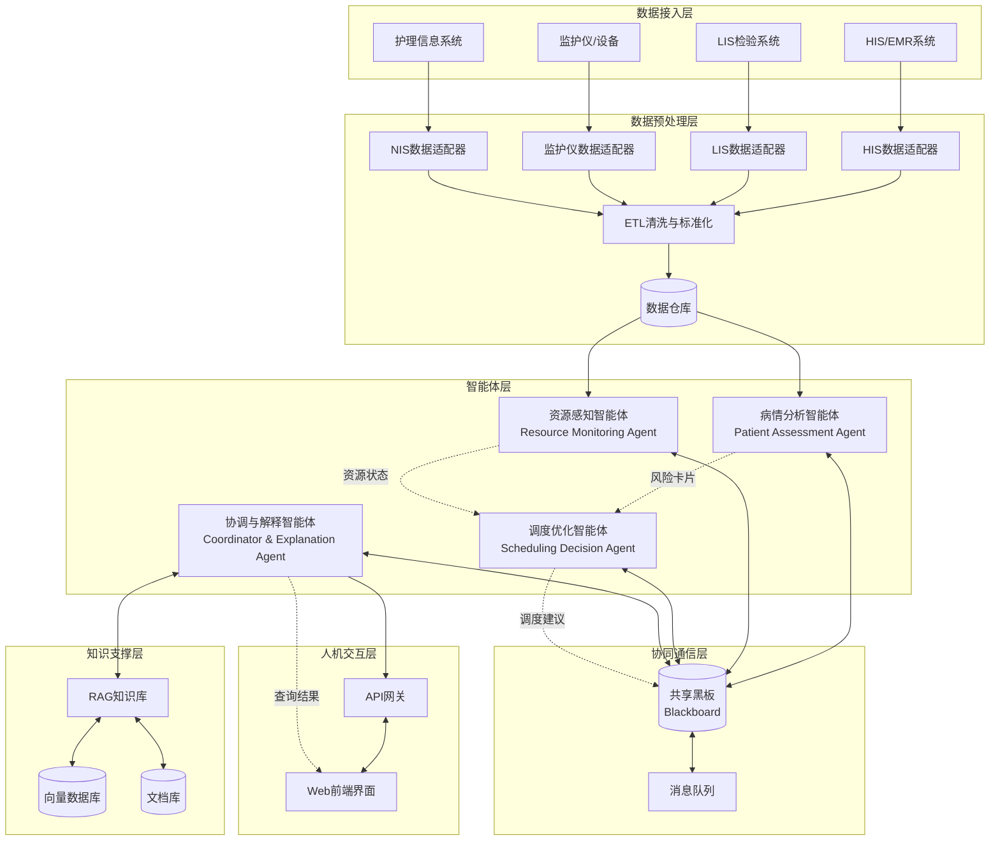
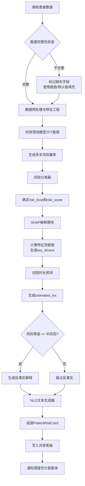
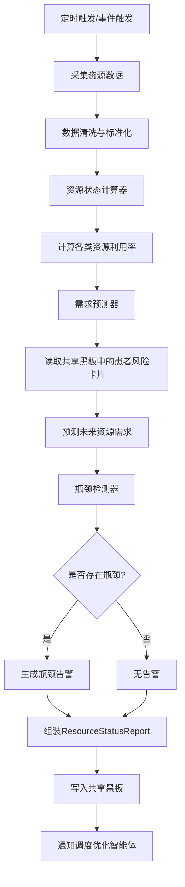
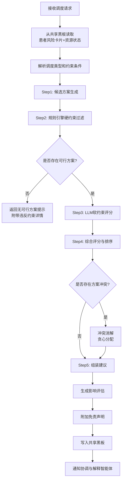
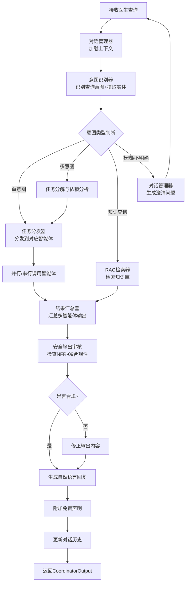
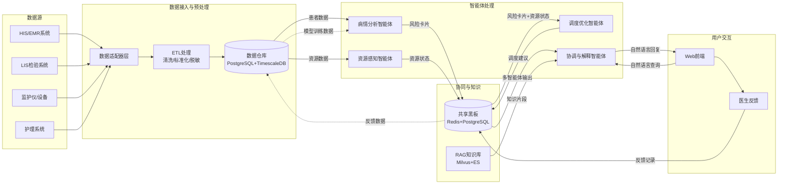

# 基于AIGC的智慧ICU人机协同决策与动态调度系统

## 软件工程需求分析文档（第一部分）

**文档版本**：V1.0
**编写日期**：2026年4月26日
**项目类型**：大学生创新创业训练计划项目
**所属领域**：智慧医疗 / 人工智能 / 运筹优化

---

# 一、引言

## 1.1 编写目的

本文档是"基于AIGC的智慧ICU人机协同决策与动态调度系统"（以下简称"智慧ICU系统"或"本系统"）的软件工程需求分析文档，旨在对系统的功能需求、非功能需求及约束条件进行全面、系统、可追溯的规约。

### 目标读者

本文档面向以下受众，各受众的关注重点如下：

| 读者角色 | 关注重点 | 使用方式 |
|---------|---------|---------|
| **项目指导教师** | 系统技术方案的合理性与学术价值、需求覆盖的完整性 | 评审审核 |
| **开发团队成员** | 需求的具体含义、输入输出、验收标准、模块间依赖关系 | 开发实施依据 |
| **合作医院ICU科室医生** | 系统能否解决实际临床问题、预警准确度、调度合理性 | 需求确认与验收 |
| **测试人员** | 验收标准的可测试性、边界条件的明确性 | 测试用例设计 |
| **项目评审专家** | 项目创新性、技术可行性、需求与目标的匹配度 | 项目评审 |

### 文档用途

1. **需求基线**：作为项目开发的需求基线文档，所有功能设计、技术选型、开发实现均以本文档为依据；
2. **沟通桥梁**：作为开发团队、指导教师、合作医院三方之间的需求沟通与确认工具；
3. **验收依据**：作为系统测试与最终验收的核心评判标准；
4. **变更管理**：后续需求变更须参照本文档进行影响分析与版本管理；
5. **学术支撑**：为项目相关的学术论文、技术报告提供需求层面的参考依据。

## 1.2 项目背景

### 1.2.1 ICU临床现状与核心问题

重症监护室（Intensive Care Unit, ICU）是医院中收治危重患者的核心科室，其临床环境具有以下显著特征：

**（1）信息过载问题严重**

ICU患者通常同时连接多台生命支持设备，每台设备持续产生高频监测数据。以一个典型床位为例，心电监护仪每秒产生数百个数据点，呼吸机、输液泵、血气分析仪等设备也在持续输出数据。一个拥有20张床位的ICU，每天产生的临床数据量可达数百万条记录。主治医生在查房时需要在短时间内综合分析大量患者的多维度数据，信息过载已成为制约临床决策效率的关键瓶颈。

**（2）医生疲劳与认知负荷过高**

ICU实行24小时轮班制度，值班医生需要同时关注多位危重患者的实时状态变化。研究表明，ICU医生的认知负荷远超其他科室，长时间高强度工作导致注意力下降和判断力减退。特别是在夜间值班时段，单人需负责全科室患者的监护工作，疲劳状态下的漏诊率和误判率显著升高。如何在医生疲劳状态下保障患者安全，是ICU管理面临的核心挑战。

**（3）资源调度困难且缺乏前瞻性**

ICU资源（床位、呼吸机、ECMO设备、医护人员等）有限且昂贵，资源调度直接影响患者救治效果。当前ICU的资源调度主要依赖值班医生的个人经验和主观判断，缺乏系统性的优化工具。常见问题包括：紧急入院时无可用床位、关键设备被低优先级患者占用、高峰时段医护力量不足等。传统的被动响应式调度模式无法应对ICU动态变化的资源需求。

**（4）预警系统智能化程度不足**

现有ICU监护系统主要采用固定阈值报警机制（如心率>120次/分触发报警），这种机制存在大量假阳性报警（有研究显示假阳性率高达85%-99%），导致"报警疲劳"现象。医生逐渐对频繁的报警产生脱敏反应，反而可能错过真正关键的恶化信号。同时，现有系统缺乏对多变量联合趋势的分析能力，无法提前识别潜在的恶化模式。

**（5）决策过程缺乏可解释性**

当前临床决策支持系统（CDSS）多为"黑箱"模型，仅给出预测结果而不提供决策依据。在ICU高风险场景下，医生无法信任一个无法解释其推理过程的系统。可解释性不仅是技术需求，更是医疗伦理和法规的刚性要求。

### 1.2.2 技术发展趋势

近年来，人工智能生成内容（AIGC）技术和大语言模型（LLM）的快速发展为解决上述问题提供了新的技术路径：

- **时序预测模型**（如Temporal Fusion Transformer, TFT）在多变量时间序列预测任务中展现出优异性能，可用于生命体征轨迹预测；
- **可解释AI技术**（如SHAP值、注意力机制可视化）使深度学习模型的决策过程变得透明可理解；
- **检索增强生成**（RAG）技术将大语言模型与专业医学知识库结合，能够在保证准确性的同时生成自然语言解释；
- **多智能体协同**（Multi-Agent）架构为复杂决策任务的分解与协作提供了有效的工程范式；
- **运筹优化算法**在资源调度领域已有成熟应用，可与AI预测模型深度结合。

### 1.2.3 项目契机

本项目依托杜老师与合作医院的长期科研合作关系，可获得真实的ICU临床数据支持。结合团队在AIGC、时序预测、运筹优化等领域的技术积累，构建面向ICU场景的人机协同决策智能体系统，既具有明确的临床应用价值，也具备充分的技术可行性。

## 1.3 系统范围与边界

### 1.3.1 系统范围定义

本系统的核心定位是：**利用AIGC技术构建ICU场景下的"可解释预警+宏观资源调度"人机协同决策智能体**。系统以智能体模型为核心交付物，Web前端仅作为可视化与交互载体。

**系统将实现的功能（做什么）：**

| 功能领域 | 具体内容 |
|---------|---------|
| **数据接入与预处理** | 接入ICU临床数据（生命体征、实验室检验、用药记录等）及资源数据（床位、设备、人员），完成数据清洗、对齐、标准化 |
| **病情评估与预警** | 基于多变量时序模型预测患者生命体征轨迹，评估患者风险等级，发出早期恶化预警，预测住院周期 |
| **可解释性分析** | 对所有AI预测结果提供SHAP特征贡献度分析、注意力权重可视化、自然语言理由生成 |
| **资源感知与预测** | 实时监控ICU床位、设备、医护人员状态，预测未来资源需求，识别资源瓶颈 |
| **资源调度优化** | 基于运筹优化算法生成床位流转、设备调配、医护排班方案，支持反事实场景模拟 |
| **多智能体协同** | 实现4智能体（病情分析、资源感知、调度优化、协调解释）的协同工作机制 |
| **人机交互** | 提供自然语言查询、多轮对话、结构化结果展示、医生反馈收集等交互能力 |
| **知识库与RAG** | 构建ICU专业知识库，支持知识检索、知识注入与知识库更新 |

### 1.3.2 系统边界定义（不做什么）

以下内容明确不在本系统的开发范围内：

| 排除领域 | 具体说明 | 排除原因 |
|---------|---------|---------|
| **疾病诊断** | 系统不提供任何疾病诊断功能，不输出诊断结论 | 诊断属于医疗核心业务，需要严格的医疗器械审批，超出本项目范围 |
| **治疗建议** | 系统不提供具体治疗方案建议（如用药剂量、手术方案等） | 同上，涉及医疗责任与法规限制 |
| **数据安全与隐私保护** | 不涉及数据加密传输、脱敏存储、访问控制等安全功能 | 数据来源于合作医院内部系统，安全由医院侧保障 |
| **L4级自动化决策** | 不实现任何自动执行决策的功能（如自动调整设备参数、自动下达医嘱） | 系统定位为L2-L3级辅助决策，决策权始终在医生手中 |
| **护理工作站功能** | 不开发面向护士的护理记录、护理计划等功能 | 护士非本项目主要目标用户 |
| **与HIS/EMR系统的双向集成** | 不实现与医院信息系统的实时双向数据同步 | 集成工作由医院IT部门负责，本项目仅做单向数据读取 |
| **移动端应用** | 不开发手机APP或平板端应用 | 项目周期与资源有限，聚焦Web端可视化 |
| **硬件设备控制** | 不直接控制任何医疗设备（如呼吸机、输液泵等） | 涉及患者安全，需医疗器械认证 |
| **电子病历书写** | 不提供病历书写、编辑、归档等功能 | 属于EMR系统职责范围 |

### 1.3.3 AI等级定义

本系统的AI自动化等级严格限定在L2-L3范围内：

| 等级 | 定义 | 本系统对应 |
|------|------|-----------|
| **L0** | 无自动化，完全人工 | — |
| **L1** | 辅助信息展示（如数据看板） | 系统包含此能力，但不限于此 |
| **L2** | AI提供分析结果，人工决策执行 | **病情预警、资源状态展示属于此等级** |
| **L3** | AI提供推荐方案，人工审核确认 | **调度方案推荐属于此等级** |
| **L4** | AI自动执行决策，人工监督 | **明确排除** |
| **L5** | 完全自主决策 | **明确排除** |

**核心原则**：决策权始终在医生手中。系统提供的所有预测、预警、调度建议均为"推荐"性质，最终决策必须由具有相应权限的医生确认后方可生效。

## 1.4 术语与缩略语

### 1.4.1 核心术语

| 术语/缩略语 | 英文全称 | 中文释义 | 在本系统中的含义 |
|------------|---------|---------|----------------|
| **AIGC** | Artificial Intelligence Generated Content | 人工智能生成内容 | 指利用AI技术（特别是大语言模型）生成文本、分析结果等内容的能力 |
| **ICU** | Intensive Care Unit | 重症监护室 | 本系统的应用场景，收治危重患者的特殊病房 |
| **SHAP** | SHapley Additive exPlanations | SHAP解释框架 | 一种基于博弈论的特征重要性解释方法，用于量化各输入特征对模型预测结果的贡献度 |
| **RAG** | Retrieval-Augmented Generation | 检索增强生成 | 将外部知识库检索与大语言模型生成相结合的技术，用于提升回答的准确性和专业性 |
| **TFT** | Temporal Fusion Transformer | 时序融合Transformer | Google提出的专门用于多变量时间序列预测的深度学习模型架构 |
| **DDPM** | Denoising Diffusion Probabilistic Model | 去噪扩散概率模型 | 一种生成模型，可用于时序数据的概率预测和场景模拟 |
| **EHR** | Electronic Health Record | 电子健康档案 | 患者的数字化医疗记录总称 |
| **EMR** | Electronic Medical Record | 电子病历 | 患者在单个医疗机构内的数字化病历记录 |
| **HIS** | Hospital Information System | 医院信息系统 | 医院核心信息管理平台，涵盖挂号、收费、药房等 |
| **MIMIC** | Medical Information Mart for Intensive Care | ICU医疗信息数据集 | 麻省理工学院发布的公开ICU临床数据库，常用于ICU相关研究 |
| **Agent** | Intelligent Agent | 智能体 | 能够感知环境、自主决策并执行动作的软件实体，本系统包含4个协同智能体 |
| **L2-L3** | Level 2 to Level 3 | AI自动化等级2-3级 | L2为AI辅助分析人工决策，L3为AI推荐方案人工审核 |
| **Human-AI Teaming** | Human-AI Teaming | 人机协同/人机组队 | 人与AI系统作为协作团队共同完成决策任务的工作模式 |
| **SOFA** | Sequential Organ Failure Assessment | 序贯器官衰竭评估 | 评估ICU患者器官功能衰竭程度的临床评分系统 |
| **APACHE** | Acute Physiology and Chronic Health Evaluation | 急性生理与慢性健康评分 | ICU患者病情严重程度的经典评分系统 |
| **NLP** | Natural Language Processing | 自然语言处理 | 使计算机理解和生成人类语言的技术 |
| **LLM** | Large Language Model | 大语言模型 | 参数规模巨大的预训练语言模型，如GPT系列、LLaMA等 |
| **LoRA** | Low-Rank Adaptation | 低秩适应 | 一种高效的大模型微调方法，通过低秩矩阵分解减少可训练参数量 |
| **Prompt Engineering** | Prompt Engineering | 提示工程 | 设计和优化输入提示以引导大语言模型生成期望输出的技术 |
| **Multi-Agent** | Multi-Agent System | 多智能体系统 | 多个智能体通过协作完成复杂任务的系统架构 |
| **OR** | Operations Research | 运筹学 | 应用数学方法对复杂系统进行优化决策的学科 |
| **MILP** | Mixed Integer Linear Programming | 混合整数线性规划 | 一类运筹优化问题的数学建模方法 |
| **GNN** | Graph Neural Network | 图神经网络 | 处理图结构数据的神经网络，可用于建模患者间的相似性关系 |
| **Embedding** | Embedding | 向量嵌入 | 将离散数据映射为连续向量表示的技术 |

### 1.4.2 系统特有术语

| 术语 | 释义 |
|------|------|
| **一擎两翼** | 本系统核心架构："一擎"指数据引擎，"两翼"指白盒预警翼和资源运筹翼 |
| **白盒预警** | 具有完整可解释性的AI预警机制，所有预警结果附带SHAP解释和自然语言理由 |
| **资源运筹** | 基于运筹优化算法的ICU资源（床位、设备、人员）智能调度能力 |
| **协调解释智能体** | 负责汇总其他智能体结果、生成面向医生的综合解释与建议的智能体 |
| **病情分析智能体** | 负责患者生命体征预测、风险评估、恶化预警的智能体 |
| **资源感知智能体** | 负责ICU资源状态监控、需求预测、瓶颈识别的智能体 |
| **调度优化智能体** | 负责生成和优化资源调度方案的智能体 |
| **反事实场景模拟** | 在假设条件下（如"如果3号床患者明天转出"）模拟系统状态变化的能力 |
| **报警疲劳** | 医生因频繁接收到假阳性报警而产生的脱敏和忽视现象 |

## 1.5 参考文档

### 1.5.1 项目文档

| 文档编号 | 文档名称 | 版本 | 说明 |
|---------|---------|------|------|
| [REF-01] | 《基于AIGC的智慧ICU人机协同决策与动态调度系统——立项申请书》 | V1.0 | 项目立项的核心文档，包含研究背景、技术路线、预期成果等 |
| [REF-02] | 《基于AIGC的智慧ICU人机协同决策与动态调度系统——技术方案设计》 | V1.0 | 系统技术架构设计方案 |
| [REF-03] | 合作医院ICU数据库数据字典 | V1.0 | 合作医院提供的ICU临床数据库字段说明文档 |

### 1.5.2 核心参考文献

以下为本系统设计与实现过程中参考的核心学术文献：

**时序预测与生命体征建模：**

| 编号 | 文献 | 关键贡献 | 引用方向 |
|------|------|---------|---------|
| [1] | Lim B, Arık S Ö, Loeff N, et al. Temporal Fusion Transformers for interpretable multi-horizon time series forecasting. *International Journal of Forecasting*, 2021. | 提出TFT模型，实现可解释的多步时序预测 | FR-B01 生命体征轨迹预测 |
| [2] | Harutyunyan H, Zech J, Kale A, et al. Multitask learning and benchmarking with clinical time series data. *Scientific Data*, 2019. | MIMIC-III基准数据集上的多任务学习框架 | 数据预处理与模型训练 |
| [3] | Rajkomar A, Oren E, Chen K, et al. Scalable and accurate deep learning with electronic health records. *NPJ Digital Medicine*, 2018. | 基于EHR的深度学习可扩展框架 | FR-A02 数据标准化 |

**可解释性AI：**

| 编号 | 文献 | 关键贡献 | 引用方向 |
|------|------|---------|---------|
| [4] | Lundberg S M, Lee S I. A unified approach to interpreting model predictions. *NeurIPS*, 2017. | SHAP值的统一理论框架 | FR-C01 SHAP特征贡献度 |
| [5] | Tjoa E, Guan C. A survey on explainable artificial intelligence (XAI): Toward medical XAI. *IEEE TNNLS*, 2021. | XAI在医疗领域的综述 | FR-C02~C05 可解释性设计 |
| [6] | Vaswani A, Shazeer N, Parmar N, et al. Attention is all you need. *NeurIPS*, 2017. | Transformer注意力机制 | FR-C03 注意力权重提取 |

**检索增强生成（RAG）：**

| 编号 | 文献 | 关键贡献 | 引用方向 |
|------|------|---------|---------|
| [7] | Lewis P, Perez E, Piktus A, et al. Retrieval-augmented generation for knowledge-intensive NLP tasks. *NeurIPS*, 2020. | RAG技术的奠基性工作 | FR-H01~H04 知识库与RAG |
| [8] | Gao Y, Xiong Y, Gao X, et al. Retrieval-augmented generation for large language models: A survey. *arXiv preprint*, 2024. | RAG技术最新综述 | FR-H02 知识检索 |

**多智能体系统：**

| 编号 | 文献 | 关键贡献 | 引用方向 |
|------|------|---------|---------|
| [9] | Park J S, O'Brien J C, Cai C J, et al. Generative agents: Interactive simulacra of human behavior. *UIST*, 2023. | 生成式智能体的协同架构 | FR-F01~F05 多智能体协同 |
| [10] | Hong S, Zhuge M, Chen J, et al. MetaGPT: Meta programming for multi-agent collaborative framework. *ICLR*, 2024. | 多智能体协作框架设计 | FR-F01 任务分发 |
| [11] | Qian C, Cong X, Yang C, et al. Communicative agents for software development. *arXiv preprint*, 2023. | 智能体间通信协议设计 | FR-F04 通信协议 |

**资源调度与运筹优化：**

| 编号 | 文献 | 关键贡献 | 引用方向 |
|------|------|---------|---------|
| [12] | Hulshof P J H, Kortbeek N, Boucherie R J, et al. Taxonomic classification of strategic decisions for design of ICUs. *Health Care Management Science*, 2011. | ICU资源调度决策分类学 | FR-E01~E08 调度优化 |
| [13] | Bai J, Fung S H, Xie Z, et al. ICU admission prediction and capacity planning via deep learning. *IEEE JBHI*, 2021. | 基于深度学习的ICU容量规划 | FR-D04 资源需求预测 |
| [14] | Garg P, Garg A. ICU bed management: A systematic review. *Journal of Medical Systems*, 2023. | ICU床位管理综述 | FR-E02 床位流转优化 |

**人机协同与临床决策支持：**

| 编号 | 文献 | 关键贡献 | 引用方向 |
|------|------|---------|---------|
| [15] | Faisal M, Ponnusamy V, Younis E M G, et al. A systematic review of AI in ICU. *IEEE Access*, 2023. | AI在ICU应用的系统综述 | 整体系统设计 |
| [16] | Rajkomar A, Dean J, Kohane I. Machine learning in medicine. *NEJM*, 2019. | 机器学习在医学中的应用前景 | FR-G01~G06 人机交互 |
| [17] | Cabitza F, Campagner A, Balsano C. Bridging the "last mile" gap between AI implementation and operation. *Annals of Translational Medicine*, 2020. | AI临床落地的最后一公里问题 | 系统边界与约束 |

**扩散模型与概率预测：**

| 编号 | 文献 | 关键贡献 | 引用方向 |
|------|------|---------|---------|
| [18] | Ho J, Jain A, Abbeel P. Denoising diffusion probabilistic models. *NeurIPS*, 2020. | DDPM基础框架 | FR-E07 反事实场景模拟 |
| [19] | Rasul K, Seward C, Schölkopf B, et al. Autoregressive denoising diffusion models for multivariate probabilistic time series forecasting. *ICML*, 2021. | 基于扩散模型的时序概率预测 | FR-B01 概率预测 |

## 1.6 文档约定

### 1.6.1 需求编号规则

本系统所有功能需求采用统一的编号规则，格式为 **FR-XX-YY**，具体含义如下：

```
FR-XX-YY
 │  │  └── YY：两位数字序号，表示该模块内的需求序号（01, 02, 03, ...）
 │  └───── XX：模块标识符，用大写字母A~H表示所属模块
 └──────── FR：Functional Requirement，功能需求
```

**模块标识符映射表：**

| 标识符 | 模块名称 | 需求编号范围 |
|--------|---------|-------------|
| A | 数据接入与预处理层 | FR-A01 ~ FR-A06 |
| B | 病情评估与预警层 | FR-B01 ~ FR-B05 |
| C | 可解释性分析层 | FR-C01 ~ FR-C05 |
| D | 资源感知与预测层 | FR-D01 ~ FR-D06 |
| E | 资源调度优化层 | FR-E01 ~ FR-E08 |
| F | 多智能体协同层 | FR-F01 ~ FR-F05 |
| G | 人机交互层 | FR-G01 ~ FR-G06 |
| H | 知识库与RAG层 | FR-H01 ~ FR-H04 |

**示例**：FR-B03 表示"病情评估与预警层"模块的第3个功能需求（早期恶化预警）。

### 1.6.2 优先级定义

需求优先级采用四级定义，从P0到P3优先级递减：

| 优先级 | 名称 | 定义 | 处理策略 |
|--------|------|------|---------|
| **P0** | 核心必做 | 系统运行不可或缺的核心功能，缺失则系统无法完成基本使命 | 必须在第一轮迭代中实现，不允许延期 |
| **P1** | 重要应做 | 对系统价值有重大贡献的功能，显著影响用户体验或系统完整性 | 应在第一轮或第二轮迭代中实现 |
| **P2** | 一般可做 | 能够提升系统价值或用户体验的增强功能 | 在核心功能稳定后实现，可视资源情况调整 |
| **P3** | 可选延做 | 锦上添花的功能，不影响系统核心价值 | 在资源充裕时实现，可推迟到后续版本 |

### 1.6.3 需求属性模板

每个功能需求均包含以下标准属性：

```
**FR-XX-YY：[需求名称]**
- **优先级**：P0/P1/P2/P3
- **描述**：对该需求功能的详细描述
- **输入**：该功能所需的输入数据及其格式
- **输出**：该功能产生的输出数据及其格式
- **前置条件**：该功能执行前必须满足的条件
- **后置条件**：该功能执行完成后系统状态的变化
- **验收标准**：可量化、可测试的验收条件列表
- **关联需求**：与该需求存在依赖或关联关系的其他需求ID
```

### 1.6.4 其他约定

- 本文档中所有时间格式默认为 **24小时制**（如 14:30 表示下午2:30）；
- 本文档中"医生"一词如无特别说明，泛指ICU主任、主治医生、值班医生三类用户；
- 本文档中"患者"指ICU在院患者；
- 本文档中"资源"特指ICU床位、关键医疗设备、医护人员三类资源；
- 需求变更须提交变更申请，经项目组评审后更新本文档并标注变更记录。

---

# 二、系统概述

## 2.1 系统目标

### 2.1.1 总目标

构建一个基于AIGC技术的ICU人机协同决策智能体系统，通过"一擎两翼"架构（数据引擎 + 白盒预警翼 + 资源运筹翼），实现ICU患者病情的**可解释性智能预警**与科室资源的**动态优化调度**，在L2-L3自动化等级下辅助医生进行临床决策，提升ICU整体运营效率和患者安全水平。

### 2.1.2 分目标

**分目标1：构建高精度多变量生命体征预测模型**

- 基于TFT（Temporal Fusion Transformer）架构，实现对ICU患者5项核心生命体征（收缩压/舒张压、脉搏、血氧饱和度、体温、呼吸频率）未来1-6小时的多步轨迹预测；
- 预测精度指标：平均绝对误差（MAE）较基线模型（LSTM、GRU）降低不低于15%；
- 预测覆盖范围：支持同时预测全科室不少于20名患者的生命体征轨迹；
- 单次全科室预测延迟不超过30秒。

**分目标2：实现全链路可解释性分析能力**

- 对所有AI预测结果提供SHAP特征贡献度量化分析，支持全局和局部两个维度的解释；
- 基于RAG技术生成面向医生的自然语言预测理由，理由内容须引用具体临床指标数值；
- 可解释性分析覆盖率达到100%，即不产生任何"无解释"的预测结果；
- 自然语言理由的临床合理性经合作医院ICU医生评审通过率不低于80%。

**分目标3：构建ICU资源智能调度优化引擎**

- 基于运筹优化算法（MILP/启发式算法）实现床位流转、设备调配、医护排班三类调度方案的自动生成；
- 调度方案生成时间不超过60秒；
- 在模拟场景下，优化方案较人工调度方案在床位利用率、设备周转率等指标上提升不低于10%；
- 支持反事实场景模拟（"What-If"分析），模拟响应时间不超过10秒。

**分目标4：实现4智能体协同的人机交互系统**

- 构建病情分析、资源感知、调度优化、协调解释4个智能体，实现任务自动分发、结果汇总、异常降级的协同工作机制；
- 提供自然语言查询接口，支持医生以自然语言提问并获取结构化回答；
- 支持多轮对话，对话上下文记忆窗口不少于5轮；
- 系统响应时间：简单查询不超过3秒，复杂分析不超过15秒。

### 2.1.3 量化指标汇总

| 指标类别 | 具体指标 | 目标值 |
|---------|---------|--------|
| **预测精度** | 生命体征预测MAE较基线降低 | >= 15% |
| **预警性能** | 早期恶化预警提前时间 | >= 2小时 |
| **预警性能** | 恶化预警召回率 | >= 85% |
| **预警性能** | 恶化预警精确率 | >= 70% |
| **可解释性** | SHAP解释覆盖率 | 100% |
| **可解释性** | 自然语言理由评审通过率 | >= 80% |
| **调度效率** | 方案生成时间 | <= 60秒 |
| **调度效率** | 床位利用率提升 | >= 10% |
| **调度效率** | 反事实模拟响应时间 | <= 10秒 |
| **系统性能** | 全科室预测延迟 | <= 30秒 |
| **系统性能** | 简单查询响应时间 | <= 3秒 |
| **系统性能** | 复杂分析响应时间 | <= 15秒 |
| **交互体验** | 对话上下文记忆窗口 | >= 5轮 |

## 2.2 系统边界图

### 2.2.1 系统上下文图

以下用ASCII图描述本系统与外部实体之间的交互边界：

```
┌─────────────────────────────────────────────────────────────────────────┐
│                           系统边界（System Boundary）                      │
│                                                                         │
│   ┌─────────────────────────────────────────────────────────────────┐   │
│   │                                                                 │   │
│   │   ┌──────────┐  ┌──────────┐  ┌──────────┐  ┌──────────┐      │   │
│   │   │ 病情分析  │  │ 资源感知  │  │ 调度优化  │  │ 协调解释  │      │   │
│   │   │  智能体  │  │  智能体  │  │  智能体  │  │  智能体  │      │   │
│   │   └────┬─────┘  └────┬─────┘  └────┬─────┘  └────┬─────┘      │   │
│   │        │              │              │              │            │   │
│   │        └──────────────┴──────┬───────┴──────────────┘            │   │
│   │                              │                                    │   │
│   │                    ┌─────────┴─────────┐                        │   │
│   │                    │   多智能体协同层   │                        │   │
│   │                    └─────────┬─────────┘                        │   │
│   │                              │                                    │   │
│   │        ┌─────────────────────┼─────────────────────┐            │   │
│   │        │                     │                     │            │   │
│   │  ┌─────┴──────┐    ┌────────┴───────┐    ┌───────┴─────┐      │   │
│   │  │ 数据接入与  │    │  知识库与RAG  │    │  人机交互   │      │   │
│   │  │ 预处理层   │    │     层        │    │    层       │      │   │
│   │  └─────┬──────┘    └────────┬───────┘    └───────┬─────┘      │   │
│   │        │                    │                     │            │   │
│   │  ┌─────┴────────────────────┴─────────────────────┴─────┐      │   │
│   │  │                    数据引擎（一擎）                    │      │   │
│   │  └─────────────────────────────────────────────────────┘      │   │
│   │                                                                 │   │
│   │   ┌──────────────────┐              ┌──────────────────┐       │   │
│   │   │  白盒预警翼       │              │  资源运筹翼       │       │   │
│   │   │ (模块B+C)        │              │ (模块D+E)        │       │   │
│   │   └──────────────────┘              └──────────────────┘       │   │
│   │                                                                 │   │
│   └─────────────────────────────────────────────────────────────────┘   │
│                                                                         │
└─────────────────────────────────────────────────────────────────────────┘

         ▲                ▲                ▲                ▲
         │                │                │                │
    ┌────┴────┐     ┌─────┴─────┐    ┌────┴────┐     ┌─────┴─────┐
    │ HIS系统 │     │ EMR系统   │    │排班系统 │     │设备管理   │
    │         │     │           │    │         │     │  系统     │
    └────┬────┘     └─────┬─────┘    └────┬────┘     └─────┬─────┘
         │                │                │                │
    患者基本信息     临床检验结果      医护排班数据      设备状态数据
    诊断信息         医嘱信息          人员资质信息      设备位置信息
    收费信息         护理记录          班次安排          维护计划
         │                │                │                │
    ─────┼────────────────┼────────────────┼────────────────┼──────
         │          单向数据读取（只读）     │                │
         │                │                │                │

         ▲                ▲                ▲
         │                │                │
    ┌────┴────┐     ┌─────┴─────┐    ┌────┴────┐
    │ ICU主任  │     │ 主治医生  │    │ 值班医生 │
    │         │     │           │    │         │
    └─────────┘     └───────────┘    └─────────┘

    自然语言查询 / 预警查看 / 调度方案审核 / 反馈提交
```

### 2.2.2 数据流边界说明

| 外部系统/实体 | 数据流向 | 数据内容 | 交互方式 |
|-------------|---------|---------|---------|
| **HIS系统** | 外部 -> 本系统（单向只读） | 患者基本信息（姓名、年龄、性别、入院时间等）、诊断信息、科室信息 | 数据库读取 / API调用 |
| **EMR系统** | 外部 -> 本系统（单向只读） | 生命体征监测数据、实验室检验结果、医嘱信息、护理记录 | 数据库读取 / API调用 |
| **排班系统** | 外部 -> 本系统（单向只读） | 医护人员排班表、资质信息、班次安排、在岗状态 | 数据库读取 / 文件导入 |
| **设备管理系统** | 外部 -> 本系统（单向只读） | 设备清单、实时状态（在用/空闲/维护中）、位置信息、维护计划 | 数据库读取 / API调用 |
| **ICU主任** | 双向交互 | 输入：宏观查询、调度方案审核、全局配置；输出：全局态势报告、调度建议 | Web界面 + 自然语言交互 |
| **主治医生** | 双向交互 | 输入：患者病情查询、预警确认、调度反馈；输出：患者预警、分析报告、调度建议 | Web界面 + 自然语言交互 |
| **值班医生** | 双向交互 | 输入：实时状态查询、预警处理、紧急调度请求；输出：实时预警、紧急调度建议 | Web界面 + 自然语言交互 |

## 2.3 用户角色定义

### 2.3.1 角色总览

| 角色 | 角色编码 | 主要职责 | 系统权限级别 | 使用场景 |
|------|---------|---------|-------------|---------|
| **ICU主任** | ROLE-ICU-DIR | 全科室宏观管理、资源调度审核、战略决策 | 最高权限（L3方案审核） | 每日查房、周度资源规划、突发事件决策 |
| **主治医生** | ROLE-ATTEND | 管辖患者病情管理、预警响应、日常调度 | 中等权限（L3方案建议） | 日常查房、患者评估、预警处理 |
| **值班医生** | ROLE-DUTY | 全科室实时监护、紧急预警响应、临时调度 | 基础权限（L2信息查看+紧急请求） | 值班期间实时监控、紧急事件处理 |
| **系统管理员** | ROLE-ADMIN | 系统配置、数据管理、用户权限管理 | 系统管理权限 | 系统部署、配置变更、日志审计 |

### 2.3.2 详细用户画像

---

**用户画像1：ICU主任**

```
┌─────────────────────────────────────────────────────────┐
│  角色：ICU主任                                           │
│  编码：ROLE-ICU-DIR                                      │
├─────────────────────────────────────────────────────────┤
│  基本信息：                                               │
│    - 年龄范围：45~55岁                                    │
│    - 从业经验：15~25年临床经验，ICU工作8年以上              │
│    - 职称：主任医师/副主任医师                              │
│    - 学历：硕士及以上                                     │
│    - 技术熟练度：中等偏低                                   │
│      · 日常使用电脑进行病历查阅和邮件沟通                   │
│      · 对复杂软件界面接受度有限，偏好简洁直观的操作方式       │
│      · 不熟悉AI/ML技术术语，需要业务语言而非技术语言          │
├─────────────────────────────────────────────────────────┤
│  核心需求：                                               │
│    1. 快速掌握全科室患者整体态势（"一眼看清"）              │
│    2. 获取资源利用率的宏观视图和趋势分析                    │
│    3. 审核和批准重大资源调度方案（如床位扩容、设备采购）      │
│    4. 在突发事件（如批量伤员入院）时获得决策支持             │
│    5. 了解系统预警的整体统计和准确性指标                    │
├─────────────────────────────────────────────────────────┤
│  使用频率：                                               │
│    - 每日使用1~2次，每次10~20分钟                          │
│    - 主要使用时段：上午查房后（9:00-11:00）、下午下班前      │
│    - 突发事件时随时使用                                    │
├─────────────────────────────────────────────────────────┤
│  痛点：                                                   │
│    1. 缺乏全科室实时态势的全局视角，需要逐一查看患者         │
│    2. 资源调度决策缺乏数据支撑，过度依赖个人经验             │
│    3. 无法预测未来24-48小时的资源需求变化                   │
│    4. 突发事件下决策压力大，缺乏快速分析工具                 │
│    5. 对AI系统的不信任——需要看到"为什么"                    │
└─────────────────────────────────────────────────────────┘
```

---

**用户画像2：主治医生**

```
┌─────────────────────────────────────────────────────────┐
│  角色：主治医生                                           │
│  编码：ROLE-ATTEND                                       │
├─────────────────────────────────────────────────────────┤
│  基本信息：                                               │
│    - 年龄范围：32~45岁                                    │
│    - 从业经验：5~15年临床经验，ICU工作3年以上               │
│    - 职称：主治医师                                       │
│    - 学历：硕士及以上                                     │
│    - 技术熟练度：中等                                      │
│      · 熟练使用电子病历系统和常规办公软件                   │
│      · 对新技术有一定接受度，愿意尝试AI辅助工具              │
│      · 能理解基本的统计概念（如置信区间、敏感度）            │
├─────────────────────────────────────────────────────────┤
│  核心需求：                                               │
│    1. 实时获取管辖患者的病情变化预警                        │
│    2. 查看预警的详细解释，理解AI判断的依据                  │
│    3. 获取患者生命体征的趋势预测，辅助提前干预               │
│    4. 提出资源调度需求并获取推荐方案                       │
│    5. 追踪历史预警的准确性和反馈效果                       │
├─────────────────────────────────────────────────────────┤
│  使用频率：                                               │
│    - 每日使用3~5次，每次5~15分钟                           │
│    - 主要使用时段：查房期间（8:00-10:00）、交接班时          │
│    - 收到预警推送时随时查看                                │
├─────────────────────────────────────────────────────────┤
│  痛点：                                                   │
│    1. 同时管理多名患者，难以持续关注每个患者的细微变化        │
│    2. 现有报警系统假阳性过多，浪费时间处理无效报警           │
│    3. 缺乏对患者未来状态的前瞻性预测能力                    │
│    4. 申请床位或设备时缺乏优先级依据，沟通成本高             │
│    5. 交接班时信息传递不完整，关键信息容易遗漏               │
└─────────────────────────────────────────────────────────┘
```

---

**用户画像3：值班医生**

```
┌─────────────────────────────────────────────────────────┐
│  角色：值班医生                                           │
│  编码：ROLE-DUTY                                         │
├─────────────────────────────────────────────────────────┤
│  基本信息：                                               │
│    - 年龄范围：25~35岁                                    │
│    - 从业经验：1~5年临床经验，ICU工作1年以上                │
│    - 职称：住院医师/规培医生                               │
│    - 学历：本科及以上                                     │
│    - 技术熟练度：中高                                      │
│      · 数字化工具使用熟练，适应能力强                      │
│      · 对AI技术有较高接受度和好奇心                        │
│      · 可能缺乏足够的临床经验做出独立判断                   │
├─────────────────────────────────────────────────────────┤
│  核心需求：                                               │
│    1. 实时监控全科室所有患者的状态变化                      │
│    2. 获得及时、准确的恶化预警，减少漏诊                    │
│    3. 在紧急情况下获得快速的资源调度建议                    │
│    4. 通过自然语言快速查询患者信息和历史记录                │
│    5. 获取上级医生（主任/主治）的决策参考                   │
├─────────────────────────────────────────────────────────┤
│  使用频率：                                               │
│    - 值班期间持续使用（8-12小时/班）                       │
│    - 交互频率高但单次交互时间短（1-3分钟/次）               │
│    - 夜间值班时为主要使用时段                              │
├─────────────────────────────────────────────────────────┤
│  痛点：                                                   │
│    1. 夜间单人值班压力大，缺乏上级医生即时指导              │
│    2. 疲劳状态下注意力下降，容易忽略早期恶化信号            │
│    3. 紧急情况下资源调度手忙脚乱，缺乏系统支持              │
│    4. 经验不足时对复杂病情的判断缺乏信心                    │
│    5. 需要频繁在不同系统间切换查看信息，效率低下            │
└─────────────────────────────────────────────────────────┘
```

---

**用户画像4：系统管理员**

```
┌─────────────────────────────────────────────────────────┐
│  角色：系统管理员                                         │
│  编码：ROLE-ADMIN                                        │
├─────────────────────────────────────────────────────────┤
│  基本信息：                                               │
│    - 年龄范围：25~40岁                                    │
│    - 背景：医院信息科工程师或项目组技术成员                 │
│    - 技术熟练度：高                                        │
│      · 熟悉Linux服务器运维、数据库管理                     │
│      · 了解Python、Docker等开发/部署工具                   │
│      · 具备基本的AI/ML概念知识                            │
├─────────────────────────────────────────────────────────┤
│  核心需求：                                               │
│    1. 系统部署、配置与日常运维                             │
│    2. 数据源连接配置与数据管道监控                         │
│    3. 用户账号管理与权限配置                               │
│    4. 系统日志查看与问题排查                               │
│    5. 模型性能监控与知识库内容管理                         │
├─────────────────────────────────────────────────────────┤
│  使用频率：                                               │
│    - 日常维护：每周1~2次                                  │
│    - 系统部署/升级时集中使用                               │
│    - 故障排查时随时使用                                    │
├─────────────────────────────────────────────────────────┤
│  痛点：                                                   │
│    1. 系统组件多，故障定位困难                             │
│    2. 数据源接口变更时适配工作量大                         │
│    3. 缺乏系统运行状态的统一监控面板                       │
│    4. 模型更新和知识库维护缺乏标准化流程                   │
└─────────────────────────────────────────────────────────┘
```

## 2.4 运行环境假设

### 2.4.1 硬件环境假设

| 组件 | 最低配置 | 推荐配置 | 说明 |
|------|---------|---------|------|
| **GPU服务器** | NVIDIA RTX 3090 (24GB) x1 | NVIDIA A100 (40GB/80GB) x1-2 | 用于模型训练与推理，支持TFT、LLM等模型运行 |
| **CPU服务器** | 16核 64GB RAM | 32核 128GB RAM | 用于数据处理、运筹优化求解、Web服务 |
| **存储空间** | 500GB SSD | 2TB SSD + 10TB HDD | SSD用于系统和模型，HDD用于历史数据存储 |
| **网络环境** | 100Mbps内网 | 1Gbps内网 | 系统部署在医院内网，不依赖公网连接 |

### 2.4.2 软件环境假设

| 组件 | 版本要求 | 说明 |
|------|---------|------|
| **操作系统** | Ubuntu 20.04+ / CentOS 7+ | Linux服务器环境 |
| **Python** | 3.9+ | 核心开发语言 |
| **CUDA/cuDNN** | CUDA 11.8+ / cuDNN 8.6+ | GPU计算支持 |
| **Docker** | 20.10+ | 容器化部署 |
| **数据库** | PostgreSQL 14+ / MySQL 8.0+ | 关系型数据存储 |
| **向量数据库** | Milvus 2.3+ / ChromaDB | RAG知识库向量存储 |
| **消息队列** | Redis 7.0+ / RabbitMQ | 智能体间异步通信 |
| **Web服务器** | Nginx 1.20+ | 反向代理与静态资源服务 |

### 2.4.3 数据环境假设

| 假设项 | 具体说明 |
|--------|---------|
| **数据来源** | 合作医院ICU数据库，通过数据库读取或API接口获取 |
| **数据格式** | 结构化数据（SQL数据库），可能包含部分半结构化数据（JSON格式的设备日志） |
| **数据更新频率** | 生命体征数据：实时或近实时（延迟<5分钟）；检验结果：每4-6小时批量更新；医嘱信息：事件驱动更新 |
| **历史数据量** | 预计可用历史数据覆盖不少于2年、不少于1000名ICU患者记录 |
| **数据质量** | 存在一定比例的缺失值和异常值，需系统进行预处理 |
| **数据标注** | 恶化事件标签由合作医院ICU医生根据临床记录标注 |

### 2.4.4 网络与安全假设

| 假设项 | 具体说明 |
|--------|---------|
| **部署环境** | 系统部署在医院内网，不直接暴露到公网 |
| **数据传输** | 数据在医院内部网络传输，不经过公网 |
| **身份认证** | 依赖医院现有的LDAP/AD统一身份认证系统 |
| **数据安全** | 数据脱敏和访问控制由医院侧负责，本系统不额外处理 |

## 2.5 设计约束与原则

### 2.5.1 AI等级约束

**约束规则**：系统所有功能的AI自动化等级严格限定在L2-L3范围内。

| 约束项 | 具体要求 |
|--------|---------|
| **决策权归属** | 所有临床决策的最终决策权始终在医生手中，系统不得自动执行任何临床决策 |
| **L2功能边界** | 病情预警、风险评估、资源状态展示等功能仅提供分析结果，不推荐具体行动 |
| **L3功能边界** | 调度方案推荐须明确标注为"建议"，并附带完整的理由说明，医生可选择采纳、修改或拒绝 |
| **人工确认机制** | 所有L3级推荐方案必须经过具有相应权限的医生确认后才能视为"采纳" |
| **拒绝能力** | 医生必须能够随时拒绝系统的任何建议，且拒绝操作不得影响系统后续正常运行 |

### 2.5.2 可解释性优先原则

**原则声明**：在ICU高风险场景下，可解释性优先于预测精度。一个精度略低但完全可解释的模型，优于精度更高但无法解释的模型。

| 原则项 | 具体要求 |
|--------|---------|
| **零黑箱** | 系统不产生任何无解释的预测或建议结果 |
| **多层解释** | 每个预测/建议须同时提供：特征级解释（SHAP值）、趋势级解释（注意力权重）、语义级解释（自然语言理由） |
| **解释可审计** | 所有解释结果须可追溯、可存储、可回放 |
| **医生可理解** | 解释内容须使用临床术语而非技术术语，目标用户（ICU医生）须能无障碍理解 |
| **解释粒度可控** | 医生可选择查看不同粒度的解释（概要/详细/技术细节） |

### 2.5.3 成本控制约束

| 约束项 | 具体要求 |
|--------|---------|
| **硬件成本** | 系统须能在单台GPU服务器（消费级显卡）上完成全部推理任务 |
| **推理成本** | 单次全科室分析的综合推理成本（GPU时间）不超过5分钟 |
| **API调用** | 尽量减少对外部付费API（如OpenAI API）的依赖，优先使用本地部署的开源模型 |
| **存储成本** | 历史数据保留策略须考虑存储成本，支持数据分级存储 |

### 2.5.4 开源优先原则

| 原则项 | 具体要求 |
|--------|---------|
| **模型开源** | 优先选用开源预训练模型（如LLaMA、ChatGLM、Qwen等），通过LoRA等高效微调方式适配ICU场景 |
| **框架开源** | 技术栈优先选用成熟的开源框架（PyTorch、HuggingFace Transformers、LangChain等） |
| **工具开源** | 运维和开发工具优先选用开源方案（Docker、Grafana、MLflow等） |
| **可复现性** | 所有模型训练、数据处理流程须完全可复现，代码和配置须版本化管理 |

### 2.5.5 模块化设计原则

| 原则项 | 具体要求 |
|--------|---------|
| **松耦合** | 各模块之间通过明确定义的接口通信，模块内部实现可独立变更 |
| **高内聚** | 每个模块内部的功能高度相关，单一职责 |
| **可替换** | 核心组件（如预测模型、优化求解器、LLM）须可替换，不与特定实现绑定 |
| **可独立测试** | 每个模块须可独立进行单元测试和集成测试 |
| **渐进式开发** | 支持按模块渐进式开发和部署，不要求所有模块同时完成 |

### 2.5.6 医疗领域特殊约束

| 约束项 | 具体要求 |
|--------|---------|
| **不做诊断** | 系统输出不包含任何诊断结论，仅提供风险等级评估和状态预测 |
| **不做治疗** | 系统不推荐具体治疗方案（如药物种类、剂量、手术方式等） |
| **辅助定位** | 系统定位为"辅助决策工具"，不替代医生的专业判断 |
| **责任边界** | 系统提供的所有信息和建议仅供参考，最终临床决策的责任由医生承担 |
| **合规参考** | 系统设计参考《医疗器械软件注册审查指导原则》等法规要求，但本项目为研究原型，不申请医疗器械注册 |

---

# 三、功能性需求

## 模块A：数据接入与预处理层

本模块是系统的数据基础设施，负责从多个外部数据源接入ICU临床数据和资源数据，并完成数据清洗、对齐、标准化等预处理工作，为上层智能分析模块提供高质量的数据支撑。

---

**FR-A01：ICU临床数据接入**

- **优先级**：P0
- **描述**：系统须能够从合作医院的ICU数据库中自动接入患者临床数据，包括但不限于：生命体征监测数据（心率、血压、血氧饱和度、体温、呼吸频率等）、实验室检验结果（血常规、生化指标、血气分析等）、医嘱信息（用药记录、检查申请等）、护理记录（出入量、意识评分等）、患者基本信息（年龄、性别、入院诊断、既往病史等）。数据接入方式支持数据库直连读取和API接口调用两种模式，可根据医院实际IT环境灵活配置。系统须支持增量数据同步机制，能够识别并仅获取自上次同步以来新增或变更的数据记录。
- **输入**：
  - 数据源配置信息：数据库连接参数（主机地址、端口、用户名、密码、数据库名称）或API端点地址及认证凭据
  - 数据表映射配置：源数据表名与字段名到系统内部数据模型的映射关系
  - 同步策略配置：全量同步/增量同步模式选择、同步频率设置（如每5分钟增量同步一次）
- **输出**：
  - 标准化的原始数据记录，按系统内部数据模型存储
  - 数据同步日志：记录同步时间、同步记录数、成功/失败状态
  - 数据质量报告：同步数据的完整性、时效性统计
- **前置条件**：
  - 已获得合作医院的数据访问授权
  - 数据库连接参数或API认证信息已正确配置
  - 系统内部数据模型已定义完成
- **后置条件**：
  - ICU临床数据已成功导入系统内部数据存储
  - 数据同步日志已记录
  - 后续模块可读取到最新的临床数据
- **验收标准**：
  - AC1：系统能够成功连接到指定的ICU数据库，连接成功率不低于99%
  - AC2：支持至少3种数据类型（生命体征、检验结果、医嘱信息）的接入
  - AC3：增量同步模式下，能够正确识别并仅同步新增/变更记录，无重复数据
  - AC4：单次增量同步（数据量<1000条）的完成时间不超过10秒
  - AC5：数据同步失败时，系统能够记录错误日志并自动重试（最多3次），不丢失已同步数据
  - AC6：数据同步过程不影响源数据库的正常运行
- **关联需求**：FR-A02（数据对齐与标准化依赖本需求的数据接入）、FR-A04（数据质量监控）

---

**FR-A02：多模态数据对齐与标准化**

- **优先级**：P0
- **描述**：ICU临床数据来源于多个设备和系统，具有不同的采样频率、数据格式和单位体系。本需求要求系统对多源异构数据进行时间对齐和标准化处理。时间对齐方面：将不同采样频率的数据统一到标准时间网格上（如按小时对齐），对于高频数据（如秒级生命体征）进行统计聚合（均值、最大值、最小值、标准差），对于低频数据（如每日检验结果）进行前向填充。标准化方面：统一数据单位（如血压统一为mmHg、体温统一为摄氏度）、统一编码体系（如使用ICD-10编码诊断信息、使用LOINC编码检验项目）、统一缺失值表示方式。
- **输入**：
  - FR-A01接入的原始临床数据
  - 时间对齐配置：目标时间粒度（如1小时）、聚合策略（均值/最大值/最小值/中位数）
  - 标准化规则配置：单位映射表、编码映射表、缺失值标记规则
- **输出**：
  - 时间对齐后的标准化数据集，所有数据点统一到相同的时间网格
  - 数据转换日志：记录每种数据类型的转换规则应用情况和转换统计
  - 数据对齐质量报告：对齐后的数据覆盖率、插值比例等统计信息
- **前置条件**：
  - FR-A01已完成数据接入，原始数据可用
  - 时间对齐和标准化规则已配置完成
- **后置条件**：
  - 多源数据已统一到标准时间网格和标准格式
  - 上层分析模块可直接使用标准化数据，无需额外处理
- **验收标准**：
  - AC1：支持至少3种不同采样频率的数据对齐（秒级/分钟级/小时级/天级）
  - AC2：标准化后的数据单位一致性达到100%，不存在单位混用情况
  - AC3：时间对齐后的数据覆盖率不低于原始数据的90%（允许因聚合导致的合理损失）
  - AC4：对齐处理延迟：单患者24小时数据的对齐处理时间不超过2秒
  - AC5：能够正确处理跨日、跨月的时间对齐（如23:00到次日01:00的连续数据）
  - AC6：标准化规则变更后，能够对历史数据进行重新处理
- **关联需求**：FR-A01（数据源）、FR-A03（缺失值处理）、FR-B01（预测模型输入）

---

**FR-A03：缺失值检测与填补**

- **优先级**：P0
- **描述**：ICU临床数据中普遍存在缺失值问题，可能由设备断连、检验未执行、记录遗漏等原因导致。本需求要求系统能够自动检测数据中的缺失值，并根据缺失模式和临床语义选择合适的填补策略。系统须支持多种填补方法：前向填充（适用于连续监测数据的短期缺失）、均值/中位数填充（适用于检验数据的随机缺失）、插值法（线性插值/样条插值，适用于趋势性数据的短期缺失）、模型预测填补（基于TFT等模型的预测值填补，适用于关键指标的缺失）。系统须记录每个填补点的原始缺失状态和填补方法，确保上层模块能够区分真实值和填补值。
- **输入**：
  - FR-A02输出的标准化数据（可能包含缺失值）
  - 缺失值处理策略配置：不同数据类型的默认填补方法、最大允许缺失比例阈值
  - 缺失值检测规则：哪些字段允许缺失、哪些字段不允许缺失
- **输出**：
  - 填补后的完整数据集
  - 缺失值报告：各字段的缺失率、缺失模式分析、填补方法统计
  - 填补标记：每个被填补的数据点须标记为"已填补"及所用的填补方法
- **前置条件**：
  - FR-A02已完成数据标准化
  - 缺失值处理策略已配置
- **后置条件**：
  - 数据中的缺失值已按策略填补
  - 上层分析模块获得完整的数据输入
  - 填补标记信息可供可解释性分析模块使用
- **验收标准**：
  - AC1：能够检测所有配置字段的缺失值，检测准确率100%
  - AC2：支持至少3种填补方法（前向填充、统计填充、插值填充）
  - AC3：填补后的数据中，关键生命体征的缺失率降至0%
  - AC4：每个填补数据点都有完整的填补方法标记
  - AC5：当某字段缺失率超过配置阈值（如50%）时，系统发出告警而非强制填补
  - AC6：单患者30天数据的缺失值检测与填补处理时间不超过5秒
- **关联需求**：FR-A02（标准化数据输入）、FR-A04（数据质量监控）、FR-C01（SHAP分析须考虑填补标记）

---

**FR-A04：数据质量监控**

- **优先级**：P1
- **描述**：系统须建立持续的数据质量监控机制，对接入和预处理后的数据进行多维度的质量评估。监控维度包括：完整性（各字段的缺失率）、一致性（同一患者不同数据源间的数据是否矛盾）、时效性（数据从产生到接入系统的延迟）、准确性（数据值是否在合理范围内，如心率不应为负数或超过300次/分）、唯一性（是否存在重复记录）。系统须定期生成数据质量报告，并在数据质量低于预设阈值时触发告警通知系统管理员。
- **输入**：
  - FR-A01接入的原始数据和FR-A02/A03处理后的数据
  - 数据质量规则配置：各字段的合理值范围、一致性校验规则、时效性要求
  - 告警阈值配置：各质量维度的告警触发阈值
- **输出**：
  - 数据质量评分：综合评分（0-100分）及各维度分项评分
  - 数据质量报告：包含各维度的详细统计和异常记录列表
  - 质量告警：当质量低于阈值时生成的告警信息
- **前置条件**：
  - 数据接入和预处理流程已运行
  - 数据质量规则已配置
- **后置条件**：
  - 数据质量状态可被系统管理员查看
  - 质量异常可被及时发现和处理
- **验收标准**：
  - AC1：支持至少4个质量维度的监控（完整性、一致性、时效性、准确性）
  - AC2：数据质量评分的计算时间不超过30秒（针对全科室数据）
  - AC3：质量低于阈值时，告警通知的延迟不超过5分钟
  - AC4：数据质量报告包含至少以下信息：各字段缺失率、异常值数量、数据延迟统计
  - AC5：支持按日/周/月生成数据质量趋势报告
- **关联需求**：FR-A01（原始数据）、FR-A02（标准化数据）、FR-A03（填补数据）

---

**FR-A05：资源数据接入**

- **优先级**：P0
- **描述**：系统须能够接入ICU资源相关数据，包括三类核心资源：（1）床位数据：床位编号、位置、当前状态（空闲/占用/预留/维护中）、当前患者信息、预计出院时间等；（2）设备数据：设备编号、类型（呼吸机/监护仪/ECMO/CRRT等）、状态（在用/空闲/维护中/故障）、所在床位、使用时长等；（3）人员数据：医护人员姓名、角色（医生/护士）、资质等级、当前在岗状态、班次信息等。数据接入方式与FR-A01一致，支持数据库读取和API调用。
- **输入**：
  - 资源数据源配置：床位管理系统、设备管理系统、排班系统的连接参数
  - 资源数据映射配置：源数据字段到系统资源模型的映射关系
  - 同步策略配置：资源状态数据的同步频率（建议实时或近实时）
- **输出**：
  - 标准化的资源状态数据，包含床位、设备、人员三类资源的实时状态
  - 资源数据同步日志
  - 资源利用率统计（如床位使用率、设备利用率）
- **前置条件**：
  - 已获得资源管理系统的数据访问授权
  - 资源数据映射关系已配置
- **后置条件**：
  - 资源状态数据可供资源感知智能体（FR-D01~D03）使用
  - 资源利用率统计可供ICU主任查看
- **验收标准**：
  - AC1：支持三类资源（床位、设备、人员）数据的接入
  - AC2：资源状态数据的同步延迟不超过5分钟
  - AC3：能够正确识别资源状态变更事件（如床位从"占用"变为"空闲"）
  - AC4：资源数据接入失败时，系统能够使用最近一次成功同步的数据并发出告警
  - AC5：支持至少3种设备类型的状态监控
- **关联需求**：FR-A01（接入机制复用）、FR-D01（床位监控）、FR-D02（设备监控）、FR-D03（人员监控）

---

**FR-A06：医生工作状态数据接入**

- **优先级**：P2
- **描述**：系统须能够接入和推断医生的工作状态信息，用于评估医生疲劳度和优化排班调度。数据来源包括：（1）直接接入排班系统的排班数据，获取医生的班次安排、连续工作天数、夜班频率等；（2）基于系统使用日志推断医生的工作强度（如查询频率、在线时长等）；（3）基于历史数据统计医生的工作模式（如平均查房时长、交接班时间等）。系统须综合以上信息生成医生工作状态画像，包括疲劳度评估指标。
- **输入**：
  - 排班系统的排班数据（班次表、人员资质信息）
  - 系统使用日志（医生登录/登出时间、查询记录、操作记录）
  - 医生工作状态评估规则配置（疲劳度计算公式、阈值设置）
- **输出**：
  - 医生工作状态画像：包含在岗状态、连续工作时长、近期夜班次数、疲劳度评分等
  - 疲劳度评估结果：低/中/高三级疲劳度等级
  - 医生工作状态汇总报告
- **前置条件**：
  - 排班数据已通过FR-A05接入
  - 系统使用日志已积累足够数据（至少1周）
  - 疲劳度评估规则已配置
- **后置条件**：
  - 医生工作状态信息可供资源感知智能体和调度优化智能体使用
  - 高疲劳度医生可被纳入排班优化的约束条件
- **验收标准**：
  - AC1：能够从排班数据中提取每位医生的班次信息和工作时长
  - AC2：疲劳度评估结果包含至少3个维度（连续工作时长、近期夜班次数、工作强度）
  - AC3：疲劳度等级评估的更新频率不低于每4小时一次
  - AC4：医生工作状态画像的生成时间不超过10秒（全科室医生）
  - AC5：支持手动修正医生状态（如请假、临时调班等特殊情况）
- **关联需求**：FR-A05（排班数据接入）、FR-D03（医护资源监控）、FR-D06（疲劳度评估）、FR-E04（排班优化）

## 模块B：病情评估与预警层

本模块是"白盒预警翼"的核心，负责对ICU患者的病情进行多维度评估和智能预警，包括生命体征轨迹预测、风险等级评估、早期恶化预警、全科室状态聚合和住院周期预测。

---

**FR-B01：单患者多变量生命体征轨迹预测**

- **优先级**：P0
- **描述**：系统须基于TFT（Temporal Fusion Transformer）架构，对单个ICU患者的5项核心生命体征进行未来1-6小时的多步轨迹预测。5项核心生命体征为：（1）血压（收缩压SBP和舒张压DBP）；（2）脉搏/心率（HR）；（3）血氧饱和度（SpO2）；（4）体温（Temp）；（5）呼吸频率（RR）。模型须同时考虑多变量间的相互关系（如血压变化与心率变化的关联），并支持条件输入（如用药事件、检验结果等作为已知未来输入）。预测结果须包含点预测值和预测区间（置信度可配置，默认80%和95%），以反映预测的不确定性。
- **输入**：
  - 患者历史生命体征时序数据：过去24-72小时的5项生命体征时间序列（经FR-A02标准化和FR-A03填补处理）
  - 协变量数据：年龄、性别、入院诊断、SOFA评分等静态特征；用药记录、检验结果等动态特征
  - 预测参数配置：预测步长（1h/2h/4h/6h）、置信度水平（默认80%/95%）
- **输出**：
  - 5项生命体征的未来轨迹预测：每项包含点预测值序列和预测区间（上界/下界）
  - 预测不确定性量化：每个预测点的标准差或分位数
  - 预测特征重要性：对该次预测贡献最大的Top-K特征及其SHAP值（供FR-C01使用）
  - 预测时间戳和模型版本信息
- **前置条件**：
  - 患者有足够的历史数据（至少过去12小时的连续数据）
  - TFT预测模型已完成训练并通过验证
  - 输入数据已通过FR-A02和FR-A03的预处理
- **后置条件**：
  - 预测结果存储到系统数据库，可供预警模块和可视化模块使用
  - 预测特征重要性数据可供可解释性分析模块使用
- **验收标准**：
  - AC1：5项生命体征均能生成预测轨迹，覆盖率达到100%
  - AC2：预测MAE较基线模型（LSTM/GRU）降低不低于15%（在合作医院验证集上评估）
  - AC3：单患者的预测生成时间不超过2秒
  - AC4：预测区间覆盖率：80%置信区间的实际覆盖率不低于75%，95%置信区间的实际覆盖率不低于90%
  - AC5：支持1h/2h/4h/6h四种预测步长的切换
  - AC6：当输入数据不足（如少于12小时）时，系统能够给出明确的提示而非生成不可靠的预测
  - AC7：预测结果包含模型版本信息和预测时间戳，支持结果追溯
- **关联需求**：FR-A02（标准化数据）、FR-A03（填补数据）、FR-B02（风险等级评估）、FR-B03（恶化预警）、FR-C01（SHAP分析）、FR-C03（注意力权重）

---

**FR-B02：患者风险等级评估**

- **优先级**：P0
- **描述**：系统须对ICU在院患者进行动态风险等级评估，将患者分为高、中、低三个风险等级。评估维度包括：（1）生命体征偏离正常范围的程度和趋势（基于FR-B01的预测结果）；（2）器官功能指标（基于SOFA评分或类似指标）；（3）实验室检验异常指标数量和严重程度；（4）病情变化速率（近期各项指标的变化趋势）。风险等级须动态更新，更新频率与数据同步频率一致。评估结果须包含各维度的分项评分和综合评分，以及风险等级变化的历史轨迹。
- **输入**：
  - FR-B01的生命体征预测结果
  - 当前生命体征实时数据
  - 最新的实验室检验结果
  - SOFA评分或类似器官功能评估数据
  - 患者基本信息（年龄、入院诊断等）
  - 风险评估模型参数配置：各维度权重、等级划分阈值
- **输出**：
  - 患者风险等级：高/中/低，附带置信度评分（0-100分）
  - 各维度分项评分：生命体征评分、器官功能评分、检验异常评分、变化速率评分
  - 风险等级变化趋势：过去24小时内风险等级的变化记录
  - 风险等级评估时间戳
- **前置条件**：
  - 患者有当前生命体征数据和近期检验结果
  - 风险评估模型已完成训练和阈值标定
- **后置条件**：
  - 风险等级结果可供全科室状态聚合（FR-B04）和预警推送（FR-G05）使用
  - 风险等级变化历史可供趋势分析使用
- **验收标准**：
  - AC1：每位在院患者均有明确的风险等级评估结果
  - AC2：风险等级评估的更新频率不低于每30分钟一次
  - AC3：高风险患者的识别召回率不低于85%（以合作医院医生标注的恶化事件为基准）
  - AC4：风险等级评估结果包含各维度的分项评分
  - AC5：风险等级变化时（如从"中"升为"高"），系统能够记录变化时间和原因
  - AC6：单患者的风险等级评估计算时间不超过1秒
- **关联需求**：FR-B01（预测结果）、FR-B03（恶化预警）、FR-B04（全科室聚合）、FR-C01（SHAP解释）、FR-G05（预警推送）

---

**FR-B03：早期恶化预警**

- **优先级**：P0
- **描述**：系统须能够提前识别ICU患者的病情恶化趋势，发出早期预警信号。恶化事件的定义包括但不限于：生命体征急剧恶化（如收缩压持续下降超过20mmHg/小时）、新发器官功能障碍（如急性肾损伤、呼吸衰竭）、需要升级治疗级别（如从普通吸氧升级为机械通气）、需要紧急临床干预（如心肺复苏、紧急手术）。预警须基于FR-B01的预测结果和FR-B02的风险评估结果综合判断，预警提前时间目标为至少2小时。预警信息须包含恶化类型、严重程度、预测发生时间窗口、关键影响因素，以及建议关注的临床指标。
- **输入**：
  - FR-B01的生命体征轨迹预测结果
  - FR-B02的患者风险等级评估结果
  - 恶化事件定义配置：各类恶化事件的判定规则和阈值
  - 预警参数配置：预警提前时间窗口（默认2-6小时）、预警灵敏度/特异度权衡参数
- **输出**：
  - 预警信号：包含预警等级（红色紧急/橙色警告/黄色关注）、恶化类型、预测时间窗口
  - 预警详情：关键影响因素列表、建议关注的临床指标、相关生命体征趋势图
  - 预警置信度：该预警的置信度评分（0-100%）
  - 预警时间戳和关联患者信息
- **前置条件**：
  - FR-B01和FR-B02的输出结果可用
  - 恶化事件定义和预警阈值已配置
- **后置条件**：
  - 预警信息存储到系统数据库
  - 预警信息通过FR-G05推送给相关医生
  - 预警详情可供可解释性分析模块生成自然语言理由
- **验收标准**：
  - AC1：预警提前时间不低于2小时（以合作医院验证集评估）
  - AC2：恶化预警的召回率不低于85%，精确率不低于70%
  - AC3：假阳性预警率（每小时每位患者的误报次数）不超过0.5次
  - AC4：预警信息包含至少以下内容：预警等级、恶化类型、预测时间窗口、关键影响因素
  - AC5：预警生成延迟不超过10秒（从数据更新到预警发出）
  - AC6：支持预警灵敏度调节，医生可根据实际使用情况调整预警阈值
- **关联需求**：FR-B01（预测输入）、FR-B02（风险评估）、FR-C04（自然语言理由）、FR-G05（预警推送）、FR-G06（决策记录）

---

**FR-B04：全科室患者状态聚合**

- **优先级**：P1
- **描述**：系统须将全科室所有在院患者的个体评估结果聚合为科室级别的整体态势视图。聚合维度包括：（1）患者风险分布：高/中/低风险患者数量和占比；（2）预警统计：当前活跃预警数量、预警等级分布、近期预警趋势；（3）资源占用概况：各风险等级患者占用的资源数量；（4）科室整体风险指数：综合反映全科室当前整体风险的量化指标。聚合结果须支持按不同维度（风险等级、床位区域、疾病类型等）进行下钻分析。
- **输入**：
  - 全科室所有患者的FR-B02风险等级评估结果
  - 全科室所有活跃的FR-B03预警信息
  - FR-D01的床位状态数据
  - 聚合规则配置：聚合维度、下钻维度、整体风险指数计算公式
- **输出**：
  - 科室态势概览：患者风险分布、预警统计、资源占用概况
  - 科室整体风险指数：0-100分的量化评分
  - 按维度的下钻分析结果
  - 态势变化趋势：过去24小时/7天的科室风险指数变化曲线
- **前置条件**：
  - 全科室患者的个体评估结果可用
  - 床位状态数据可用
- **后置条件**：
  - 科室态势概览可供ICU主任和主治医生查看
  - 科室整体风险指数可作为资源调度优化的输入
- **验收标准**：
  - AC1：科室态势概览包含患者风险分布、预警统计、资源占用三个核心维度
  - AC2：科室态势数据的更新频率不低于每30分钟一次
  - AC3：支持至少2个下钻维度（风险等级、床位区域）
  - AC4：科室态势概览的生成时间不超过5秒
  - AC5：科室整体风险指数的计算逻辑可配置
- **关联需求**：FR-B02（个体风险评估）、FR-B03（预警信息）、FR-D01（床位状态）、FR-G03（结构化呈现）

---

**FR-B05：住院周期预测**

- **优先级**：P2
- **描述**：系统须能够预测ICU患者的预计住院时长（Length of Stay, LOS），为资源调度提供时间维度的参考信息。预测须基于患者的当前状态、入院信息、治疗进展等多维度特征，输出预计出院时间点和预测区间。预测模型须考虑不同疾病类型和严重程度的差异，支持分类预测（短期<3天/中期3-7天/长期>7天）和回归预测（具体天数）两种模式。
- **输入**：
  - 患者当前生命体征和检验数据
  - 患者入院信息：入院时间、入院诊断、入院时严重程度评分
  - 患者治疗进展信息：已接受的治疗措施、SOFA评分变化趋势
  - 预测模式配置：分类模式/回归模式
- **输出**：
  - 预计住院周期：分类结果（短/中/长）或回归结果（预计天数+预测区间）
  - 预计出院时间窗口：具体日期范围
  - 预测置信度
  - 影响住院周期的关键因素排名
- **前置条件**：
  - 患者入院时间不少于24小时（确保有足够的历史数据）
  - 住院周期预测模型已完成训练
- **后置条件**：
  - 住院周期预测结果可供资源调度优化模块使用
  - 预计出院时间信息可供床位流转优化参考
- **验收标准**：
  - AC1：支持分类预测和回归预测两种模式
  - AC2：分类预测的准确率不低于65%（在合作医院验证集上，以3天为分界）
  - AC3：回归预测的平均绝对误差（MAE）不超过2天
  - AC4：单患者的住院周期预测时间不超过1秒
  - AC5：预测结果包含预测区间和关键影响因素
- **关联需求**：FR-B01（生命体征数据）、FR-B02（风险评估）、FR-E02（床位流转优化）、FR-C01（SHAP解释）


---

## 模块C：可解释性分析层

本模块是系统区别于传统"黑箱"AI系统的核心差异化能力，确保所有AI预测和推荐结果都具备完整的可解释性，使医生能够理解并信任系统的输出。

---

**FR-C01：SHAP特征贡献度计算**

- **优先级**：P0
- **描述**：系统须对所有基于机器学习/深度学习模型的预测结果计算SHAP（SHapley Additive exPlanations）特征贡献度。SHAP值能够量化每个输入特征对模型预测结果的边际贡献，实现局部可解释性（解释单次预测）和全局可解释性（解释模型整体行为）。计算范围包括：FR-B01的生命体征预测、FR-B02的风险等级评估、FR-B05的住院周期预测。SHAP计算须考虑特征间的交互效应，支持TreeSHAP（树模型）、DeepSHAP（深度学习模型）和KernelSHAP（通用模型）三种计算方法，根据底层模型类型自动选择。
- **输入**：
  - 待解释的模型预测结果及对应的输入特征
  - SHAP计算方法配置：自动选择/手动指定
  - 背景数据集：用于计算SHAP基准值的参考数据集（建议使用最近100名相似患者的数据）
- **输出**：
  - 各特征的SHAP值：每个输入特征对该次预测的贡献度数值
  - SHAP基准值（expected value）：模型在背景数据集上的平均预测值
  - 特征贡献方向：正贡献（推高预测值）/负贡献（拉低预测值）
  - SHAP计算耗时
- **前置条件**：
  - 待解释的模型预测已完成
  - 背景数据集已准备（至少50条记录）
- **后置条件**：
  - SHAP值可供可视化模块（FR-C02）和自然语言生成模块（FR-C04）使用
  - SHAP值存储到数据库，支持历史查询
- **验收标准**：
  - AC1：所有模型预测结果均能生成对应的SHAP值，覆盖率100%
  - AC2：SHAP值计算的正确性通过SHAP一致性检验（SHAP值之和等于预测值与基准值之差）
  - AC3：单次预测的SHAP计算时间不超过3秒
  - AC4：支持至少2种SHAP计算方法（DeepSHAP和KernelSHAP）
  - AC5：SHAP值精度：数值精度不低于小数点后4位
- **关联需求**：FR-B01（预测结果）、FR-B02（风险评估）、FR-B05（住院周期预测）、FR-C02（可视化）、FR-C04（自然语言生成）、FR-C05（全局分析）

---

**FR-C02：特征贡献度可视化**

- **优先级**：P0
- **描述**：系统须将SHAP特征贡献度以直观的可视化方式呈现给医生，帮助医生快速理解AI预测的关键驱动因素。支持的可视化类型包括：（1）特征贡献度条形图：展示单次预测中各特征的SHAP值排名，正贡献和负贡献用不同颜色区分；（2）特征依赖图：展示单个特征取值与其SHAP值的关系，揭示特征对预测的非线性影响；（3）力图（Force Plot）：展示各特征如何将基准值"推"到最终预测值的动态过程；（4）决策图（Decision Plot）：展示预测的累积SHAP值路径，帮助理解模型的决策流程。所有可视化须支持交互操作（如悬停查看具体数值、点击下钻查看详情）。
- **输入**：
  - FR-C01计算的SHAP值
  - 可视化配置：图表类型、颜色方案、显示Top-K特征数量（默认Top-10）
  - 交互参数：悬停/点击事件参数
- **输出**：
  - 可视化图表（SVG/Canvas格式，嵌入Web页面）
  - 图表交互响应（悬停提示、点击下钻详情）
  - 图表导出功能（PNG/PDF格式）
- **前置条件**：
  - FR-C01的SHAP值已计算完成
  - Web前端可视化组件已加载
- **后置条件**：
  - 医生可通过可视化图表理解AI预测的关键驱动因素
- **验收标准**：
  - AC1：支持至少3种可视化类型（条形图、力图、决策图）
  - AC2：图表渲染时间不超过2秒
  - AC3：支持悬停交互，响应时间不超过200毫秒
  - AC4：图表颜色方案符合医疗场景的专业审美（避免花哨配色）
  - AC5：支持图表导出为PNG/PDF格式
  - AC6：图表标注使用中文临床术语而非英文技术术语
- **关联需求**：FR-C01（SHAP值输入）、FR-G03（结构化呈现）

---

**FR-C03：注意力权重提取与展示**

- **优先级**：P1
- **描述**：对于基于Transformer架构的模型（如TFT），系统须提取并展示模型注意力机制的权重分布，作为SHAP值之外的补充解释维度。注意力权重能够揭示模型在预测时"关注"了哪些时间步和哪些变量，帮助医生理解模型的时间推理逻辑。展示方式包括：（1）时间注意力热力图：展示模型对不同历史时间步的注意力分布，帮助理解哪些历史时段的数据对当前预测最重要；（2）变量注意力热力图：展示模型对不同输入变量的注意力分布；（3）多头注意力分析：展示不同注意力头关注的模式差异。
- **输入**：
  - TFT模型的注意力权重矩阵（在模型推理过程中提取）
  - 注意力展示配置：展示的时间范围、变量子集、注意力头选择
- **输出**：
  - 时间注意力热力图：横轴为历史时间步，纵轴为注意力头，颜色深浅表示注意力强度
  - 变量注意力热力图：展示各输入变量的注意力权重分布
  - 注意力分析摘要：自动生成的高注意力时段和变量的文字描述
- **前置条件**：
  - TFT模型推理已完成，注意力权重已提取
  - 注意力展示配置已设置
- **后置条件**：
  - 注意力权重可视化可供医生查看
  - 注意力分析摘要可供自然语言理由生成参考
- **验收标准**：
  - AC1：能够提取TFT模型的多头注意力权重
  - AC2：支持至少2种注意力可视化方式（时间热力图、变量热力图）
  - AC3：注意力热力图的渲染时间不超过3秒
  - AC4：注意力权重提取不影响模型推理性能（性能损失不超过10%）
  - AC5：支持选择展示特定注意力头或所有注意力头的聚合结果
- **关联需求**：FR-B01（TFT模型推理）、FR-C01（SHAP补充）、FR-C02（可视化组件复用）

---

**FR-C04：预测理由自然语言生成**

- **优先级**：P0
- **描述**：系统须基于RAG（检索增强生成）技术，将AI预测结果及其可解释性分析（SHAP值、注意力权重等）转化为面向医生的自然语言理由。生成的理由须满足以下要求：（1）使用临床术语而非技术术语；（2）引用具体的临床指标数值和变化趋势；（3）逻辑清晰，因果关系明确；（4）区分确定性和不确定性信息（如"预计"vs"可能"）。理由生成须结合ICU专业知识库（FR-H01）中的临床指南和循证医学证据，确保理由内容的专业性和准确性。
- **输入**：
  - 待解释的预测结果（FR-B01/B02/B03/B05的输出）
  - FR-C01计算的SHAP值
  - FR-C03提取的注意力权重（可选）
  - FR-H01的ICU专业知识库
  - 理由生成配置：详细程度（概要/标准/详细）、目标读者（主任/主治/值班）
- **输出**：
  - 自然语言理由文本：结构化的段落，包含结论、关键依据、不确定性说明
  - 理由中引用的知识来源标注（引用的文献或临床指南）
  - 理由的置信度评估
- **前置条件**：
  - 预测结果和SHAP值已计算完成
  - ICU专业知识库已构建（FR-H01）
  - RAG检索管道可用
- **后置条件**：
  - 自然语言理由可在Web界面展示
  - 理由内容可供医生审核和反馈
- **验收标准**：
  - AC1：所有P0级预测结果（FR-B01/B02/B03）均能生成自然语言理由，覆盖率100%
  - AC2：理由文本中须引用至少2个具体的临床指标数值
  - AC3：理由生成时间不超过5秒
  - AC4：理由的临床合理性经合作医院ICU医生评审通过率不低于80%
  - AC5：理由中明确区分确定性信息和不确定性信息
  - AC6：支持至少2种详细程度（概要/详细）
- **关联需求**：FR-B01（预测结果）、FR-B02（风险评估）、FR-B03（恶化预警）、FR-C01（SHAP值）、FR-C03（注意力权重）、FR-H01（知识库）、FR-H02（知识检索）、FR-G03（结果呈现）

---

**FR-C05：全局特征重要性分析**

- **优先级**：P2
- **描述**：系统须提供模型级别的全局特征重要性分析能力，帮助医生和研究人员理解模型在整体层面上的决策逻辑。全局分析基于大量样本的SHAP值聚合统计，展示各特征对模型预测的平均影响程度和影响方向。支持的分析视图包括：（1）全局特征重要性排名：按平均|SHAP值|排序的所有特征排名；（2）SHAP摘要图（Summary Plot）：展示各特征取值与SHAP值分布的关系；（3）特征交互效应分析：展示两个特征联合作用对预测的影响。全局分析结果须支持按时间维度（如按月）进行对比，观察模型行为是否随时间发生漂移。
- **输入**：
  - 历史预测结果的SHAP值集合（建议至少覆盖最近100次预测）
  - 全局分析配置：分析时间范围、特征子集选择、交互分析的特征对
- **输出**：
  - 全局特征重要性排名表
  - SHAP摘要图
  - 特征交互效应分析结果
  - 模型行为漂移检测报告（如适用）
- **前置条件**：
  - 系统已积累足够数量的SHAP值记录（至少100条）
  - 全局分析计算资源可用
- **后置条件**：
  - 全局分析结果可供系统管理员和研究人员查看
  - 模型行为漂移检测结果可用于触发模型重训练
- **验收标准**：
  - AC1：全局特征重要性排名包含所有输入特征
  - AC2：SHAP摘要图支持至少3种特征的可视化展示
  - AC3：全局分析的计算时间不超过60秒（基于1000条SHAP记录）
  - AC4：支持按月对比模型行为变化
  - AC5：特征交互效应分析支持至少5对特征组合
- **关联需求**：FR-C01（SHAP值数据源）、FR-C02（可视化组件复用）


---

## 模块D：资源感知与预测层

本模块是"资源运筹翼"的感知基础，负责实时监控ICU各类资源的状态，预测未来资源需求，识别潜在的资源瓶颈，为调度优化模块提供决策输入。

---

**FR-D01：床位状态实时监控**

- **优先级**：P0
- **描述**：系统须实时监控ICU所有床位的状态信息，提供床位级别的精细化管理视图。监控内容包括：床位编号、物理位置（如A区/B区）、当前状态（空闲/占用/预留/维护中/消毒中）、当前患者信息（如占用状态）、患者风险等级（关联FR-B02）、预计出院时间（关联FR-B05）、床位设备配置（如是否配备呼吸机接口、监护仪等）。系统须支持床位状态变更的实时检测和通知。
- **输入**：FR-A05接入的床位数据、FR-B02的患者风险等级、FR-B05的预计出院时间、床位监控配置
- **输出**：床位状态总览（全科室床位的实时状态分布）、床位详情列表、床位状态变更事件、床位利用率统计
- **前置条件**：FR-A05的床位数据已接入，患者风险等级和预计出院时间数据可用
- **后置条件**：床位状态信息可供ICU主任和主治医生查看，床位利用率数据可供调度优化模块使用
- **验收标准**：
  - AC1：能够展示全科室所有床位的实时状态，信息完整率100%
  - AC2：床位状态变更的检测延迟不超过5分钟
  - AC3：床位利用率统计的更新频率不低于每30分钟一次
  - AC4：床位状态总览的页面加载时间不超过3秒
  - AC5：支持按区域/状态/风险等级筛选床位
- **关联需求**：FR-A05、FR-B02、FR-B05、FR-D04、FR-E02

---

**FR-D02：关键设备状态监控**

- **优先级**：P1
- **描述**：系统须实时监控ICU关键医疗设备的状态信息，重点关注高价值、低数量的瓶颈设备。监控设备类型包括但不限于：呼吸机（有创/无创）、ECMO、CRRT、便携式超声、除颤仪等。监控内容包括：设备编号、设备类型、当前状态（在用/空闲/维护中/故障）、所在位置、使用时长、下次维护时间。系统须识别设备瓶颈状态（如所有呼吸机均在使用中，无空闲设备）。
- **输入**：FR-A05接入的设备数据、设备监控配置（重点监控设备类型列表、瓶颈阈值设置）
- **输出**：设备状态总览（各类型设备的数量和状态分布）、设备详情列表、设备瓶颈告警、设备利用率统计
- **前置条件**：FR-A05的设备数据已接入，设备监控规则已配置
- **后置条件**：设备状态信息可供医生和系统管理员查看，设备瓶颈告警可触发调度优化流程
- **验收标准**：
  - AC1：支持至少3种设备类型的监控（呼吸机、ECMO、CRRT）
  - AC2：设备状态变更的检测延迟不超过5分钟
  - AC3：设备瓶颈告警的触发延迟不超过10分钟
  - AC4：设备状态总览的页面加载时间不超过3秒
  - AC5：设备利用率统计的更新频率不低于每小时一次
- **关联需求**：FR-A05、FR-D05、FR-E03

---

**FR-D03：医护资源状态监控**

- **优先级**：P1
- **描述**：系统须监控ICU医护人员的在岗状态和工作负荷信息。监控内容包括：当前在岗人数、各资质等级人员分布、各班次人员配置、每位医护人员的当前任务分配、人员与患者的配比（医患比、护患比）。系统须将医护资源状态与患者风险分布进行关联分析，识别人员配置与患者病情严重程度之间的匹配情况。
- **输入**：FR-A05接入的人员排班数据、FR-A06的医生工作状态数据、FR-B02的患者风险等级分布、人员监控配置
- **输出**：人员状态总览、医患配比分析、人员负荷分析、人员配置建议
- **前置条件**：排班数据和工作状态数据已接入，患者风险等级分布数据可用
- **后置条件**：人员状态信息可供ICU主任查看，人员配比偏差可触发排班优化建议
- **验收标准**：
  - AC1：能够展示当前在岗医护人员的基本信息和工作状态
  - AC2：医患配比分析包含至少2个维度（医患比、护患比）
  - AC3：人员状态信息的更新频率不低于每30分钟一次
  - AC4：能够识别人员配置不足的情况并发出提示
  - AC5：人员状态总览的页面加载时间不超过3秒
- **关联需求**：FR-A05、FR-A06、FR-B02、FR-D06、FR-E04

---

**FR-D04：资源需求预测**

- **优先级**：P0
- **描述**：系统须基于当前患者状态、入院趋势、历史模式等信息，预测ICU未来24-72小时的资源需求。预测维度包括：（1）床位需求预测：预测未来各时段的床位占用数量；（2）设备需求预测：预测未来各时段各类设备的需求量；（3）人员需求预测：预测未来各时段所需的医护人员数量和资质等级。预测结果须包含预测区间，反映需求的不确定性。
- **输入**：当前资源状态（FR-D01~D03）、患者风险等级和住院周期预测（FR-B02、FR-B05）、历史入院/出院模式数据、预测配置
- **输出**：床位需求预测曲线、设备需求预测、人员需求预测、资源缺口预警
- **前置条件**：当前资源状态数据可用，患者预测数据可用，历史模式数据充足（至少3个月）
- **后置条件**：资源需求预测结果可供调度优化模块使用，资源缺口预警可提前触发调度优化流程
- **验收标准**：
  - AC1：支持3种资源类型（床位、设备、人员）的需求预测
  - AC2：支持24h/48h/72h三种预测时间范围
  - AC3：床位需求预测的MAE不超过2张床位（按4小时时段评估）
  - AC4：资源需求预测的生成时间不超过15秒
  - AC5：预测结果包含预测区间（默认80%置信度）
  - AC6：资源缺口预警的提前时间不低于4小时
- **关联需求**：FR-D01、FR-D02、FR-D03、FR-B02、FR-B05、FR-E01、FR-E05

---

**FR-D05：资源瓶颈识别**

- **优先级**：P1
- **描述**：系统须能够自动识别ICU当前和未来可能出现的资源瓶颈。瓶颈定义：某种资源的可用数量低于满足当前或预测需求所需的最小数量。系统须综合考虑资源间的依赖关系（如某床位需要配备呼吸机才能收治需要机械通气的患者），识别复合瓶颈场景。
- **输入**：当前资源状态（FR-D01~D03）、资源需求预测（FR-D04）、资源依赖关系配置、瓶颈识别规则
- **输出**：当前瓶颈列表、预测瓶颈列表、瓶颈严重程度评级（紧急/重要/一般）、瓶颈影响分析、缓解建议
- **前置条件**：当前资源状态和需求预测数据可用，资源依赖关系已配置
- **后置条件**：瓶颈信息可触发调度优化流程，瓶颈缓解建议可供医生参考
- **验收标准**：
  - AC1：能够识别至少3种资源类型的瓶颈（床位、设备、人员）
  - AC2：支持当前瓶颈和预测瓶颈的识别
  - AC3：瓶颈识别的更新频率不低于每30分钟一次
  - AC4：瓶颈严重程度评级包含至少2个级别
  - AC5：瓶颈影响分析包含受影响患者数量
- **关联需求**：FR-D01、FR-D02、FR-D03、FR-D04、FR-E01

---

**FR-D06：医生疲劳度评估**

- **优先级**：P2
- **描述**：系统须基于多维度数据对ICU值班医生的疲劳程度进行量化评估，为排班优化提供人性化约束条件。评估维度包括：（1）时间维度：连续在岗时长、当日累计工作时长、近期累计工作时长、近期夜班次数；（2）工作强度维度：当前负责的患者数量及风险等级分布、近期处理的预警事件数量；（3）生理节律维度：当前时段的生理疲劳系数（如凌晨2-6点为高疲劳时段）。综合以上维度计算疲劳度评分（0-100分），并划分为低（0-30）、中（31-70）、高（71-100）三个等级。
- **输入**：FR-A06的医生工作状态数据、FR-B03的预警处理记录、系统使用日志、疲劳度评估模型配置
- **输出**：每位在岗医生的疲劳度评分和等级、各维度分项评分、疲劳度变化趋势、高疲劳度告警
- **前置条件**：医生工作状态数据已接入（FR-A06），疲劳度评估模型已配置，系统使用日志数据充足（至少1周）
- **后置条件**：疲劳度评估结果可供排班优化模块使用，高疲劳度告警可供ICU主任查看
- **验收标准**：
  - AC1：每位在岗医生均有疲劳度评分和等级
  - AC2：疲劳度评估包含至少3个维度（时间、工作强度、生理节律）
  - AC3：疲劳度评估的更新频率不低于每2小时一次
  - AC4：高疲劳度告警的触发延迟不超过30分钟
  - AC5：疲劳度评分的计算时间不超过5秒（全科室医生）
- **关联需求**：FR-A06、FR-B03、FR-D03、FR-E04


---

## 模块E：资源调度优化层

本模块是"资源运筹翼"的核心决策引擎，负责基于运筹优化算法生成各类资源调度方案，并提供反事实场景模拟能力。

---

**FR-E01：调度方案生成**

- **优先级**：P0
- **描述**：系统须基于当前资源状态（FR-D01~D03）、资源需求预测（FR-D04）和瓶颈识别结果（FR-D05），自动生成综合性的ICU资源调度方案。调度方案涵盖床位流转、设备调配、医护排班三个维度，须同时考虑多类约束条件：资源容量约束（如总床位数、设备数量）、临床约束（如高风险患者须安排在靠近护士站的床位）、人员约束（如医生资质与患者病情匹配）、时间约束（如设备调配的运输时间）。方案生成采用运筹优化方法（MILP或启发式算法），在可行解空间中搜索最优或近优方案。
- **输入**：当前资源状态快照（FR-D01~D03）、资源需求预测结果（FR-D04）、资源瓶颈识别结果（FR-D05）、调度约束配置、优化目标配置
- **输出**：综合调度方案（床位流转计划、设备调配计划、人员调整建议）、方案评估指标、方案执行时间表、方案理由摘要
- **前置条件**：当前资源状态数据可用，资源需求预测已完成，调度约束条件已配置
- **后置条件**：调度方案可供医生审核（FR-G03），方案理由可供自然语言生成模块使用（FR-E08）
- **验收标准**：
  - AC1：能够生成涵盖床位、设备、人员三个维度的综合调度方案
  - AC2：方案生成时间不超过60秒
  - AC3：生成的方案满足所有硬约束条件（如资源容量不超限）
  - AC4：方案包含至少以下评估指标：资源利用率、资源缺口减少量
  - AC5：支持至少2个优化目标的组合（如同时优化床位利用率和人员匹配度）
  - AC6：当无可行解时，系统能够给出明确的提示和松弛建议
- **关联需求**：FR-D01~D05、FR-E02~E05、FR-E08

---

**FR-E02：床位流转优化**

- **优先级**：P0
- **描述**：系统须能够优化ICU床位的流转安排，包括新患者入院床位分配、在院患者床位调整、患者转出排序优化。优化目标包括：最大化床位利用率、确保高风险患者获得更优床位位置（如靠近护士站）、最小化床位调整频次。约束条件包括：床位-设备匹配约束、感染控制约束、患者偏好约束。
- **输入**：当前床位状态（FR-D01）、待入院患者信息、患者风险等级（FR-B02）、预计出院时间（FR-B05）、床位优化约束配置
- **输出**：床位分配方案、床位调整方案、转出排序建议、方案评估
- **前置条件**：床位状态和患者信息数据可用，床位优化约束已配置
- **后置条件**：床位流转方案可供医生审核，方案可纳入综合调度方案（FR-E01）
- **验收标准**：
  - AC1：能够为新入院患者自动推荐最优床位
  - AC2：床位分配方案满足所有硬约束（设备匹配、感染控制）
  - AC3：床位优化计算时间不超过30秒
  - AC4：方案包含每项调整操作的理由说明
  - AC5：支持手动指定约束条件（如"某患者必须留在当前床位"）
- **关联需求**：FR-D01、FR-B02、FR-B05、FR-E01、FR-E05

---

**FR-E03：设备调配优化**

- **优先级**：P1
- **描述**：系统须能够优化ICU关键医疗设备的调配安排，确保设备资源在患者间的合理分配。优化场景包括：设备从空闲状态分配给新需求患者、设备在患者间的重新调配、设备维护计划的优化安排。优化目标包括：最大化设备利用率、确保高优先级患者的设备需求得到满足、最小化设备调配的运输成本和时间。
- **输入**：当前设备状态（FR-D02）、患者设备需求列表、患者优先级排序（基于FR-B02风险等级）、设备调配约束配置
- **输出**：设备分配方案、设备调配方案、设备维护计划建议、方案评估
- **前置条件**：设备状态和患者需求信息可用，设备调配约束已配置
- **后置条件**：设备调配方案可供医生审核，方案可纳入综合调度方案（FR-E01）
- **验收标准**：
  - AC1：能够为至少3种设备类型生成调配方案
  - AC2：设备调配方案满足设备类型匹配约束
  - AC3：高优先级患者的设备需求满足率不低于95%
  - AC4：设备调配优化计算时间不超过30秒
  - AC5：方案包含每项调配操作的理由说明
- **关联需求**：FR-D02、FR-B02、FR-E01、FR-E05

---

**FR-E04：医护排班优化**

- **优先级**：P1
- **描述**：系统须能够基于患者风险分布、医护资源状态和医生疲劳度评估结果，生成优化的医护排班建议。优化目标包括：确保各班次的医护力量与患者病情严重程度匹配、均衡医生工作负荷、减少高疲劳度医生的高强度排班。约束条件包括：法规约束（如连续工作时长上限）、资质约束、公平性约束、个人约束（如请假）。
- **输入**：当前排班数据（FR-A05）、医生疲劳度评估（FR-D06）、患者风险分布（FR-B02）、人员配比标准配置、排班优化约束配置
- **输出**：优化排班建议（未来1-7天）、排班调整建议、排班评估指标、排班风险提示
- **前置条件**：排班数据和疲劳度数据可用，排班优化约束已配置
- **后置条件**：排班建议可供ICU主任审核，方案可纳入综合调度方案（FR-E01）
- **验收标准**：
  - AC1：能够生成未来至少3天的排班建议
  - AC2：排班方案满足所有法规约束（连续工作时长、休息时间）
  - AC3：高疲劳度医生不被安排高强度班次
  - AC4：排班优化计算时间不超过45秒
  - AC5：排班方案包含与当前排班的差异对比
- **关联需求**：FR-A05、FR-B02、FR-D03、FR-D06、FR-E01、FR-E05

---

**FR-E05：多约束联合求解**

- **优先级**：P0
- **描述**：系统须能够在床位流转、设备调配、医护排班三个子问题之间进行联合求解，确保生成的综合调度方案在全局范围内是最优或近优的，而非各子问题独立优化的简单拼接。联合求解须处理资源间的依赖关系，并支持硬约束和软约束的区分。求解方法采用分层优化或分解协调策略。
- **输入**：各子问题的输入数据（FR-E02~E04的输入）、跨子问题约束配置、优化目标权重配置
- **输出**：联合优化方案、方案可行性验证结果、多目标权衡分析、求解状态（最优解/近优解/可行解/无可行解）
- **前置条件**：各子问题的输入数据可用，跨子问题约束已配置，优化求解器可用
- **后置条件**：联合优化方案可供医生审核，方案质量优于各子问题独立优化的拼接方案
- **验收标准**：
  - AC1：联合优化方案满足所有硬约束条件
  - AC2：联合优化方案的综合目标值优于各子问题独立优化拼接方案至少5%
  - AC3：联合求解的计算时间不超过60秒
  - AC4：支持至少3个优化目标的加权组合
  - AC5：无可行解时，系统能够识别冲突约束并给出松弛建议
- **关联需求**：FR-E01、FR-E02、FR-E03、FR-E04

---

**FR-E06：调度方案优先级排序**

- **优先级**：P1
- **描述**：当系统同时生成多个调度方案或方案中包含多项调度操作时，须能够根据临床紧急程度、资源影响范围、执行难度等因素对方案或操作进行优先级排序。排序维度包括：（1）临床紧急程度；（2）资源影响范围；（3）执行时间敏感度；（4）执行难度。排序结果须附带排序理由。
- **输入**：待排序的调度方案列表或操作列表、优先级排序规则配置、当前临床紧急事件信息
- **输出**：排序后的方案/操作列表、每项的优先级等级（紧急/高/中/低）、排序理由说明
- **前置条件**：待排序的方案/操作已生成，排序规则已配置
- **后置条件**：排序结果可供医生参考执行顺序
- **验收标准**：
  - AC1：支持对多个方案或多项操作进行优先级排序
  - AC2：排序结果包含至少4个优先级等级
  - AC3：排序计算时间不超过5秒
  - AC4：每项排序结果附带排序理由
  - AC5：临床紧急事件能够自动提升相关操作的优先级
- **关联需求**：FR-E01、FR-E08

---

**FR-E07：反事实场景模拟**

- **优先级**：P1
- **描述**：系统须支持"反事实场景模拟"（What-If Analysis）能力，允许医生假设某种条件变化后，模拟系统状态和调度方案的变化。典型场景包括："如果3号床患者明天转出，对本周床位利用率有什么影响？""如果再收治2名呼吸衰竭患者，设备是否够用？"模拟须基于当前系统状态，结合资源需求预测模型和调度优化引擎，快速生成假设场景下的预测结果和调度建议。
- **输入**：医生输入的反事实条件（条件类型和参数）、当前系统状态快照、模拟时间范围配置
- **输出**：模拟场景下的资源状态预测、模拟场景下的调度方案建议、模拟结果与当前状态的对比分析、模拟结果的不确定性说明
- **前置条件**：当前系统状态数据可用，资源需求预测和调度优化引擎可用
- **后置条件**：模拟结果可供医生参考决策，模拟记录可供历史查询
- **验收标准**：
  - AC1：支持至少3种反事实条件类型（患者变动、设备变动、人员变动）
  - AC2：模拟响应时间不超过10秒
  - AC3：模拟结果包含与当前状态的对比分析
  - AC4：模拟结果标注不确定性程度
  - AC5：支持同时设置多个反事实条件（组合模拟）
  - AC6：模拟结果可保存和回溯
- **关联需求**：FR-D04、FR-E01、FR-E05、FR-G02

---

**FR-E08：调度方案理由生成**

- **优先级**：P0
- **描述**：系统须为每个生成的调度方案生成自然语言的理由说明，帮助医生理解方案背后的逻辑和考量。理由须包含以下要素：（1）方案生成的主要触发因素；（2）方案的核心优化逻辑；（3）各项调度操作的具体理由；（4）方案的局限性和不确定性说明。理由生成须结合ICU专业知识库（FR-H01）。
- **输入**：FR-E01生成的调度方案、方案生成过程中的约束满足情况、优化目标的达成程度、FR-H01的ICU专业知识库
- **输出**：调度方案理由文本（结构化的自然语言说明）、理由中引用的约束和规则标注、方案局限性说明
- **前置条件**：调度方案已生成，ICU专业知识库可用
- **后置条件**：理由文本可在Web界面展示，理由可供医生审核和反馈
- **验收标准**：
  - AC1：每个调度方案均附带自然语言理由，覆盖率100%
  - AC2：理由包含至少3个要素（触发因素、优化逻辑、操作理由）
  - AC3：理由生成时间不超过5秒
  - AC4：理由中引用具体的资源数据和患者信息
  - AC5：理由内容经合作医院ICU医生评审通过率不低于75%
- **关联需求**：FR-E01、FR-C04、FR-H01、FR-G03


---

## 模块F：多智能体协同层

本模块负责实现4个智能体（病情分析、资源感知、调度优化、协调解释）之间的协同工作机制。

---

**FR-F01：智能体任务分发**

- **优先级**：P0
- **描述**：系统须实现智能体任务分发机制，能够根据用户请求或系统触发事件，将任务自动分解并分发给合适的智能体执行。任务分发器（由协调解释智能体承担）须能够理解任务的类型和复杂度，判断需要哪些智能体参与，并确定执行顺序（并行或串行）。任务类型与智能体映射关系：病情分析类任务 -> 病情分析智能体；资源查询类任务 -> 资源感知智能体；调度优化类任务 -> 调度优化智能体；综合分析类任务 -> 多智能体协作。任务分发须支持优先级队列，紧急任务优先执行。
- **输入**：用户请求（来自FR-G01自然语言查询理解的结果）、系统触发事件（如定时预测任务、预警触发任务）、任务分发规则配置
- **输出**：任务分解结果（子任务列表及分配的智能体）、任务执行计划（子任务的执行顺序和依赖关系）、任务分发日志
- **前置条件**：各智能体处于可用状态，任务分发规则已配置
- **后置条件**：各智能体接收到分配的任务并开始执行，任务执行状态可被追踪
- **验收标准**：
  - AC1：能够正确识别至少5种任务类型并分发给对应智能体
  - AC2：综合分析类任务能够正确分解为多个子任务并分配给多个智能体
  - AC3：任务分发延迟不超过1秒
  - AC4：紧急任务的分发优先级高于普通任务
  - AC5：任务分发失败时能够记录错误并通知系统管理员
- **关联需求**：FR-F02、FR-F04、FR-F05、FR-G01

---

**FR-F02：智能体结果汇总**

- **优先级**：P0
- **描述**：系统须实现多智能体执行结果的汇总机制，将各智能体的独立输出整合为统一的、面向用户的综合结果。汇总逻辑包括：（1）结果格式统一；（2）结果去重与冲突消解；（3）结果排序；（4）结果摘要生成。结果汇总由协调解释智能体负责。
- **输入**：各智能体的执行结果、结果汇总规则配置、用户上下文信息
- **输出**：汇总后的综合结果、结果摘要文本、各子结果的来源标注
- **前置条件**：相关智能体已完成任务执行，结果汇总规则已配置
- **后置条件**：汇总结果可供人机交互层展示（FR-G03），汇总结果可供自然语言理由生成（FR-C04）
- **验收标准**：
  - AC1：能够汇总至少3个智能体的输出结果
  - AC2：结果汇总的完成时间不超过3秒
  - AC3：当智能体输出存在冲突时，能够给出冲突说明而非简单丢弃
  - AC4：汇总结果标注每个信息块的来源智能体
  - AC5：汇总结果包含简短摘要
- **关联需求**：FR-F01、FR-F03、FR-G03、FR-C04

---

**FR-F03：共享状态管理**

- **优先级**：P0
- **描述**：系统须维护一个多智能体共享的状态空间，用于存储和传递智能体间的中间结果、上下文信息和全局状态。共享状态包括：（1）患者状态缓存；（2）资源状态缓存；（3）任务状态；（4）对话上下文。共享状态须支持并发读写，保证数据一致性。状态更新须通过事件通知机制及时同步到所有相关智能体。
- **输入**：各智能体的状态更新请求、状态查询请求、状态过期和清理规则配置
- **输出**：共享状态的当前值、状态变更事件通知、状态一致性检查结果
- **前置条件**：共享状态存储（如Redis）已初始化，状态访问权限已配置
- **后置条件**：各智能体可读取到最新的共享状态，状态变更及时通知相关智能体
- **验收标准**：
  - AC1：共享状态支持至少4类状态数据（患者状态、资源状态、任务状态、对话上下文）
  - AC2：状态写入后的读取延迟不超过100毫秒
  - AC3：状态变更事件通知的延迟不超过500毫秒
  - AC4：支持状态过期自动清理（可配置TTL）
  - AC5：并发读写场景下数据一致性得到保证（无脏读）
- **关联需求**：FR-F01、FR-F02、FR-F04

---

**FR-F04：智能体间通信协议**

- **优先级**：P1
- **描述**：系统须定义并实现智能体间的标准化通信协议。通信协议包括：（1）消息格式规范：定义消息头（发送方、接收方、消息类型、时间戳、消息ID）和消息体（结构化的JSON数据）；（2）消息类型定义：任务请求、任务结果、状态更新、错误报告、心跳检测等；（3）通信模式：支持同步请求-响应模式和异步发布-订阅模式；（4）消息可靠性：支持消息确认机制和重传机制。
- **输入**：发送方智能体生成的消息、通信协议配置
- **输出**：格式化的消息、消息投递确认、通信日志
- **前置条件**：消息队列或通信中间件已部署，通信协议已定义
- **后置条件**：消息被正确投递到目标智能体，通信日志已记录
- **验收标准**：
  - AC1：支持至少4种消息类型（任务请求、任务结果、状态更新、错误报告）
  - AC2：同步通信的响应时间不超过2秒
  - AC3：异步通信的消息投递延迟不超过500毫秒
  - AC4：消息格式符合预定义的JSON Schema
  - AC5：关键消息的投递可靠性不低于99.9%
  - AC6：通信日志记录所有消息的发送、接收和投递状态
- **关联需求**：FR-F01、FR-F02、FR-F03、FR-F05

---

**FR-F05：异常处理与降级**

- **优先级**：P0
- **描述**：系统须实现完善的异常处理和降级机制，确保在单个智能体或组件出现故障时，系统整体仍能提供基本的服务能力。异常处理策略包括：（1）智能体级降级；（2）超时处理；（3）重试机制；（4）熔断机制；（5）优雅降级。
- **输入**：智能体执行状态（成功/失败/超时）、异常类型和错误信息、降级策略配置
- **输出**：降级后的结果（标注降级状态）、异常告警信息、降级日志记录
- **前置条件**：降级策略已配置，缓存结果可用（如适用）
- **后置条件**：系统在异常情况下仍能提供基本服务，异常信息已通知管理员
- **验收标准**：
  - AC1：单个智能体故障时，系统整体不崩溃，仍能响应其他请求
  - AC2：智能体执行超时（默认30秒）后，系统返回部分结果和超时警告
  - AC3：临时性故障的自动重试次数可配置（默认3次）
  - AC4：连续失败超过阈值（默认5次）时触发熔断并告警
  - AC5：降级结果明确标注哪些功能不可用
  - AC6：异常恢复后，系统能够自动恢复正常服务
- **关联需求**：FR-F01、FR-F02、FR-F03、FR-F04


---

## 模块G：人机交互层

本模块是系统与医生之间的交互桥梁，负责将医生的意图转化为系统可理解的任务，并将系统的分析结果转化为医生可理解的信息。

---

**FR-G01：自然语言查询理解**

- **优先级**：P0
- **描述**：系统须能够理解医生以自然语言（中文）提出的查询请求，准确识别查询意图和关键参数。支持的查询意图类型包括：（1）患者状态查询：如"3号床患者现在的血压趋势怎么样？"（2）预警查询：如"目前有哪些高危患者？"（3）资源查询：如"现在还有几台空闲的呼吸机？"（4）调度请求：如"帮我规划一下明天如果收治2名新患者的床位安排"（5）反事实模拟：如"如果5号床患者转出，对排班有什么影响？"（6）解释请求：如"为什么系统认为8号床患者有恶化风险？"查询理解须提取的关键参数包括：患者标识（床号/姓名）、时间范围、指标类型、条件假设等。
- **输入**：医生输入的自然语言查询文本、当前对话上下文、查询理解模型配置
- **输出**：查询意图分类（6种意图类型之一）、提取的关键参数、查询澄清建议、查询改写
- **前置条件**：查询理解模型已完成训练或配置，对话上下文可用（如有）
- **后置条件**：查询意图和参数传递给任务分发模块（FR-F01），查询澄清建议返回给医生
- **验收标准**：
  - AC1：支持至少6种查询意图类型的识别
  - AC2：意图分类准确率不低于85%（在测试集上评估）
  - AC3：关键参数提取的准确率不低于80%
  - AC4：查询理解响应时间不超过2秒
  - AC5：当查询信息不完整时，能够生成合理的澄清问题
  - AC6：支持口语化表达的理解（如"3床咋样"能被正确理解为"3号床患者状态查询"）
- **关联需求**：FR-F01、FR-G02、FR-H02

---

**FR-G02：多轮对话管理**

- **优先级**：P0
- **描述**：系统须支持与医生的多轮自然语言对话，能够维护对话上下文，理解指代消解和省略恢复，实现连贯的交互体验。对话管理功能包括：（1）上下文维护：维护最近N轮（默认5轮）的对话历史；（2）指代消解；（3）省略恢复；（4）话题切换；（5）对话摘要。
- **输入**：当前轮次的用户输入、对话历史（最近N轮）、对话管理配置
- **输出**：更新后的对话上下文、指代消解和省略恢复后的完整查询、话题切换检测信号、对话摘要
- **前置条件**：对话历史已存储，对话管理模型已配置
- **后置条件**：对话上下文已更新，完整查询传递给查询理解模块（FR-G01）
- **验收标准**：
  - AC1：支持至少5轮对话上下文记忆
  - AC2：指代消解准确率不低于80%（在测试集上评估）
  - AC3：省略恢复准确率不低于75%
  - AC4：话题切换检测准确率不低于85%
  - AC5：对话上下文处理延迟不超过500毫秒
  - AC6：对话历史可查看和回溯
- **关联需求**：FR-G01、FR-F03、FR-G06

---

**FR-G03：结构化结果呈现**

- **优先级**：P0
- **描述**：系统须将智能体的分析结果以结构化、可视化的方式在Web界面上呈现给医生。呈现形式根据结果类型分为：（1）文本类结果：以卡片式布局展示；（2）数值类结果：以数据面板+趋势图展示；（3）图表类结果：以交互式图表展示；（4）列表类结果：以可排序/筛选的表格展示；（5）方案类结果：以时间线+操作列表展示。所有呈现内容须支持按用户角色进行差异化展示。
- **输入**：FR-F02汇总的综合结果、FR-C02的可视化图表数据、用户角色信息、呈现配置
- **输出**：Web页面渲染结果、可交互的图表和表格组件、按角色定制的视图布局
- **前置条件**：分析结果已生成，Web前端已加载，用户已登录并识别角色
- **后置条件**：医生可在Web界面查看和理解分析结果
- **验收标准**：
  - AC1：支持至少5种结果呈现形式（文本卡片、数据面板、交互图表、可排序表格、时间线）
  - AC2：页面首次渲染时间不超过3秒
  - AC3：支持3种用户角色的差异化视图
  - AC4：图表支持基本的交互操作（缩放、筛选、导出）
  - AC5：呈现内容使用中文标注
  - AC6：支持响应式布局，适配不同屏幕尺寸
- **关联需求**：FR-F02、FR-C02、FR-G04

---

**FR-G04：医生反馈收集**

- **优先级**：P1
- **描述**：系统须提供便捷的反馈收集机制，允许医生对系统的预测结果、预警信息和调度方案进行评价和反馈。反馈类型包括：（1）预警准确性反馈；（2）调度方案反馈；（3）解释质量反馈；（4）系统体验反馈。反馈数据须结构化存储，用于后续的模型优化和系统改进。
- **输入**：医生的反馈操作（预警确认/否认、方案采纳/修改/拒绝、评分、文字反馈）、反馈关联信息
- **输出**：结构化的反馈记录、反馈统计报告、反馈数据导出
- **前置条件**：反馈收集界面已加载，关联的预测/预警/方案信息可用
- **后置条件**：反馈数据已存储到数据库，反馈统计可供系统管理员查看，反馈数据可用于模型迭代优化
- **验收标准**：
  - AC1：支持至少4种反馈类型（预警准确性、方案评价、解释质量、体验反馈）
  - AC2：反馈提交的响应时间不超过1秒
  - AC3：反馈数据包含完整的关联信息（关联ID、时间、医生）
  - AC4：能够生成反馈统计报告（按日/周/月）
  - AC5：反馈数据支持导出为CSV/JSON格式
- **关联需求**：FR-B03、FR-E01、FR-C04、FR-G06

---

**FR-G05：预警推送管理**

- **优先级**：P0
- **描述**：系统须实现预警信息的推送管理功能，确保重要的预警信息能够及时、准确地传达给相关医生。推送管理包括：（1）推送规则配置；（2）推送渠道管理（Web内通知、声音提醒、邮件通知）；（3）推送频率控制；（4）推送状态跟踪。
- **输入**：FR-B03生成的预警信息、推送规则配置、医生偏好设置
- **输出**：推送通知、推送日志、预警已读/未读状态、推送统计
- **前置条件**：预警信息已生成（FR-B03），推送规则已配置，医生偏好已设置
- **后置条件**：预警信息已推送给目标医生，推送状态可追踪
- **验收标准**：
  - AC1：红色预警的推送延迟不超过30秒
  - AC2：推送目标根据预警等级和患者管辖关系正确匹配
  - AC3：同一预警不重复推送（除非医生主动请求刷新）
  - AC4：支持Web内通知和至少1种额外推送渠道
  - AC5：推送统计的更新频率不低于每小时一次
  - AC6：医生可自定义推送偏好设置
- **关联需求**：FR-B03、FR-B02、FR-G04、FR-G06

---

**FR-G06：历史查询与决策记录**

- **优先级**：P1
- **描述**：系统须完整记录所有用户查询和系统决策的历史，支持历史查询、回溯和分析。记录内容包括：（1）查询记录：查询时间、查询医生、查询内容、系统响应、响应时间；（2）预警记录：预警时间、预警内容、关联患者、推送状态、医生响应、反馈结果；（3）调度决策记录：方案生成时间、方案内容、审核医生、审核结果（采纳/修改/拒绝）、执行状态。历史记录须支持多维度检索（按时间、患者、医生、类型等）和统计分析。
- **输入**：系统运行过程中自动产生的查询、预警、决策事件数据
- **输出**：历史记录数据库、多维度检索结果、统计分析报告
- **前置条件**：系统正常运行，事件数据自动采集
- **后置条件**：历史记录可供医生和管理员查询和分析
- **验收标准**：
  - AC1：所有查询、预警、决策事件均有完整记录
  - AC2：支持至少4个检索维度（时间范围、患者、医生、事件类型）
  - AC3：历史记录检索的响应时间不超过3秒
  - AC4：能够生成月度统计分析报告
  - AC5：历史记录保留期限不少于6个月
  - AC6：支持历史记录的导出功能
- **关联需求**：FR-G01（查询记录）、FR-B03（预警记录）、FR-E01（决策记录）、FR-G04（反馈记录）


---

## 模块H：知识库与RAG层

本模块负责构建和维护ICU专业知识库，并通过检索增强生成（RAG）技术为系统的自然语言理由生成、查询理解等功能提供专业知识支撑。

---

**FR-H01：医学知识库构建**

- **优先级**：P0
- **描述**：系统须构建面向ICU场景的专业知识库，涵盖以下知识领域：（1）ICU临床指南和诊疗规范（如脓毒症管理指南、机械通气指南、镇痛镇静指南等）；（2）常用评分系统说明（如SOFA、APACHE II、GCS等评分的定义、计算方法和临床意义）；（3）常见ICU疾病知识（如急性呼吸窘迫综合征、急性肾损伤、心力衰竭等疾病的定义、分类、诊断标准和治疗原则）；（4）生命体征正常范围和异常阈值参考值；（5）常用药物信息（适应症、禁忌症、常用剂量范围等）。知识库须支持结构化存储（便于精确检索）和非结构化存储（便于语义检索）两种形式。
- **输入**：
  - 知识来源文档：临床指南PDF、教材章节、文献全文等
  - 知识结构化模板：各类知识的标准化存储格式定义
  - 知识标注规范：知识条目的标注规则和质量标准
- **输出**：
  - 结构化知识库：按知识类型分类存储的结构化知识条目
  - 向量化知识索引：基于Embedding模型生成的知识向量索引
  - 知识库元数据：知识来源、版本、更新时间、覆盖范围等元信息
  - 知识库质量报告：知识条目数量、覆盖领域、质量评分
- **前置条件**：
  - 知识来源文档已收集（至少覆盖5个核心ICU知识领域）
  - Embedding模型已部署
  - 向量数据库已初始化
- **后置条件**：
  - 知识库可供知识检索模块（FR-H02）使用
  - 知识库可供自然语言生成模块（FR-C04）引用
- **验收标准**：
  - AC1：知识库覆盖至少5个核心ICU知识领域
  - AC2：知识库包含不少于500条结构化知识条目
  - AC3：每条知识条目包含来源标注（文献引用或指南名称）
  - AC4：知识向量化索引的构建时间不超过30分钟（基于500条知识条目）
  - AC5：知识库质量评分不低于80分（基于覆盖度、准确性、时效性三个维度）
- **关联需求**：FR-H02（知识检索）、FR-H03（知识注入）、FR-H04（知识库更新）、FR-C04（自然语言生成）

---

**FR-H02：知识检索**

- **优先级**：P0
- **描述**：系统须实现高效的知识检索能力，支持从知识库中快速找到与当前查询或预测结果最相关的专业知识。检索方式包括：（1）语义检索：基于向量相似度的语义匹配检索，能够理解查询意图而非简单的关键词匹配；（2）结构化检索：基于知识类型、疾病分类、评分系统等结构化字段的精确检索；（3）混合检索：结合语义检索和结构化检索的混合排序策略。检索结果须包含相关性评分和来源标注，支持Top-K结果返回（默认Top-5）。
- **输入**：
  - 检索查询文本（来自FR-G01的查询或FR-C04的理由生成需求）
  - 检索参数配置：检索方式（语义/结构化/混合）、返回数量（Top-K）、相关性阈值
  - 检索过滤条件：知识类型、时间范围、来源类型等
- **输出**：
  - 检索结果列表：按相关性排序的知识条目
  - 每条结果的相关性评分和来源标注
  - 检索元数据：检索耗时、检索到的结果数量
- **前置条件**：
  - 知识库已构建（FR-H01）
  - 向量索引可用
  - Embedding模型可正常推理
- **后置条件**：
  - 检索结果可供知识注入模块（FR-H03）使用
  - 检索结果可供自然语言生成模块（FR-C04）参考
- **验收标准**：
  - AC1：支持语义检索、结构化检索和混合检索三种方式
  - AC2：单次检索的响应时间不超过500毫秒（基于500条知识条目的知识库）
  - AC3：检索结果的相关性准确率（Top-5中包含相关知识的比例）不低于80%
  - AC4：检索结果包含完整的来源标注
  - AC5：支持按知识类型和时间范围进行过滤
- **关联需求**：FR-H01（知识库）、FR-H03（知识注入）、FR-C04（自然语言生成）、FR-G01（查询输入）

---

**FR-H03：知识注入**

- **优先级**：P1
- **描述**：系统须将检索到的专业知识有效地注入到大语言模型的生成过程中，确保模型生成的自然语言理由和回答基于准确的专业知识而非"幻觉"。知识注入方式包括：（1）Prompt注入：将检索到的知识片段作为上下文信息嵌入到LLM的输入Prompt中；（2）上下文窗口管理：当检索到的知识过多时，智能选择最相关的知识片段，确保不超过模型的上下文窗口限制；（3）知识冲突处理：当检索到的多条知识存在矛盾时，优先使用更新、更权威的知识来源。
- **输入**：
  - FR-H02的检索结果列表
  - 待生成的目标文本类型（理由/回答/摘要）
  - LLM上下文窗口限制配置
  - 知识冲突处理规则
- **输出**：
  - 构建好的包含知识上下文的Prompt
  - 注入的知识片段列表及来源标注
  - 上下文窗口使用统计
- **前置条件**：
  - 检索结果已获取（FR-H02）
  - LLM模型可用
  - 上下文窗口限制已配置
- **后置条件**：
  - 知识增强的Prompt可供LLM生成使用
  - 生成结果基于专业知识而非幻觉
- **验收标准**：
  - AC1：能够将检索结果有效注入到LLM的Prompt中
  - AC2：注入的知识不超过模型上下文窗口限制的80%（预留生成空间）
  - AC3：知识冲突时能够正确选择更权威的知识来源
  - AC4：知识注入处理时间不超过200毫秒
  - AC5：注入的知识片段包含来源标注，便于生成结果引用
- **关联需求**：FR-H01（知识库）、FR-H02（检索结果）、FR-C04（LLM生成）

---

**FR-H04：知识库更新**

- **优先级**：P2
- **描述**：系统须支持知识库的增量更新和版本管理，确保知识内容的时效性和准确性。更新方式包括：（1）手动更新：系统管理员通过Web界面手动添加、修改或删除知识条目；（2）批量导入：支持从结构化文件（CSV/JSON）批量导入知识条目；（3）版本管理：每次更新生成新版本，支持版本回溯和差异对比；（4）更新通知：知识库更新后通知相关模块（如FR-H02的向量索引需要重建）。更新后的知识库须重新生成向量索引。
- **输入**：
  - 新增/修改/删除的知识条目
  - 批量导入文件（CSV/JSON格式）
  - 更新操作日志
- **输出**：
  - 更新后的知识库
  - 更新后的向量索引
  - 更新日志：更新时间、更新内容摘要、操作者
  - 版本信息：当前版本号、版本变更记录
- **前置条件**：
  - 操作者具有知识库管理权限
  - 新增知识的质量符合标注规范
- **后置条件**：
  - 知识库内容已更新
  - 向量索引已重建
  - 后续检索使用最新版知识库
- **验收标准**：
  - AC1：支持手动添加、修改、删除知识条目
  - AC2：支持从CSV/JSON文件批量导入知识条目
  - AC3：知识库更新后，向量索引的重建时间不超过30分钟
  - AC4：支持知识库版本回溯（至少保留最近5个版本）
  - AC5：更新操作有完整的日志记录
  - AC6：更新后自动通知相关模块刷新缓存
- **关联需求**：FR-H01（知识库）、FR-H02（向量索引更新）

---

*（第一部分完）*

---

**文档变更记录**

| 版本 | 日期 | 变更内容 | 变更人 |
|------|------|---------|--------|
| V1.0 | 2026-04-26 | 初始版本，完成引言、系统概述、功能性需求（模块A~H，共45个需求） | 项目组 |
# 基于AIGC的智慧ICU人机协同决策与动态调度系统 — 软件工程需求分析文档（第二、三部分）

---

## 四、非功能性需求

本节定义系统在性能、安全性、可靠性、可用性、可扩展性、可维护性及安全输出约束等方面的非功能性需求。每条需求均包含唯一标识、名称、详细描述、优先级、量化指标及验证方法，确保需求可度量、可验证。

### NFR-01 预测准确性

| 属性 | 内容 |
|------|------|
| **需求ID** | NFR-01 |
| **名称** | 预测准确性 |
| **优先级** | 高（P0） |
| **描述** | 病情分析智能体的预测模型须在多维度指标上达到临床可接受的准确率水平。模型需能够对ICU患者的病情恶化风险进行可靠预测，包括但不限于：器官衰竭风险、脓毒症恶化风险、死亡风险、ICU住院时长预测等。预测结果需与现有临床评分系统（SAPS II、APACHE IV）进行对比，证明本系统的预测能力不低于甚至优于传统评分系统。模型需在多中心数据上进行验证，确保泛化能力。 |
| **量化指标** | 1. **AUROC（受试者工作特征曲线下面积）**：主要预测任务（如病情恶化风险）的AUROC ≥ 0.80；脓毒症早期预警AUROC ≥ 0.85。2. **AUPRC（精确率-召回率曲线下面积）**：在正负样本不平衡场景下（如ICU死亡率预测，正样本比例约10%~15%），AUPRC ≥ 0.40。3. **基线对比**：与SAPS II评分相比，AUROC提升 ≥ 0.05；与APACHE IV评分相比，AUROC提升 ≥ 0.03。4. **校准度**：Brier Score ≤ 0.15，Hosmer-Lemeshow检验p值 > 0.05。5. **ICU住院时长预测**：平均绝对误差（MAE） ≤ 2.0天，决定系数R² ≥ 0.50。6. **模型更新**：每季度进行一次模型性能回溯评估，性能下降超过5%时触发模型重训练。 |
| **验证方法** | 1. 在历史ICU数据集（如MIMIC-IV、eICU）上进行5折交叉验证，报告AUROC、AUPRC、Brier Score等指标。2. 使用Bootstrap重采样（1000次）计算95%置信区间。3. 与SAPS II、APACHE IV在同一测试集上进行DeLong检验，验证AUROC差异的统计显著性（p < 0.05）。4. 进行亚组分析（按年龄、疾病类型、入院来源分层），确保各亚组性能不低于总体性能的90%。5. 建立模型性能监控仪表盘，实时追踪线上预测准确率。 |

---

### NFR-02 可解释性

| 属性 | 内容 |
|------|------|
| **需求ID** | NFR-02 |
| **名称** | 可解释性 |
| **优先级** | 高（P0） |
| **描述** | 系统的所有预测输出必须配备可解释性分析，使临床医生能够理解模型做出预测的依据。可解释性包括两个层面：（1）特征级解释——通过SHAP值量化每个输入特征对预测结果的贡献度；（2）语义级解释——通过自然语言生成（NLG）模块将特征贡献转化为临床可理解的文字说明。解释内容需覆盖所有预测输出，包括风险等级、风险评分、趋势预测、住院时长估计等。解释需兼顾准确性与可理解性，避免过度技术化的表述。 |
| **量化指标** | 1. **SHAP覆盖率**：100%的预测输出必须附带SHAP特征贡献排序（Top-10特征及其贡献值）。2. **解释生成延迟**：单次解释生成时间 < 3秒（含SHAP计算与NLG文本生成）。3. **医生理解度**：通过SUS（System Usability Scale）量表评估，医生对解释内容的理解度评分 ≥ 4.0/5.0（5分制李克特量表）。4. **解释一致性**：同一患者同一时刻的多次预测，SHAP特征排序的Kendall's τ一致性系数 ≥ 0.90。5. **解释完整性**：NLG生成的自然语言解释需包含：风险等级说明、主要驱动因素（≥2个）、趋势判断依据、建议关注指标。6. **反事实解释**：对高风险患者（risk_level ≥ "中风险"），需提供至少1条反事实解释（如"若心率降低至XX以下，风险评分将下降XX%"）。 |
| **验证方法** | 1. 单元测试验证SHAP值计算的正确性（使用已知输入-输出对的合成数据进行验证）。2. 性能测试验证解释生成延迟是否满足 < 3秒的要求（1000次请求的P95延迟）。3. 用户研究：邀请 ≥ 10名ICU临床医生参与可用性评估，填写SUS量表和自定义理解度问卷，统计平均分及95%置信区间。4. 一致性测试：对同一输入执行100次预测，验证SHAP排序的稳定性。5. 专家评审：由 ≥ 3名高年资ICU医生评审NLG生成的解释文本，评估临床合理性与表述准确性。 |

---

### NFR-03 安全性与隐私

| 属性 | 内容 |
|------|------|
| **需求ID** | NFR-03 |
| **名称** | 安全性与隐私 |
| **优先级** | 最高（P0-Critical） |
| **描述** | 系统处理的是高度敏感的医疗数据，必须严格遵守《中华人民共和国数据安全法》《个人信息保护法》《医疗机构管理条例》及《网络安全法》等法律法规。系统需实现全链路的数据安全保护，包括数据采集、传输、存储、处理、展示各环节。系统需支持基于角色的访问控制（RBAC），确保不同角色的用户只能访问其权限范围内的数据和功能。所有涉及患者数据的操作必须记录完整的审计日志。系统需保证数据不出本地部署环境，所有计算在院内完成。 |
| **量化指标** | 1. **数据脱敏**：所有患者标识信息（姓名、身份证号、联系方式等）在进入系统前必须完成脱敏处理，脱敏覆盖率100%。2. **访问控制**：实现RBAC模型，支持至少5种角色（系统管理员、ICU主任、主治医师、住院医师、护士），权限粒度精确到字段级别。3. **审计日志**：100%记录所有数据访问、修改、删除操作，日志保留期限 ≥ 180天，日志内容包括操作人、操作时间、操作类型、操作对象、操作结果。4. **数据本地化**：100%的数据处理在本地服务器完成，无任何数据外传，无外部API调用（除知识库更新外）。5. **传输加密**：所有数据传输使用TLS 1.2+加密，内部服务间通信使用mTLS双向认证。6. **存储加密**：患者数据静态存储使用AES-256加密。7. **认证机制**：支持LDAP/AD集成认证，密码策略要求长度 ≥ 12位，包含大小写字母、数字和特殊字符，90天强制更换。8. **漏洞扫描**：每季度进行一次安全漏洞扫描，高危漏洞修复时间 ≤ 48小时。 |
| **验证方法** | 1. 代码审查：对数据脱敏模块进行代码审查和单元测试，验证所有PII字段均被正确脱敏。2. 渗透测试：委托第三方安全团队进行年度渗透测试，验证系统抵御常见攻击（SQL注入、XSS、CSRF等）的能力。3. 权限测试：以每种角色身份登录，验证只能访问授权范围内的数据和功能。4. 审计日志验证：执行一系列操作后，检查审计日志是否完整记录所有操作。5. 网络监控：使用网络流量分析工具验证无数据外传行为。6. 加密验证：检查传输和存储加密配置，验证加密算法和密钥长度符合要求。 |

---

### NFR-04 性能与响应时间

| 属性 | 内容 |
|------|------|
| **需求ID** | NFR-04 |
| **名称** | 性能与响应时间 |
| **优先级** | 高（P0） |
| **描述** | 系统需在ICU高负荷运行环境下保持良好的响应性能。ICU场景对实时性要求较高，医生需要在短时间内获取病情评估结果和调度建议，以便做出及时的临床决策。系统需支持并发访问，能够同时处理多名医生的操作请求。各核心功能的响应时间需满足临床使用要求，避免因系统延迟影响诊疗效率。 |
| **量化指标** | 1. **病情评估响应时间**：单患者病情评估（含预测+解释生成）P95延迟 < 10秒，P99延迟 < 15秒。2. **调度方案生成时间**：单次调度方案生成（含规则引擎+LLM推理）P95延迟 < 30秒，P99延迟 < 45秒。3. **全文检索响应时间**：RAG知识库全文检索P95延迟 < 5秒，P99延迟 < 8秒。4. **自然语言查询响应**：医生自然语言查询（经协调智能体处理）P95延迟 < 15秒。5. **并发支持**：支持 ≥ 20个并发用户同时操作，系统吞吐量 ≥ 50 TPS（每秒事务数）。6. **资源状态更新频率**：资源感知智能体每 ≤ 30秒刷新一次资源状态。7. **页面加载时间**：前端页面首屏加载时间 < 3秒（在院内局域网环境下）。8. **模型推理延迟**：单个时序预测模型推理延迟 < 2秒（GPU环境）/ < 5秒（CPU环境）。 |
| **验证方法** | 1. 使用JMeter或Locust进行压力测试，模拟20个并发用户执行典型操作序列，记录各接口的P50/P95/P99延迟。2. 使用Prometheus + Grafana搭建性能监控体系，实时监控各模块的响应时间和资源占用。3. 在不同硬件配置（GPU/CPU）下分别测试模型推理延迟。4. 进行72小时稳定性测试（Soak Test），验证系统在持续负载下的性能是否衰减。5. 前端性能测试使用Lighthouse工具，验证页面加载性能。 |

---

### NFR-05 可靠性与容错

| 属性 | 内容 |
|------|------|
| **需求ID** | NFR-05 |
| **名称** | 可靠性与容错 |
| **优先级** | 高（P0） |
| **描述** | 系统作为ICU辅助决策工具，必须具备高可靠性，确保在部分组件故障时系统仍能提供基本服务。系统采用多智能体架构，需保证单个智能体的故障不会导致整个系统崩溃，其他智能体应能继续独立运行。系统需具备自动降级策略，在核心组件不可用时提供简化但可用的替代方案。数据需定期备份，确保在极端情况下能够恢复。 |
| **量化指标** | 1. **智能体隔离性**：任一智能体故障时，其他智能体100%不受影响，系统整体可用性 ≥ 99.5%。2. **自动降级**：LLM服务不可用时，系统自动降级为纯规则引擎模式，降级切换时间 < 10秒，降级模式下核心功能可用率 ≥ 70%。3. **故障检测时间**：智能体健康检查间隔 ≤ 10秒，故障检测到告警的时间 < 30秒。4. **自动恢复**：非致命故障（如临时网络中断、内存溢出）的自动恢复时间 < 60秒。5. **数据备份**：患者数据每日增量备份，每周全量备份，备份数据保留 ≥ 30天，备份恢复RTO（恢复时间目标）< 4小时，RPO（恢复点目标）< 1小时。6. **共享黑板持久化**：共享黑板数据实时持久化到数据库，写入延迟 < 100ms，数据库故障时自动切换到备用实例。7. **系统可用性**：7×24小时运行，年度可用性 ≥ 99.5%（即年度停机时间 < 43.8小时）。 |
| **验证方法** | 1. 混沌工程测试：使用Chaos Monkey工具随机终止各智能体进程，验证系统降级行为和其他智能体的独立性。2. 故障注入测试：模拟LLM服务超时、数据库连接中断、网络分区等故障场景，验证降级策略和恢复机制。3. 备份恢复测试：每季度进行一次备份恢复演练，验证RTO和RPO是否达标。4. 高可用测试：模拟主数据库故障，验证自动切换时间和数据一致性。5. 长期运行测试：连续运行7天，监控内存泄漏、文件描述符泄漏等问题。 |

---

### NFR-06 可用性与易用性

| 属性 | 内容 |
|------|------|
| **需求ID** | NFR-06 |
| **名称** | 可用性与易用性 |
| **优先级** | 中（P1） |
| **描述** | 系统面向ICU临床医护人员设计，需充分考虑用户的使用习惯和工作场景。ICU工作环境高压、快节奏，系统界面需简洁直观，操作流程需精简高效。新用户应能在极短时间内掌握系统的基本使用方法。系统需提供清晰的操作引导和错误提示，降低学习成本和操作失误率。界面设计需遵循医疗信息系统（CIS）的设计规范，与现有HIS/EMR系统的交互风格保持一致。 |
| **量化指标** | 1. **学习曲线**：新用户（无系统使用经验的ICU医生/护士）在5分钟内能独立完成核心操作（查看患者风险、查询调度建议）。2. **操作步数**：核心操作（查看患者风险卡片、发起调度请求、查看知识库）的点击/操作步数 ≤ 3步。3. **错误信息友好度**：所有系统错误信息使用中文自然语言描述，包含错误原因和建议操作，避免技术术语暴露给用户。4. **任务完成率**：在可用性测试中，用户完成预设任务的成功率 ≥ 90%。5. **用户满意度**：SUS量表评分 ≥ 70分（良好水平）。6. **帮助系统**：系统内置上下文帮助和操作提示，覆盖100%的核心功能。7. **界面一致性**：系统内所有页面遵循统一的设计规范（颜色、字体、布局、交互模式），设计规范文档覆盖率100%。8. **响应式设计**：支持 ≥ 1920×1080分辨率的桌面显示器和 ≥ 1280×1024的ICU工作站显示器。 |
| **验证方法** | 1. 可用性测试：招募 ≥ 8名ICU医护人员（含医生和护士），执行5个典型任务场景，记录任务完成时间、错误次数和主观满意度。2. 认知走查（Cognitive Walkthrough）：由UX设计师和临床顾问共同走查核心操作流程，识别可用性问题。3. A/B测试：对关键界面设计进行A/B测试，选择用户满意度更高的方案。4. 错误信息评审：由非技术人员评审所有错误信息的可理解性。5. 设计规范合规性检查：对照设计规范文档，逐页检查界面一致性。 |

---

### NFR-07 可扩展性

| 属性 | 内容 |
|------|------|
| **需求ID** | NFR-07 |
| **名称** | 可扩展性 |
| **优先级** | 中（P1） |
| **描述** | 系统采用模块化、可插拔的架构设计，便于后续功能扩展和定制。新增智能体、新增数据源、新增调度规则类型等扩展操作应尽可能降低对现有系统的影响。系统需提供标准化的扩展接口和配置机制，使扩展工作能够高效完成。架构设计需遵循开闭原则（对扩展开放，对修改关闭），确保系统具有良好的演进能力。 |
| **量化指标** | 1. **新增智能体**：新增一个智能体的开发工作量 ≤ 2人天（假设已有接口规范和开发模板），且不影响现有智能体的运行。2. **新增数据源**：新增一个外部数据源（如新的监护仪型号、新的检验系统）仅需开发数据适配器，无需修改核心业务逻辑，适配器开发工作量 ≤ 1人天。3. **新增调度类型**：新增一种调度规则类型（如新增"护理等级调度"）仅需配置规则模板和参数，无需修改调度引擎代码，配置工作量 ≤ 0.5人天。4. **知识库扩展**：新增知识文档到RAG知识库仅需执行文档导入和索引重建，操作时间 < 30分钟/文档。5. **模型热替换**：预测模型支持热替换（不重启服务即可更新模型），模型切换时间 < 30秒。6. **配置化程度**：系统核心参数（阈值、权重、超时时间等）的80%以上支持通过配置文件调整，无需修改代码。 |
| **验证方法** | 1. 扩展开发演练：实际执行一次"新增智能体"的开发任务，验证工作量是否在2人天以内。2. 数据源接入测试：模拟接入一个新的数据源，验证适配器开发流程和集成测试。3. 调度规则扩展测试：新增一个调度规则类型，验证配置化流程和运行效果。4. 架构评审：由资深软件工程师评审系统架构，评估扩展性设计的合理性。5. 依赖分析：使用静态分析工具检查模块间的耦合度，验证模块独立性。 |

---

### NFR-08 可维护性

| 属性 | 内容 |
|------|------|
| **需求ID** | NFR-08 |
| **名称** | 可维护性 |
| **优先级** | 中（P1） |
| **描述** | 系统需具备良好的可维护性，确保项目团队（大学生创新创业团队）能够高效地进行开发、调试、测试和维护工作。代码需结构清晰、注释充分、文档完整。系统需提供完善的日志和监控机制，便于问题定位和排查。自动化测试需覆盖核心业务逻辑，降低回归测试成本。 |
| **量化指标** | 1. **测试覆盖率**：核心业务模块（预测模型、规则引擎、调度算法、数据适配器）的单元测试覆盖率 ≥ 80%，集成测试覆盖率 ≥ 60%。2. **API文档**：100%的对外接口（智能体间接口、外部数据接口、用户交互接口）提供完整的API文档，使用OpenAPI/Swagger规范。3. **代码注释率**：核心业务代码的注释率 ≥ 30%（含函数文档字符串、关键逻辑注释、复杂算法说明）。4. **代码复杂度**：单个函数的圈复杂度（Cyclomatic Complexity） ≤ 15，单个文件代码行数 ≤ 500行。5. **日志规范**：所有模块使用统一的日志框架（structlog），日志级别（DEBUG/INFO/WARNING/ERROR/CRITICAL）使用规范明确，关键业务操作100%记录日志。6. **技术债务管理**：每两周进行一次代码评审，技术债务项数不超过待办事项的20%。7. **部署文档**：提供完整的部署文档，新开发者从零搭建开发环境的时间 < 2小时。 |
| **验证方法** | 1. 使用pytest-cov工具测量单元测试和集成测试覆盖率，生成覆盖率报告。2. 使用Swagger UI验证API文档的完整性和可访问性。3. 使用pylint/flake8工具检查代码注释率和代码复杂度。4. 日志审查：检查关键业务流程的日志输出是否完整、规范。5. 新人环境搭建测试：让一名未参与项目开发的团队成员按照部署文档搭建环境，验证搭建时间。6. 代码评审记录：检查代码评审的执行频率和发现的问题。 |

---

### NFR-09 安全输出约束

| 属性 | 内容 |
|------|------|
| **需求ID** | NFR-09 |
| **名称** | 安全输出约束 |
| **优先级** | 最高（P0-Critical） |
| **描述** | 作为医疗辅助决策系统，AI输出的所有内容必须严格遵守安全约束，明确界定系统的辅助定位，避免因AI输出不当而导致的医疗风险。系统不得替代医生做出最终诊断或治疗决策，所有AI生成的内容必须明确标注为"建议"性质。对于高风险建议（如涉及转科、调整治疗方案等），系统必须附带免责声明，提醒医生结合临床实际情况独立判断。系统需内置输出审核机制，防止生成不当的医疗建议。 |
| **量化指标** | 1. **建议标注率**：100%的AI输出内容必须包含"建议"或"参考"等限定性措辞，不得使用"诊断""确诊""必须""一定"等确定性医疗结论用语。2. **免责声明覆盖率**：所有涉及转科建议、治疗方案调整建议、高风险预警的输出，100%附带免责声明（如"以上建议仅供参考，最终决策请结合患者实际情况由主治医师做出"）。3. **输出审核**：内置关键词过滤和输出审核机制，对包含确定性医疗结论的输出进行拦截和修正，拦截率 ≥ 99%。4. **置信度标注**：所有预测结果必须附带置信度/不确定性标注（如风险评分的置信区间）。5. **人工确认机制**：所有调度建议在执行前必须经过医生确认，系统不得自动执行任何调度操作。6. **输出追溯**：每条AI建议可追溯至其生成依据（使用的模型版本、输入数据快照、知识库引用来源）。 |
| **验证方法** | 1. 输出审核测试：构造1000条包含各种表述的测试用例，验证输出审核机制的拦截率和误拦截率。2. 边界测试：测试系统能否正确处理"医生要求给出确定性诊断"的查询，验证系统是否坚持辅助定位。3. 免责声明检查：遍历所有高风险输出场景，验证免责声明的展示。4. 追溯性测试：随机选取10条AI建议，验证能否追溯到完整的生成依据。5. 法律合规评审：由法律顾问或医学伦理委员会评审系统输出的合规性。6. 持续监控：上线后定期抽检AI输出内容，统计违规输出比例（目标：0违规）。 |

---

## 五、系统架构设计

### 5.1 总体架构

系统采用**多智能体协作架构**，以**共享黑板（Blackboard）**作为核心通信枢纽，结合**RAG知识库**提供临床知识支撑。整体架构分为四层：数据接入层、智能体层、协同通信层和人机交互层。



**架构设计原则：**

1. **松耦合**：各智能体通过共享黑板间接通信，不直接调用彼此的内部接口，降低耦合度。
2. **高内聚**：每个智能体内部封装完整的业务逻辑和数据处理能力，独立可部署。
3. **可观测**：所有智能体的输入、输出、中间状态均记录到共享黑板，便于调试和审计。
4. **可扩展**：新增智能体只需实现标准接口并注册到共享黑板，无需修改现有智能体代码。
5. **安全隔离**：各智能体运行在独立的进程/容器中，故障隔离，互不影响。

---

### 5.2 各智能体详细设计

#### 5.2.1 病情分析智能体（Patient Assessment Agent）

**职责定义：**

病情分析智能体是系统的核心预测引擎，负责对ICU患者的病情状态进行实时评估和趋势预测。其主要职责包括：
- 接收并处理患者的多源时序数据（生命体征、检验结果、医嘱记录等）
- 基于时序预测模型（Temporal Fusion Transformer, TFT）生成多维度风险预测
- 通过SHAP值分析提供特征级可解释性
- 通过NLG模块生成面向临床医生的自然语言风险解释
- 将预测结果和解释写入共享黑板，供其他智能体消费

**输入数据结构（JSON Schema）：**

```json
{
  "$schema": "http://json-schema.org/draft-07/schema#",
  "title": "PatientAssessmentInput",
  "type": "object",
  "required": ["patient_id", "timestamp", "vital_signs", "lab_results", "orders"],
  "properties": {
    "patient_id": {
      "type": "string",
      "description": "患者唯一标识（脱敏后）",
      "pattern": "^PAT-[A-Z0-9]{8}$",
      "example": "PAT-A1B2C3D4"
    },
    "timestamp": {
      "type": "string",
      "format": "date-time",
      "description": "数据采集时间戳（ISO 8601格式）",
      "example": "2025-03-15T08:30:00+08:00"
    },
    "vital_signs": {
      "type": "array",
      "description": "生命体征时序数据（最近24小时，每小时一条）",
      "items": {
        "type": "object",
        "required": ["time", "heart_rate", "sbp", "dbp", "map", "spo2", "temperature", "respiratory_rate"],
        "properties": {
          "time": {"type": "string", "format": "date-time"},
          "heart_rate": {"type": "number", "minimum": 0, "maximum": 300, "unit": "bpm", "description": "心率"},
          "sbp": {"type": "number", "minimum": 0, "maximum": 300, "unit": "mmHg", "description": "收缩压"},
          "dbp": {"type": "number", "minimum": 0, "maximum": 200, "unit": "mmHg", "description": "舒张压"},
          "map": {"type": "number", "minimum": 0, "maximum": 250, "unit": "mmHg", "description": "平均动脉压"},
          "spo2": {"type": "number", "minimum": 0, "maximum": 100, "unit": "%", "description": "血氧饱和度"},
          "temperature": {"type": "number", "minimum": 30, "maximum": 45, "unit": "℃", "description": "体温"},
          "respiratory_rate": {"type": "number", "minimum": 0, "maximum": 60, "unit": "次/分", "description": "呼吸频率"},
          "gcs": {"type": "integer", "minimum": 3, "maximum": 15, "description": "格拉斯哥昏迷评分（可选）"}
        }
      },
      "minItems": 1,
      "maxItems": 72
    },
    "lab_results": {
      "type": "array",
      "description": "检验结果（最近48小时内的所有检验记录）",
      "items": {
        "type": "object",
        "required": ["test_name", "test_time", "value", "unit", "reference_range"],
        "properties": {
          "test_name": {"type": "string", "description": "检验项目名称", "example": "WBC"},
          "test_time": {"type": "string", "format": "date-time"},
          "value": {"type": "number", "description": "检验值"},
          "unit": {"type": "string", "description": "单位", "example": "10^9/L"},
          "reference_range": {"type": "string", "description": "参考范围", "example": "4.0-10.0"},
          "is_abnormal": {"type": "boolean", "description": "是否异常"}
        }
      }
    },
    "orders": {
      "type": "array",
      "description": "医嘱记录（当前有效的医嘱）",
      "items": {
        "type": "object",
        "required": ["order_id", "order_type", "order_content", "start_time"],
        "properties": {
          "order_id": {"type": "string"},
          "order_type": {"type": "string", "enum": ["medication", "examination", "nursing", "diet", "other"], "description": "医嘱类型"},
          "order_content": {"type": "string", "description": "医嘱内容"},
          "start_time": {"type": "string", "format": "date-time"},
          "end_time": {"type": "string", "format": "date-time", "description": "结束时间（长期医嘱）"},
          "frequency": {"type": "string", "description": "执行频率", "example": "qd, bid, tid, q8h"},
          "priority": {"type": "string", "enum": ["routine", "urgent", "stat"], "description": "优先级"}
        }
      }
    },
    "demographics": {
      "type": "object",
      "description": "患者基本信息（脱敏后）",
      "properties": {
        "age": {"type": "integer", "minimum": 0, "maximum": 120},
        "gender": {"type": "string", "enum": ["M", "F", "U"]},
        "icu_admission_time": {"type": "string", "format": "date-time"},
        "icu_los_hours": {"type": "number", "description": "ICU已住院时长（小时）"},
        "admission_diagnosis": {"type": "string", "description": "入院诊断（ICD-10编码）"},
        "comorbidities": {"type": "array", "items": {"type": "string"}, "description": "合并症列表"}
      }
    }
  }
}
```

**输出数据结构（JSON Schema）：**

```json
{
  "$schema": "http://json-schema.org/draft-07/schema#",
  "title": "PatientRiskCard",
  "type": "object",
  "required": ["patient_id", "assessment_time", "risk_level", "risk_score", "predicted_trend", "key_drivers", "estimated_los", "explanation", "confidence"],
  "properties": {
    "patient_id": {
      "type": "string",
      "description": "患者唯一标识"
    },
    "assessment_time": {
      "type": "string",
      "format": "date-time",
      "description": "评估时间戳"
    },
    "risk_level": {
      "type": "string",
      "enum": ["low", "medium", "high", "critical"],
      "description": "风险等级：low-低风险, medium-中风险, high-高风险, critical-极高风险"
    },
    "risk_score": {
      "type": "number",
      "minimum": 0,
      "maximum": 100,
      "description": "综合风险评分（0-100分，分数越高风险越大）"
    },
    "predicted_trend": {
      "type": "object",
      "description": "预测趋势（未来6/12/24小时）",
      "properties": {
        "trend_direction": {"type": "string", "enum": ["improving", "stable", "deteriorating", "rapidly_deteriorating"], "description": "趋势方向"},
        "confidence": {"type": "number", "minimum": 0, "maximum": 1, "description": "趋势预测置信度"},
        "risk_at_6h": {"type": "number", "description": "6小时后预测风险评分"},
        "risk_at_12h": {"type": "number", "description": "12小时后预测风险评分"},
        "risk_at_24h": {"type": "number", "description": "24小时后预测风险评分"}
      }
    },
    "key_drivers": {
      "type": "array",
      "description": "关键风险驱动因素（SHAP Top-10）",
      "items": {
        "type": "object",
        "properties": {
          "feature_name": {"type": "string", "description": "特征名称（中文）", "example": "心率变异系数"},
          "feature_code": {"type": "string", "description": "特征编码", "example": "hr_cv_24h"},
          "shap_value": {"type": "number", "description": "SHAP值（正值增加风险，负值降低风险）"},
          "feature_value": {"type": "number", "description": "当前特征值"},
          "direction": {"type": "string", "enum": ["increases_risk", "decreases_risk"], "description": "对风险的影响方向"}
        }
      },
      "minItems": 5,
      "maxItems": 10
    },
    "estimated_los": {
      "type": "object",
      "description": "预计ICU住院时长",
      "properties": {
        "predicted_days": {"type": "number", "description": "预计剩余住院天数"},
        "confidence_interval": {"type": "array", "items": {"type": "number"}, "description": "95%置信区间 [下限, 上限]"},
        "discharge_readiness_score": {"type": "number", "minimum": 0, "maximum": 100, "description": "出院准备度评分"}
      }
    },
    "explanation": {
      "type": "object",
      "description": "自然语言解释",
      "properties": {
        "summary": {"type": "string", "description": "风险摘要（1-2句话）", "example": "该患者当前综合风险评分为72分（高风险），主要驱动因素为心率持续升高和白细胞计数异常。"},
        "detailed_analysis": {"type": "string", "description": "详细分析（3-5句话）"},
        "recommendations": {"type": "array", "items": {"type": "string"}, "description": "建议关注事项"},
        "counterfactual": {"type": "string", "description": "反事实解释（如适用）", "example": "若心率能控制在90bpm以下，风险评分预计可降低约15分。"}
      }
    },
    "confidence": {
      "type": "object",
      "description": "预测置信度信息",
      "properties": {
        "overall_confidence": {"type": "number", "minimum": 0, "maximum": 1, "description": "总体置信度"},
        "data_completeness": {"type": "number", "minimum": 0, "maximum": 1, "description": "输入数据完整度"},
        "model_version": {"type": "string", "description": "使用的模型版本"},
        "warning_flags": {"type": "array", "items": {"type": "string"}, "description": "警告标志（如数据缺失、模型外推等）"}
      }
    }
  }
}
```

**内部组件：**

1. **时序预测模型（TFT - Temporal Fusion Transformer）**
   - 基于PyTorch实现的TFT模型，专门处理ICU多变量时序数据
   - 支持已知未来输入（如计划用药时间）和未知未来输入（如生命体征）
   - 支持静态协变量（如年龄、性别、合并症）
   - 输出：多步预测（6h/12h/24h）的风险概率分布
   - 模型参数量：约500K，推理延迟 < 2秒（GPU）

2. **风险分类器**
   - 基于TFT输出的概率值，结合临床阈值进行风险等级划分
   - 支持自定义阈值配置（不同ICU类型可配置不同阈值）
   - 输出：risk_level（low/medium/high/critical）+ risk_score（0-100）

3. **SHAP解释模块**
   - 基于TreeSHAP/DeepSHAP算法计算特征贡献度
   - 支持全局解释（模型整体行为）和局部解释（单个患者预测）
   - 输出：Top-10特征的SHAP值排序和贡献方向

4. **NLG文本生成器**
   - 基于模板+LLM混合方案生成自然语言解释
   - 模板覆盖常见风险模式（80%场景），LLM处理复杂/罕见情况（20%场景）
   - 输出：结构化的自然语言解释（摘要+详细分析+建议+反事实）

**处理流程：**



**对外接口定义：**

```python
class PatientAssessmentAgent:
    """病情分析智能体对外接口"""

    async def assess_patient(
        self,
        patient_id: str,
        vital_signs: List[VitalSignRecord],
        lab_results: List[LabResult],
        orders: List[MedicalOrder],
        demographics: Optional[PatientDemographics] = None,
        assessment_config: Optional[AssessmentConfig] = None
    ) -> PatientRiskCard:
        """
        对单个患者进行病情评估。

        Args:
            patient_id: 患者唯一标识（脱敏后）
            vital_signs: 生命体征时序数据列表
            lab_results: 检验结果列表
            orders: 医嘱记录列表
            demographics: 患者基本信息（可选）
            assessment_config: 评估配置（可选，如自定义阈值）

        Returns:
            PatientRiskCard: 患者风险卡片，包含风险等级、评分、趋势、
                            关键驱动因素、预计住院时长、自然语言解释

        Raises:
            DataValidationError: 输入数据格式或范围不合法
            ModelInferenceError: 模型推理失败
            DataInsufficientError: 数据不足以生成可靠预测
        """
        ...

    async def batch_assess(
        self,
        patient_ids: List[str],
        priority: Optional[str] = "risk_score_desc"
    ) -> List[PatientRiskCard]:
        """
        批量评估多名患者。按优先级排序返回结果。

        Args:
            patient_ids: 患者ID列表
            priority: 排序策略，可选值：
                     - "risk_score_desc": 按风险评分降序（默认）
                     - "los_asc": 按预计住院时长升序
                     - "assessment_time_asc": 按评估时间升序

        Returns:
            List[PatientRiskCard]: 按指定优先级排序的风险卡片列表
        """
        ...

    async def get_shap_explanation(
        self,
        patient_id: str,
        top_k: int = 10,
        include_interaction: bool = False
    ) -> SHAPExplanation:
        """
        获取指定患者的SHAP解释详情。

        Args:
            patient_id: 患者唯一标识
            top_k: 返回Top-K个重要特征
            include_interaction: 是否包含特征交互效应

        Returns:
            SHAPExplanation: SHAP解释详情，含特征贡献值、交互效应、可视化数据
        """
        ...

    async def get_counterfactual(
        self,
        patient_id: str,
        target_feature: str,
        target_value: float
    ) -> CounterfactualResult:
        """
        生成反事实解释：如果某特征值改变，风险评分会如何变化。

        Args:
            patient_id: 患者唯一标识
            target_feature: 目标特征名称
            target_value: 假设的特征值

        Returns:
            CounterfactualResult: 反事实结果，含新的风险评分、变化量、变化百分比
        """
        ...
```

---

#### 5.2.2 资源感知智能体（Resource Monitoring Agent）

**职责定义：**

资源感知智能体负责实时监控ICU内的各类资源状态，包括床位、医疗设备、医护人员等，并预测未来的资源需求趋势，识别潜在的资源瓶颈。其主要职责包括：
- 实时采集和整合ICU床位、设备、人员排班等资源数据
- 计算当前资源利用率，生成资源状态快照
- 基于患者病情趋势预测未来资源需求
- 识别资源瓶颈和潜在冲突（如设备不足、人员短缺）
- 将资源状态报告写入共享黑板，供调度优化智能体消费

**输入数据结构（JSON Schema）：**

```json
{
  "$schema": "http://json-schema.org/draft-07/schema#",
  "title": "ResourceMonitoringInput",
  "type": "object",
  "required": ["timestamp", "beds", "equipment", "staff_schedule"],
  "properties": {
    "timestamp": {
      "type": "string",
      "format": "date-time",
      "description": "数据采集时间戳"
    },
    "beds": {
      "type": "object",
      "description": "床位信息",
      "required": ["total", "occupied", "list"],
      "properties": {
        "total": {"type": "integer", "description": "总床位数", "example": 20},
        "occupied": {"type": "integer", "description": "已占用床位数", "example": 17},
        "reserved": {"type": "integer", "description": "预留床位数（即将转入）", "example": 2},
        "maintenance": {"type": "integer", "description": "维护中床位数", "example": 1},
        "list": {
          "type": "array",
          "description": "各床位详细信息",
          "items": {
            "type": "object",
            "properties": {
              "bed_id": {"type": "string", "example": "BED-ICU01"},
              "bed_type": {"type": "string", "enum": ["standard", "isolation", "negative_pressure", "ecmo"], "description": "床位类型"},
              "status": {"type": "string", "enum": ["occupied", "available", "reserved", "maintenance", "cleaning"], "description": "床位状态"},
              "current_patient_id": {"type": ["string", "null"], "description": "当前患者ID"},
              "equipment_ids": {"type": "array", "items": {"type": "string"}, "description": "已连接设备ID列表"},
              "nurse_assigned": {"type": ["string", "null"], "description": "责任护士ID"}
            }
          }
        }
      }
    },
    "equipment": {
      "type": "object",
      "description": "设备信息",
      "properties": {
        "ventilators": {
          "type": "array",
          "description": "呼吸机列表",
          "items": {
            "type": "object",
            "properties": {
              "equipment_id": {"type": "string"},
              "model": {"type": "string", "description": "设备型号"},
              "status": {"type": "string", "enum": ["in_use", "available", "maintenance", "reserved"]},
              "assigned_patient_id": {"type": ["string", "null"]},
              "location": {"type": "string", "description": "所在位置"},
              "next_maintenance_date": {"type": "string", "format": "date"}
            }
          }
        },
        "monitoring_devices": {
          "type": "array",
          "description": "监护设备列表",
          "items": {
            "type": "object",
            "properties": {
              "equipment_id": {"type": "string"},
              "device_type": {"type": "string", "enum": ["bedside_monitor", "central_monitor", "portable_monitor", "ecg_monitor"]},
              "status": {"type": "string", "enum": ["in_use", "available", "maintenance"]},
              "assigned_patient_id": {"type": ["string", "null"]}
            }
          }
        },
        "other_equipment": {
          "type": "array",
          "description": "其他设备（CRRT、ECMO、输液泵等）",
          "items": {
            "type": "object",
            "properties": {
              "equipment_id": {"type": "string"},
              "equipment_type": {"type": "string", "enum": ["crrt", "ecmo", "infusion_pump", "defibrillator", "ultrasound", "other"]},
              "status": {"type": "string", "enum": ["in_use", "available", "maintenance"]},
              "assigned_patient_id": {"type": ["string", "null"]}
            }
          }
        }
      }
    },
    "staff_schedule": {
      "type": "object",
      "description": "人员排班信息",
      "properties": {
        "current_shift": {"type": "string", "enum": ["morning", "afternoon", "night"], "description": "当前班次"},
        "doctors": {
          "type": "array",
          "description": "在岗医生列表",
          "items": {
            "type": "object",
            "properties": {
              "staff_id": {"type": "string"},
              "name": {"type": "string", "description": "姓名（脱敏）"},
              "role": {"type": "string", "enum": ["attending", "fellow", "resident", "intern"], "description": "职称"},
              "specialty": {"type": "string", "description": "专科方向"},
              "patients_assigned": {"type": "array", "items": {"type": "string"}, "description": "负责的患者ID列表"},
              "shift_start": {"type": "string", "format": "date-time"},
              "shift_end": {"type": "string", "format": "date-time"},
              "workload_score": {"type": "number", "minimum": 0, "maximum": 100, "description": "工作负荷评分"},
              "fatigue_level": {"type": "string", "enum": ["normal", "mild", "moderate", "high"], "description": "疲劳度等级"}
            }
          }
        },
        "nurses": {
          "type": "array",
          "description": "在岗护士列表",
          "items": {
            "type": "object",
            "properties": {
              "staff_id": {"type": "string"},
              "name": {"type": "string"},
              "role": {"type": "string", "enum": ["head_nurse", "senior_nurse", "nurse", "trainee"]},
              "patients_assigned": {"type": "array", "items": {"type": "string"}},
              "shift_start": {"type": "string", "format": "date-time"},
              "shift_end": {"type": "string", "format": "date-time"},
              "workload_score": {"type": "number", "minimum": 0, "maximum": 100},
              "certifications": {"type": "array", "items": {"type": "string"}, "description": "持证情况（如CRRT、ECMO资质）"}
            }
          }
        }
      }
    }
  }
}
```

**输出数据结构（JSON Schema）：**

```json
{
  "$schema": "http://json-schema.org/draft-07/schema#",
  "title": "ResourceStatusReport",
  "type": "object",
  "required": ["report_time", "resource_summary", "utilization", "bottlenecks", "demand_forecast"],
  "properties": {
    "report_time": {
      "type": "string",
      "format": "date-time",
      "description": "报告生成时间"
    },
    "resource_summary": {
      "type": "object",
      "description": "资源概览",
      "properties": {
        "beds": {
          "type": "object",
          "properties": {
            "total": {"type": "integer"},
            "available": {"type": "integer"},
            "occupancy_rate": {"type": "number", "description": "床位占用率（0-1）"},
            "by_type": {
              "type": "object",
              "description": "按类型统计",
              "additionalProperties": {
                "type": "object",
                "properties": {
                  "total": {"type": "integer"},
                  "available": {"type": "integer"},
                  "occupied": {"type": "integer"}
                }
              }
            }
          }
        },
        "equipment": {
          "type": "object",
          "properties": {
            "ventilators": {"type": "object", "properties": {"total": {"type": "integer"}, "available": {"type": "integer"}, "in_use": {"type": "integer"}, "utilization_rate": {"type": "number"}}},
            "crrt": {"type": "object", "properties": {"total": {"type": "integer"}, "available": {"type": "integer"}, "in_use": {"type": "integer"}, "utilization_rate": {"type": "number"}}},
            "ecmo": {"type": "object", "properties": {"total": {"type": "integer"}, "available": {"type": "integer"}, "in_use": {"type": "integer"}, "utilization_rate": {"type": "number"}}},
            "monitoring_devices": {"type": "object", "properties": {"total": {"type": "integer"}, "available": {"type": "integer"}, "in_use": {"type": "integer"}, "utilization_rate": {"type": "number"}}}
          }
        },
        "staff": {
          "type": "object",
          "properties": {
            "doctors_on_duty": {"type": "integer", "description": "在岗医生数"},
            "nurses_on_duty": {"type": "integer", "description": "在岗护士数"},
            "nurse_to_patient_ratio": {"type": "number", "description": "护患比"},
            "avg_workload_score": {"type": "number", "description": "平均工作负荷评分"},
            "high_fatigue_count": {"type": "integer", "description": "高疲劳度人员数"}
          }
        }
      }
    },
    "utilization": {
      "type": "object",
      "description": "资源利用率详情",
      "properties": {
        "overall_utilization": {"type": "number", "description": "综合利用率（0-1）"},
        "critical_resources": {
          "type": "array",
          "description": "利用率超过80%的关键资源列表",
          "items": {
            "type": "object",
            "properties": {
              "resource_type": {"type": "string"},
              "resource_id": {"type": "string"},
              "utilization_rate": {"type": "number"},
              "trend": {"type": "string", "enum": ["increasing", "stable", "decreasing"]}
            }
          }
        }
      }
    },
    "bottlenecks": {
      "type": "array",
      "description": "资源瓶颈列表",
      "items": {
        "type": "object",
        "properties": {
          "bottleneck_id": {"type": "string"},
          "resource_type": {"type": "string", "enum": ["bed", "ventilator", "crrt", "ecmo", "nurse", "doctor", "other"]},
          "severity": {"type": "string", "enum": ["warning", "critical"]},
          "description": {"type": "string", "description": "瓶颈描述"},
          "current_status": {"type": "string", "description": "当前状态"},
          "expected_resolution_time": {"type": ["string", "null"], "format": "date-time", "description": "预计缓解时间"},
          "suggested_actions": {"type": "array", "items": {"type": "string"}, "description": "建议措施"}
        }
      }
    },
    "demand_forecast": {
      "type": "object",
      "description": "资源需求预测（未来24小时）",
      "properties": {
        "bed_demand_at_6h": {"type": "integer", "description": "6小时后预计床位需求"},
        "bed_demand_at_12h": {"type": "integer"},
        "bed_demand_at_24h": {"type": "integer"},
        "ventilator_demand_at_12h": {"type": "integer", "description": "12小时后预计呼吸机需求"},
        "nurse_demand_at_12h": {"type": "integer", "description": "12小时后预计护士需求"},
        "confidence": {"type": "number", "description": "预测置信度"}
      }
    }
  }
}
```

**内部组件：**

1. **资源状态计算器**
   - 从各数据源实时采集床位、设备、人员数据
   - 计算各类资源的当前利用率、可用量、占用率
   - 按资源类型、区域、班次进行多维度聚合统计
   - 支持自定义资源分类和统计维度

2. **需求预测器**
   - 基于当前患者风险卡片（来自共享黑板）和历史模式预测未来资源需求
   - 使用时间序列模型（如Prophet或简单滑动窗口）进行需求预测
   - 考虑时段因素（如夜间转入减少、早晨查房后转出增加）
   - 输出未来6/12/24小时的资源需求预测

3. **瓶颈检测器**
   - 基于当前利用率和需求预测，识别即将达到或超过容量上限的资源
   - 支持配置瓶颈阈值（如床位占用率 > 85% 为 warning，> 95% 为 critical）
   - 生成瓶颈描述和建议措施
   - 触发共享黑板上的告警事件

**处理流程：**



**对外接口定义：**

```python
class ResourceMonitoringAgent:
    """资源感知智能体对外接口"""

    async def get_resource_status(
        self,
        resource_types: Optional[List[str]] = None,
        include_forecast: bool = True
    ) -> ResourceStatusReport:
        """
        获取当前ICU资源状态报告。

        Args:
            resource_types: 指定查询的资源类型，None表示查询所有类型
                           可选值: ["bed", "ventilator", "crrt", "ecmo",
                                    "monitor", "nurse", "doctor"]
            include_forecast: 是否包含需求预测

        Returns:
            ResourceStatusReport: 资源状态报告
        """
        ...

    async def check_bottleneck(
        self,
        resource_type: str,
        time_horizon: int = 12
    ) -> List[BottleneckAlert]:
        """
        检查指定资源类型的瓶颈情况。

        Args:
            resource_type: 资源类型
            time_horizon: 预测时间范围（小时）

        Returns:
            List[BottleneckAlert]: 瓶颈告警列表
        """
        ...

    async def predict_demand(
        self,
        hours_ahead: int = 24
    ) -> DemandForecast:
        """
        预测未来资源需求。

        Args:
            hours_ahead: 预测未来多少小时

        Returns:
            DemandForecast: 资源需求预测结果
        """
        ...
```

---

#### 5.2.3 调度优化智能体（Scheduling Decision Agent）-- 核心智能体

**职责定义：**

调度优化智能体是系统的核心决策引擎，负责综合患者风险信息和资源状态信息，生成结构化的调度建议。该智能体采用**规则引擎+LLM混合方案**：规则引擎处理确定性高、约束明确的硬约束（如床位上限、设备数量、资质要求），LLM处理需要综合判断的软约束（如疲劳度、连续工作时长、患者偏好）。其主要职责包括：
- 接收患者风险卡片（来自病情分析智能体）和资源状态报告（来自资源感知智能体）
- 基于规则引擎进行硬约束校验，过滤不可行的调度方案
- 基于LLM进行软约束推理和复杂场景综合判断
- 对可行方案进行排序和优化，输出结构化调度建议列表
- 支持反事实模拟（What-If分析），帮助医生评估不同方案的效果
- 将调度建议写入共享黑板，供协调与解释智能体展示给医生

**输入数据结构（JSON Schema）：**

```json
{
  "$schema": "http://json-schema.org/draft-07/schema#",
  "title": "SchedulingDecisionInput",
  "type": "object",
  "required": ["timestamp", "patient_risk_cards", "resource_status", "constraints", "scheduling_context"],
  "properties": {
    "timestamp": {
      "type": "string",
      "format": "date-time"
    },
    "patient_risk_cards": {
      "type": "array",
      "description": "患者风险卡片列表（从共享黑板读取）",
      "items": {"$ref": "#/definitions/PatientRiskCard"}
    },
    "resource_status": {
      "$ref": "#/definitions/ResourceStatusReport",
      "description": "资源状态报告（从共享黑板读取）"
    },
    "constraints": {
      "type": "object",
      "description": "调度约束条件",
      "properties": {
        "hard_constraints": {
          "type": "array",
          "description": "硬约束（必须满足）",
          "items": {
            "type": "object",
            "properties": {
              "constraint_type": {"type": "string", "enum": ["bed_capacity", "equipment_availability", "staff_qualification", "infection_control", "regulatory"]},
              "constraint_id": {"type": "string"},
              "description": {"type": "string"},
              "parameters": {"type": "object", "description": "约束参数"}
            }
          }
        },
        "soft_constraints": {
          "type": "array",
          "description": "软约束（尽量满足，可权衡）",
          "items": {
            "type": "object",
            "properties": {
              "constraint_type": {"type": "string", "enum": ["workload_balance", "fatigue_management", "continuity_of_care", "patient_preference", "skill_matching"]},
              "constraint_id": {"type": "string"},
              "description": {"type": "string"},
              "weight": {"type": "number", "minimum": 0, "maximum": 1, "description": "约束权重"},
              "parameters": {"type": "object"}
            }
          }
        }
      }
    },
    "scheduling_context": {
      "type": "object",
      "description": "调度上下文",
      "properties": {
        "scheduling_type": {"type": "string", "enum": ["bed_assignment", "transfer_out", "equipment_allocation", "staff_adjustment", "comprehensive"], "description": "调度类型"},
        "trigger_reason": {"type": "string", "description": "触发原因（如：新患者入院、风险等级变化、设备故障）"},
        "target_patient_ids": {"type": "array", "items": {"type": "string"}, "description": "目标患者ID列表"},
        "time_window": {"type": "object", "properties": {"start": {"type": "string", "format": "date-time"}, "end": {"type": "string", "format": "date-time"}}, "description": "调度时间窗口"},
        "priority": {"type": "string", "enum": ["routine", "urgent", "emergency"], "description": "调度优先级"}
      }
    }
  }
}
```

**输出数据结构（JSON Schema）：**

```json
{
  "$schema": "http://json-schema.org/draft-07/schema#",
  "title": "SchedulingRecommendationList",
  "type": "object",
  "required": ["recommendation_id", "generation_time", "scheduling_type", "recommendations", "meta"],
  "properties": {
    "recommendation_id": {
      "type": "string",
      "description": "调度建议批次唯一标识"
    },
    "generation_time": {
      "type": "string",
      "format": "date-time"
    },
    "scheduling_type": {
      "type": "string",
      "enum": ["bed_assignment", "transfer_out", "equipment_allocation", "staff_adjustment", "comprehensive"]
    },
    "recommendations": {
      "type": "array",
      "description": "调度建议列表（按优先级排序）",
      "items": {
        "type": "object",
        "required": ["rank", "action_type", "target_patient_id", "description", "rationale", "feasibility", "impact_assessment"],
        "properties": {
          "rank": {"type": "integer", "minimum": 1, "description": "建议优先级排名"},
          "action_type": {
            "type": "string",
            "enum": ["assign_bed", "transfer_to_ward", "transfer_to_another_icu", "allocate_equipment", "adjust_nurse", "adjust_doctor", "no_action"],
            "description": "建议动作类型"
          },
          "target_patient_id": {"type": "string", "description": "目标患者ID"},
          "description": {"type": "string", "description": "建议描述（自然语言）"},
          "details": {
            "type": "object",
            "description": "建议详情",
            "properties": {
              "from_location": {"type": "string", "description": "当前位置"},
              "to_location": {"type": "string", "description": "目标位置"},
              "equipment_needed": {"type": "array", "items": {"type": "string"}, "description": "所需设备"},
              "staff_required": {"type": "array", "items": {"type": "string"}, "description": "所需人员"},
              "estimated_time": {"type": "string", "description": "预计执行时间"},
              "prerequisites": {"type": "array", "items": {"type": "string"}, "description": "前置条件"}
            }
          },
          "rationale": {
            "type": "object",
            "description": "建议依据",
            "properties": {
              "risk_based": {"type": "string", "description": "基于风险分析的依据"},
              "resource_based": {"type": "string", "description": "基于资源状态的依据"},
              "rule_based": {"type": "string", "description": "基于规则的依据"},
              "knowledge_based": {"type": "string", "description": "基于知识库的依据"}
            }
          },
          "feasibility": {
            "type": "object",
            "description": "可行性评估",
            "properties": {
              "overall_score": {"type": "number", "minimum": 0, "maximum": 1, "description": "综合可行性评分"},
              "hard_constraint_check": {"type": "string", "enum": ["passed", "failed"], "description": "硬约束检查结果"},
              "soft_constraint_score": {"type": "number", "description": "软约束满足度评分"},
              "blocking_factors": {"type": "array", "items": {"type": "string"}, "description": "阻碍因素"}
            }
          },
          "impact_assessment": {
            "type": "object",
            "description": "影响评估",
            "properties": {
              "on_target_patient": {"type": "string", "description": "对患者的影响"},
              "on_other_patients": {"type": "string", "description": "对其他患者的影响"},
              "on_resource_utilization": {"type": "string", "description": "对资源利用率的影响"},
              "on_staff_workload": {"type": "string", "description": "对人员工作负荷的影响"}
            }
          },
          "disclaimer": {
            "type": "string",
            "description": "免责声明（高风险建议必填）",
            "example": "以上调度建议仅供参考，最终决策请结合患者实际情况由主治医师做出。"
          }
        }
      }
    },
    "meta": {
      "type": "object",
      "description": "元信息",
      "properties": {
        "engine_used": {"type": "string", "enum": ["rule_only", "llm_only", "hybrid"], "description": "使用的引擎"},
        "model_version": {"type": "string", "description": "LLM模型版本"},
        "rules_applied": {"type": "array", "items": {"type": "string"}, "description": "应用的规则列表"},
        "processing_time_ms": {"type": "integer", "description": "处理耗时（毫秒）"},
        "confidence": {"type": "number", "description": "建议置信度"}
      }
    }
  }
}
```

**内部组件：**

1. **规则引擎（Rule Engine）-- 硬约束校验**
   - 基于Drools或自研轻量规则引擎实现
   - 处理确定性高的硬约束校验：
     - **床位容量约束**：目标区域可用床位数 >= 需求床位数
     - **设备数量约束**：所需设备（呼吸机、CRRT、ECMO等）可用数量 >= 需求量
     - **资质要求约束**：负责医护人员具备相应的操作资质（如ECMO资质、CRRT资质）
     - **感染控制约束**：感染患者只能分配到隔离床位或负压病房
     - **法规约束**：符合医院转科标准和ICU出入院规范
   - 规则以声明式方式定义，支持热加载和动态更新
   - 输出：约束校验结果（passed/failed）+ 违反的约束列表

2. **LLM推理器（LLM Reasoner）-- 软约束+复杂推理**
   - 基于本地部署的开源LLM（如Qwen-72B、ChatGLM4等）
   - 处理需要综合判断的软约束：
     - **疲劳度管理**：评估医护人员的疲劳程度，避免将高风险患者分配给高疲劳度人员
     - **连续工作时长**：考虑连续值班时间，避免超长工作时间
     - **患者偏好**：考虑患者特殊需求（如靠近护士站的床位需求）
     - **护理连续性**：尽量保持医护团队与患者的连续性
     - **技能匹配**：根据患者病情复杂度匹配合适的医护人员
   - 处理复杂场景的综合推理（如多患者同时需要转科时的优先级排序）
   - 输出：软约束评分 + 自然语言推理依据

3. **方案排序器（Proposal Ranker）**
   - 综合硬约束校验结果和软约束评分，对所有可行方案进行排序
   - 排序策略可配置（如：优先风险最高的患者、优先资源利用率最优的方案）
   - 支持多目标优化（帕累托前沿）
   - 输出：排序后的建议列表

4. **反事实模拟器（Counterfactual Simulator）**
   - 支持What-If分析：医生可以修改假设条件，查看调度方案的变化
   - 例如："如果BED-ICU03在2小时后空出，调度建议会如何变化？"
   - 基于规则引擎快速模拟，无需LLM参与
   - 输出：修改条件后的新调度建议列表

**优化算法详细设计：**

```
┌─────────────────────────────────────────────────────────────────┐
│                    调度优化混合算法流程                              │
├─────────────────────────────────────────────────────────────────┤
│                                                                 │
│  输入: 患者风险卡片集合 P, 资源状态报告 R, 约束条件 C              │
│                                                                 │
│  Step 1: 候选方案生成                                             │
│  ┌──────────────────────────────────────────────────────────┐   │
│  │  对每个需要调度的患者 p ∈ P:                               │   │
│  │    生成所有可能的调度动作 A(p) = {a1, a2, ..., an}        │   │
│  │    (如: 转至普通病房、转至其他ICU、更换床位、调整设备等)      │   │
│  └──────────────────────────────────────────────────────────┘   │
│                                                                 │
│  Step 2: 硬约束过滤 (规则引擎)                                    │
│  ┌──────────────────────────────────────────────────────────┐   │
│  │  对每个候选方案 (p, a):                                    │   │
│  │    for each hard_constraint c ∈ C.hard:                   │   │
│  │      if !c.satisfy(p, a, R):                              │   │
│  │        mark (p, a) as INFEASIBLE                         │   │
│  │        record violated constraints                        │   │
│  │    可行方案集合 F = {(p, a) | (p, a) is FEASIBLE}         │   │
│  └──────────────────────────────────────────────────────────┘   │
│                                                                 │
│  Step 3: 软约束评分 (LLM推理器)                                   │
│  ┌──────────────────────────────────────────────────────────┐   │
│  │  对每个可行方案 (p, a) ∈ F:                                │   │
│  │    prompt = build_prompt(p, a, R, C.soft)                 │   │
│  │    llm_output = LLM.generate(prompt)                      │   │
│  │    soft_score[p][a] = parse_score(llm_output)             │   │
│  │    rationale[p][a] = parse_rationale(llm_output)          │   │
│  └──────────────────────────────────────────────────────────┘   │
│                                                                 │
│  Step 4: 综合评分与排序                                           │
│  ┌──────────────────────────────────────────────────────────┐   │
│  │  对每个可行方案 (p, a) ∈ F:                                │   │
│  │    total_score[p][a] = α × risk_urgency(p)               │   │
│  │                       + β × soft_score[p][a]             │   │
│  │                       + γ × resource_efficiency(p, a, R) │   │
│  │  其中 α=0.4, β=0.35, γ=0.25 (可配置权重)                  │   │
│  │                                                            │   │
│  │  解决方案间冲突 (如两个患者竞争同一床位):                     │   │
│  │    使用贪心算法: 按total_score降序依次分配                   │   │
│  │    已分配资源从可用资源中扣除                                │   │
│  └──────────────────────────────────────────────────────────┘   │
│                                                                 │
│  Step 5: 输出结构化建议                                          │
│  ┌──────────────────────────────────────────────────────────┐   │
│  │  组装 SchedulingRecommendationList                        │   │
│  │  包含: 排序后的建议、可行性评估、影响评估、推理依据、免责声明  │   │
│  └──────────────────────────────────────────────────────────┘   │
│                                                                 │
└─────────────────────────────────────────────────────────────────┘
```

**处理流程：**



**对外接口定义：**

```python
class SchedulingDecisionAgent:
    """调度优化智能体对外接口"""

    async def generate_schedule(
        self,
        scheduling_context: SchedulingContext,
        constraints: Optional[ConstraintSet] = None,
        optimization_strategy: str = "balanced"
    ) -> SchedulingRecommendationList:
        """
        生成调度建议。

        Args:
            scheduling_context: 调度上下文（类型、目标患者、时间窗口等）
            constraints: 约束条件集合（可选，默认使用系统预设约束）
            optimization_strategy: 优化策略，可选值：
                - "risk_priority": 优先处理最高风险患者
                - "resource_efficiency": 优先资源利用率最优
                - "workload_balance": 优先工作负荷均衡
                - "balanced": 综合平衡（默认）

        Returns:
            SchedulingRecommendationList: 结构化调度建议列表
        """
        ...

    async def what_if_analysis(
        self,
        scenario_modifications: Dict[str, Any],
        base_recommendation_id: Optional[str] = None
    ) -> SchedulingRecommendationList:
        """
        反事实模拟（What-If分析）。

        Args:
            scenario_modifications: 场景修改参数，例如：
                - {"bed_available": {"BED-ICU03": "2025-03-15T14:00:00"}}
                - {"patient_improve": {"PAT-A1B2C3D4": {"risk_level": "low"}}}
                - {"staff_available": {"DOC-001": "2025-03-15T16:00:00"}}
            base_recommendation_id: 基准建议ID（可选，用于对比）

        Returns:
            SchedulingRecommendationList: 修改条件后的新调度建议
        """
        ...

    async def validate_constraints(
        self,
        proposed_action: ProposedAction
    ) -> ConstraintValidationResult:
        """
        验证单个调度方案是否满足所有约束。

        Args:
            proposed_action: 拟执行的调度动作

        Returns:
            ConstraintValidationResult: 约束验证结果，含通过/失败的约束列表
        """
        ...

    async def get_scheduling_rules(
        self,
        rule_category: Optional[str] = None
    ) -> List[RuleDefinition]:
        """
        获取当前生效的调度规则列表。

        Args:
            rule_category: 规则类别过滤（可选）

        Returns:
            List[RuleDefinition]: 规则定义列表
        """
        ...
```

---

#### 5.2.4 协调与解释智能体（Coordinator & Explanation Agent）

**职责定义：**

协调与解释智能体是系统与医生交互的统一入口，负责理解医生的自然语言查询，协调其他智能体完成复杂任务，并将多智能体的输出汇总为面向医生的自然语言回复。其主要职责包括：
- 解析和理解医生的自然语言查询意图
- 根据查询意图将任务分发到对应的智能体
- 汇总多个智能体的输出，生成连贯的自然语言回复
- 管理多轮对话上下文，支持追问和澄清
- 通过RAG知识库检索临床指南和规范，为回复提供知识支撑
- 确保所有输出符合安全输出约束（NFR-09）

**输入数据结构（JSON Schema）：**

```json
{
  "$schema": "http://json-schema.org/draft-07/schema#",
  "title": "CoordinatorInput",
  "type": "object",
  "required": ["query", "session_id"],
  "properties": {
    "query": {
      "type": "string",
      "description": "医生的自然语言查询",
      "example": "3床患者目前风险如何？是否需要转科？",
      "minLength": 1,
      "maxLength": 500
    },
    "session_id": {
      "type": "string",
      "description": "会话ID，用于维护多轮对话上下文"
    },
    "context": {
      "type": "object",
      "description": "附加上下文信息",
      "properties": {
        "user_role": {"type": "string", "enum": ["admin", "director", "attending", "resident", "nurse"], "description": "用户角色"},
        "current_view": {"type": "string", "description": "当前界面视图（如患者列表、单个患者详情）"},
        "selected_patient_ids": {"type": "array", "items": {"type": "string"}, "description": "当前选中的患者ID列表"},
        "conversation_history": {
          "type": "array",
          "description": "历史对话记录",
          "items": {
            "type": "object",
            "properties": {
              "role": {"type": "string", "enum": ["user", "assistant"]},
              "content": {"type": "string"},
              "timestamp": {"type": "string", "format": "date-time"}
            }
          },
          "maxItems": 20
        }
      }
    }
  }
}
```

**输出数据结构（JSON Schema）：**

```json
{
  "$schema": "http://json-schema.org/draft-07/schema#",
  "title": "CoordinatorOutput",
  "type": "object",
  "required": ["response_id", "session_id", "response", "sources", "meta"],
  "properties": {
    "response_id": {
      "type": "string",
      "description": "回复唯一标识"
    },
    "session_id": {
      "type": "string"
    },
    "response": {
      "type": "object",
      "description": "回复内容",
      "properties": {
        "summary": {"type": "string", "description": "回复摘要（1-3句话）"},
        "detailed_content": {"type": "string", "description": "详细回复内容（支持Markdown格式）"},
        "structured_data": {
          "type": "object",
          "description": "结构化数据（用于前端渲染卡片、表格等）",
          "properties": {
            "risk_cards": {"type": "array", "description": "关联的患者风险卡片"},
            "scheduling_recommendations": {"type": "array", "description": "关联的调度建议"},
            "resource_status": {"type": "object", "description": "关联的资源状态"},
            "knowledge_references": {"type": "array", "items": {"type": "object", "properties": {"title": {"type": "string"}, "excerpt": {"type": "string"}, "source": {"type": "string"}}}, "description": "引用的知识库文献"}
          }
        },
        "follow_up_suggestions": {
          "type": "array",
          "items": {"type": "string"},
          "description": "推荐的追问建议",
          "example": ["查看该患者的详细风险分析", "查看当前ICU资源使用情况"]
        },
        "disclaimer": {
          "type": "string",
          "description": "免责声明"
        }
      }
    },
    "sources": {
      "type": "array",
      "description": "信息来源追踪",
      "items": {
        "type": "object",
        "properties": {
          "agent": {"type": "string", "enum": ["patient_assessment", "resource_monitoring", "scheduling_decision", "rag_knowledge"], "description": "来源智能体"},
          "data_type": {"type": "string", "description": "数据类型"},
          "timestamp": {"type": "string", "format": "date-time"},
          "confidence": {"type": "number"}
        }
      }
    },
    "meta": {
      "type": "object",
      "properties": {
        "intent": {"type": "string", "description": "识别的查询意图"},
        "sub_intents": {"type": "array", "items": {"type": "string"}, "description": "子意图列表"},
        "agents_invoked": {"type": "array", "items": {"type": "string"}, "description": "调用的智能体列表"},
        "processing_time_ms": {"type": "integer"},
        "rag_queries": {"type": "array", "items": {"type": "string"}, "description": "RAG检索查询"}
      }
    }
  }
}
```

**内部组件：**

1. **意图识别器（Intent Recognizer）**
   - 基于轻量级分类模型（如BERT微调）识别查询意图
   - 意图类别包括：查询患者风险、查询资源状态、请求调度建议、查询临床指南、对比分析、反事实模拟、其他
   - 支持多意图识别（如"3床患者风险如何？是否需要转科？"包含两个意图）
   - 输出：意图类别 + 置信度 + 实体提取结果（患者ID、床号、时间范围等）

2. **任务分发器（Task Dispatcher）**
   - 根据识别的意图，将任务分发到对应的智能体
   - 支持并行分发（多个独立意图同时处理）和串行分发（有依赖关系的任务按序处理）
   - 管理任务依赖关系和执行顺序
   - 输出：各智能体的调用结果

3. **结果汇总器（Result Aggregator）**
   - 将多个智能体的输出汇总为统一格式
   - 解决不同智能体输出之间的矛盾（如风险分析建议转科但资源不足）
   - 生成结构化的回复框架
   - 输出：汇总后的结构化回复

4. **对话管理器（Dialog Manager）**
   - 维护多轮对话的上下文状态
   - 支持指代消解（如"他"指代前文提到的患者）
   - 支持追问和澄清（当查询不明确时主动询问）
   - 对话历史管理（保留最近20轮对话）
   - 输出：带上下文的查询 + 对话状态

5. **RAG检索器（RAG Retriever）**
   - 根据查询内容从RAG知识库中检索相关的临床指南和规范
   - 采用向量检索 + 关键词检索混合策略
   - 对检索结果进行重排序（Reranking）
   - 将检索结果注入LLM Prompt
   - 输出：相关知识片段列表

**Prompt设计思路（系统提示词框架模板）：**

```python
SYSTEM_PROMPT_TEMPLATE = """
你是一个ICU智能辅助决策系统的协调与解释模块。你的职责是：
1. 理解ICU医护人员提出的自然语言查询
2. 协调病情分析、资源感知、调度优化等智能体获取信息
3. 将多智能体的输出汇总为清晰、专业、易懂的自然语言回复

## 角色定位
- 你是一个**辅助决策工具**，不是诊断系统
- 你提供的所有内容均为**建议性质**，不构成医疗诊断或治疗决策
- 最终决策权始终在主治医师手中

## 回复规范
1. 使用专业但易懂的中文回复
2. 结构化呈现信息（使用标题、列表、表格等）
3. 所有数据引用需标注来源和时效性
4. 风险评估和建议必须附带不确定性说明
5. 涉及转科、治疗方案调整等高风险建议时，必须附加免责声明
6. 不得使用"诊断""确诊""必须""一定"等确定性医疗结论用语

## 可用工具
你可以调用以下智能体获取信息：
- **病情分析智能体**：获取患者风险评估、趋势预测、SHAP解释
- **资源感知智能体**：获取ICU资源状态、利用率、瓶颈信息
- **调度优化智能体**：获取调度建议、What-If分析结果
- **知识库检索**：检索ICU临床指南、转科标准、护理规范

## 回复模板
对于患者风险查询：
- 风险摘要（等级 + 评分 + 趋势）
- 关键驱动因素（Top-3）
- 建议关注事项
- 免责声明

对于调度建议查询：
- 当前资源状态概述
- 调度建议列表（按优先级排序）
- 每条建议的依据和可行性
- 影响评估
- 免责声明

对于临床指南查询：
- 指南摘要
- 关键推荐意见
- 证据等级
- 参考文献

## 当前上下文
- 当前时间：{current_time}
- ICU总床位数：{total_beds}
- 当前在岗医生数：{doctors_on_duty}
- 当前在岗护士数：{nurses_on_duty}
- 用户角色：{user_role}

## 知识库检索结果
{rag_results}

## 历史对话
{conversation_history}
"""
```

**处理流程：**



**对外接口定义：**

```python
class CoordinatorExplanationAgent:
    """协调与解释智能体对外接口"""

    async def handle_query(
        self,
        query: str,
        session_id: str,
        context: Optional[QueryContext] = None
    ) -> CoordinatorOutput:
        """
        处理医生的自然语言查询。

        Args:
            query: 医生的自然语言查询
            session_id: 会话ID
            context: 附加上下文（用户角色、当前视图等）

        Returns:
            CoordinatorOutput: 包含自然语言回复、结构化数据、来源追踪
        """
        ...

    async def get_session_history(
        self,
        session_id: str,
        limit: int = 20
    ) -> List[DialogTurn]:
        """
        获取会话历史记录。

        Args:
            session_id: 会话ID
            limit: 返回最近N轮对话

        Returns:
            List[DialogTurn]: 对话历史列表
        """
        ...

    async def search_knowledge(
        self,
        query: str,
        top_k: int = 5,
        document_types: Optional[List[str]] = None
    ) -> List[KnowledgeSnippet]:
        """
        搜索RAG知识库。

        Args:
            query: 搜索查询
            top_k: 返回Top-K结果
            document_types: 文档类型过滤（可选）

        Returns:
            List[KnowledgeSnippet]: 知识片段列表
        """
        ...
```

---

### 5.3 共享黑板设计

共享黑板（Blackboard）是系统各智能体之间通信和数据共享的核心枢纽，采用发布-订阅模式，实现智能体间的松耦合协作。

**数据结构定义：**

```json
{
  "blackboard_schema": {
    "patient_status_table": {
      "description": "患者状态表：存储所有在ICU患者的当前状态信息",
      "key": "patient_id",
      "fields": {
        "patient_id": "string (PK)",
        "bed_id": "string",
        "risk_level": "enum(low/medium/high/critical)",
        "risk_score": "float(0-100)",
        "predicted_trend": "enum(improving/stable/deteriorating/rapidly_deteriorating)",
        "estimated_los_days": "float",
        "last_assessment_time": "datetime",
        "last_assessment_agent": "string",
        "needs_scheduling": "boolean",
        "scheduling_status": "enum(pending/recommended/accepted/rejected/executed)"
      },
      "ttl": "72h",
      "index": ["risk_level", "bed_id", "needs_scheduling"]
    },
    "resource_status_table": {
      "description": "资源状态表：存储ICU各类资源的实时状态",
      "key": "resource_id",
      "fields": {
        "resource_id": "string (PK)",
        "resource_type": "enum(bed/equipment/staff)",
        "resource_subtype": "string",
        "status": "string",
        "utilization_rate": "float(0-1)",
        "assigned_patient_ids": "array<string>",
        "last_update_time": "datetime",
        "last_update_agent": "string"
      },
      "ttl": "1h",
      "index": ["resource_type", "status"]
    },
    "scheduling_queue": {
      "description": "调度建议队列：存储待处理和已处理的调度建议",
      "key": "recommendation_id",
      "fields": {
        "recommendation_id": "string (PK)",
        "target_patient_id": "string",
        "action_type": "string",
        "status": "enum(generated/pending_review/approved/rejected/executed/expired)",
        "priority": "integer",
        "generated_by": "string",
        "generated_time": "datetime",
        "reviewed_by": "string (nullable)",
        "review_time": "datetime (nullable)",
        "review_comment": "string (nullable)",
        "execution_time": "datetime (nullable)",
        "expires_at": "datetime"
      },
      "ttl": "168h (7天)",
      "index": ["status", "target_patient_id", "priority"]
    },
    "feedback_table": {
      "description": "反馈记录表：存储医生对AI建议的反馈",
      "key": "feedback_id",
      "fields": {
        "feedback_id": "string (PK)",
        "recommendation_id": "string (FK)",
        "patient_id": "string",
        "doctor_id": "string",
        "feedback_type": "enum(accept/reject/modify/skip)",
        "feedback_content": "string",
        "feedback_time": "datetime",
        "actual_outcome": "string (nullable)",
        "outcome_time": "datetime (nullable)"
      },
      "ttl": "永久（用于模型迭代优化）",
      "index": ["recommendation_id", "patient_id", "doctor_id"]
    },
    "alert_table": {
      "description": "告警表：存储系统生成的各类告警",
      "key": "alert_id",
      "fields": {
        "alert_id": "string (PK)",
        "alert_type": "enum(risk_change/resource_bottleneck/scheduling_conflict/system_error)",
        "severity": "enum(info/warning/critical)",
        "source_agent": "string",
        "target_patient_id": "string (nullable)",
        "message": "string",
        "created_time": "datetime",
        "acknowledged": "boolean",
        "acknowledged_by": "string (nullable)",
        "resolved": "boolean",
        "resolved_time": "datetime (nullable)"
      },
      "ttl": "336h (14天)",
      "index": ["alert_type", "severity", "acknowledged", "resolved"]
    }
  }
}
```

**读写权限矩阵：**

| 数据表 | 病情分析智能体 | 资源感知智能体 | 调度优化智能体 | 协调与解释智能体 |
|--------|:---:|:---:|:---:|:---:|
| patient_status_table | **读写** | 只读 | 只读 | 只读 |
| resource_status_table | 只读 | **读写** | 只读 | 只读 |
| scheduling_queue | 只读 | 只读 | **读写** | 只读 |
| feedback_table | 只读 | 只读 | 只读 | **读写** |
| alert_table | **写** | **写** | **写** | **读写** |

**说明：**
- 每个智能体只能写入自己负责的数据表，读取其他智能体的数据
- 协调与解释智能体拥有alert_table的写权限，用于记录和更新告警的确认状态
- 所有智能体都可以写入alert_table，用于触发告警

**状态更新规则和一致性机制：**

1. **写入规则**
   - 每次写入必须包含 `last_update_time` 和 `last_update_agent` 字段
   - 写入操作采用乐观锁（版本号机制），防止并发写入冲突
   - 写入失败时自动重试（最多3次，指数退避）

2. **通知机制**
   - 数据变更通过消息队列（如Redis Pub/Sub）通知相关智能体
   - 通知消息包含：变更的数据表、变更的记录ID、变更类型（create/update/delete）
   - 智能体收到通知后，根据预设策略决定是否需要重新处理

3. **一致性保证**
   - 共享黑板数据实时持久化到PostgreSQL数据库
   - 数据库采用主从复制，保证数据不丢失
   - 关键数据（如患者风险等级）写入后同步等待持久化确认
   - 非关键数据（如资源状态快照）采用异步持久化

4. **数据过期与清理**
   - 各数据表设置TTL（Time To Live），过期数据自动清理
   - 调度建议默认7天过期，已执行的调度建议保留30天后归档
   - 告警默认14天过期，未确认的critical告警不过期

---

### 5.4 RAG知识库设计

**知识库结构：**

RAG（Retrieval-Augmented Generation）知识库为系统提供ICU临床知识支撑，包含以下文档分类：

| 文档分类 | 内容说明 | 文档格式 | 预计文档数量 | 更新频率 |
|----------|----------|----------|:---:|----------|
| ICU临床指南 | 国家/国际ICU诊疗指南（如脓毒症指南、ARDS指南、镇痛镇静指南等） | PDF/Word | 30-50篇 | 每年更新 |
| 转科标准 | ICU转出标准、转入标准、各专科转科指征 | PDF/Word/Excel | 10-20篇 | 每半年更新 |
| 护理规范 | ICU护理操作规范、护理评估标准、护理质量指标 | PDF/Word | 20-30篇 | 每半年更新 |
| 药品信息 | ICU常用药品说明书、用药指南、药物相互作用 | PDF | 50-100篇 | 随药品更新 |
| 设备操作 | ICU设备操作手册、故障处理指南 | PDF | 20-30篇 | 随设备更新 |
| 医院制度 | 本院ICU管理制度、应急预案、质控标准 | PDF/Word | 10-20篇 | 每季度更新 |
| 病例库（脱敏） | 典型ICU病例（脱敏后），用于类比推理 | 结构化JSON | 100-500例 | 每月更新 |

**索引方式：**

1. **向量索引**
   - 使用文本嵌入模型（如BGE-M3或text2vec-large-chinese）将文档切分为chunks后生成向量
   - 向量存储使用Milvus或ChromaDB
   - Chunk策略：按段落切分，每chunk 512 tokens，重叠128 tokens
   - 元数据索引：文档分类、来源、发布日期、适用科室

2. **关键词索引**
   - 使用Elasticsearch建立全文索引
   - 支持中文分词（jieba或HanLP）
   - 支持同义词扩展（如"呼吸机" = "ventilator" = "机械通气"）
   - 支持ICD-10编码检索

**检索策略（向量检索+关键词检索混合）：**

```
┌─────────────────────────────────────────────────────────────────┐
│                    混合检索策略                                    │
├─────────────────────────────────────────────────────────────────┤
│                                                                 │
│  输入查询: "脓毒症休克患者转入ICU的标准是什么？"                     │
│                                                                 │
│  Step 1: 查询预处理                                              │
│  ┌──────────────────────────────────────────────────────────┐   │
│  │  - 实体识别: "脓毒症休克" → ICD-10: R65.21               │   │
│  │  - 意图分类: "转科标准查询"                               │   │
│  │  - 关键词提取: ["脓毒症", "休克", "转入", "ICU", "标准"]  │   │
│  │  - 查询扩展: +["sepsis", "septic shock", "admission"]    │   │
│  └──────────────────────────────────────────────────────────┘   │
│                                                                 │
│  Step 2: 并行检索                                                │
│  ┌──────────────────────┐  ┌──────────────────────┐            │
│  │  向量检索             │  │  关键词检索           │            │
│  │  (Milvus/ChromaDB)   │  │  (Elasticsearch)     │            │
│  │                      │  │                      │            │
│  │  Top-20 结果          │  │  Top-20 结果          │            │
│  │  基于语义相似度        │  │  基于关键词匹配度      │            │
│  └──────────┬───────────┘  └──────────┬───────────┘            │
│             │                         │                        │
│             └────────┬────────────────┘                        │
│                      ▼                                         │
│  Step 3: 结果融合与去重                                          │
│  ┌──────────────────────────────────────────────────────────┐   │
│  │  - 倒数秩融合 (Reciprocal Rank Fusion, RRF):              │   │
│  │    score(d) = Σ 1/(k + rank_i(d))                        │   │
│  │    其中 k=60, rank_i(d) 为文档d在第i个检索中的排名         │   │
│  │  - 去重: 基于文档ID去重，保留最高分                        │   │
│  │  - 过滤: 按文档类型、时效性过滤                            │   │
│  └──────────────────────────────────────────────────────────┘   │
│                                                                 │
│  Step 4: 重排序 (Reranking)                                      │
│  ┌──────────────────────────────────────────────────────────┐   │
│  │  - 使用Cross-Encoder模型对Top-10结果进行精排               │   │
│  │  - 考虑因素: 语义相关性 + 文档权威性 + 时效性               │   │
│  │  - 输出: Top-5 最终结果                                    │   │
│  └──────────────────────────────────────────────────────────┘   │
│                                                                 │
└─────────────────────────────────────────────────────────────────┘
```

**知识注入模板（如何将检索结果注入LLM Prompt）：**

```python
KNOWLEDGE_INJECTION_TEMPLATE = """
## 参考知识

以下是系统从知识库中检索到的相关临床资料，请基于这些资料回答用户问题。
如果检索结果不足以回答问题，请明确说明，不要编造信息。

### 检索结果


#### 参考资料 {{ loop.index }}：{{ doc.title }}
- **来源**：{{ doc.source }}（{{ doc.publish_date }}）
- **文档类型**：{{ doc.document_type }}
- **相关度评分**：{{ doc.relevance_score | round(2) }}
- **内容摘要**：
{{ doc.content_excerpt }}



### 使用规范
1. 引用知识库内容时，请注明参考资料编号和来源
2. 如果多个参考资料存在矛盾，请标注差异并建议医生自行判断
3. 如果知识库中无相关内容，请明确告知用户"知识库中暂未收录相关内容"
4. 不要对知识库内容进行过度推断或延伸

---
"""
```

---

### 5.5 数据流设计

**端到端数据流图：**



**各模块间的数据传递格式定义：**

| 数据流 | 源模块 | 目标模块 | 数据格式 | 传输协议 | 说明 |
|--------|--------|----------|----------|----------|------|
| 原始患者数据 | HIS/LIS/监护仪 | 数据适配器 | HL7 FHIR / CSV / 二进制 | TCP/HTTP | 各系统原生格式 |
| 标准化患者数据 | 数据适配器 | ETL处理器 | 内部JSON格式 | 内部函数调用 | 统一字段名和单位 |
| 清洗后数据 | ETL处理器 | 数据仓库 | 标准JSON → 关系表 | PostgreSQL协议 | 持久化存储 |
| 患者时序数据 | 数据仓库 | 病情分析智能体 | JSON（见5.2.1输入Schema） | 内部API调用 | 包含生命体征、检验、医嘱 |
| 患者风险卡片 | 病情分析智能体 | 共享黑板 | JSON（见5.2.1输出Schema） | Redis Pub/Sub + PostgreSQL | 写入patient_status_table |
| 资源原始数据 | HIS/护理系统 | 资源感知智能体 | JSON（见5.2.2输入Schema） | 内部API调用 | 床位/设备/排班数据 |
| 资源状态报告 | 资源感知智能体 | 共享黑板 | JSON（见5.2.2输出Schema） | Redis Pub/Sub + PostgreSQL | 写入resource_status_table |
| 调度输入 | 共享黑板 | 调度优化智能体 | JSON（见5.2.3输入Schema） | 内部API调用 | 聚合风险卡片+资源状态 |
| 调度建议 | 调度优化智能体 | 共享黑板 | JSON（见5.2.3输出Schema） | Redis Pub/Sub + PostgreSQL | 写入scheduling_queue |
| 智能体输出 | 共享黑板 | 协调与解释智能体 | JSON（各智能体输出格式） | 内部API调用 | 读取并汇总 |
| 知识片段 | RAG知识库 | 协调与解释智能体 | JSON（KnowledgeSnippet） | 内部API调用 | 向量+关键词检索结果 |
| 自然语言回复 | 协调与解释智能体 | Web前端 | JSON（见5.2.4输出Schema） | REST API (HTTP/JSON) | 含结构化数据 |
| 医生反馈 | Web前端 | 共享黑板 | JSON（feedback_record） | REST API (HTTP/JSON) | 写入feedback_table |

---

## 六、接口设计

### 6.1 智能体间接口

智能体间通过共享黑板间接通信，同时提供直接的内部API用于实时查询场景。所有接口遵循统一的请求/响应格式。

**统一请求格式：**

```json
{
  "request_id": "uuid-v4",
  "timestamp": "2025-03-15T08:30:00.000+08:00",
  "source_agent": "coordinator_explanation",
  "target_agent": "patient_assessment",
  "action": "assess_patient",
  "params": {
    "patient_id": "PAT-A1B2C3D4"
  },
  "priority": "normal",
  "timeout_ms": 10000,
  "callback_url": null
}
```

**统一响应格式：**

```json
{
  "request_id": "uuid-v4",
  "timestamp": "2025-03-15T08:30:05.123+08:00",
  "source_agent": "patient_assessment",
  "status": "success",
  "data": {
    "patient_risk_card": { }
  },
  "error": null,
  "processing_time_ms": 5123,
  "meta": {
    "model_version": "tft-v2.1.0",
    "cache_hit": false
  }
}
```

**错误响应格式：**

```json
{
  "request_id": "uuid-v4",
  "timestamp": "2025-03-15T08:30:05.123+08:00",
  "source_agent": "patient_assessment",
  "status": "error",
  "data": null,
  "error": {
    "code": "ERR_INSUFFICIENT_DATA",
    "message": "患者PAT-A1B2C3D4的最近24小时生命体征数据不足，仅有3条记录（要求至少12条）",
    "severity": "warning",
    "suggestion": "请检查数据采集链路是否正常，或等待更多数据积累后重试",
    "details": {
      "missing_fields": ["spo2", "temperature"],
      "available_records": 3,
      "required_records": 12
    }
  },
  "processing_time_ms": 45
}
```

**错误码定义：**

| 错误码 | HTTP状态码 | 描述 | 处理建议 |
|--------|:---:|------|----------|
| `ERR_SUCCESS` | 200 | 成功 | - |
| `ERR_INVALID_PARAMS` | 400 | 请求参数不合法 | 检查参数格式和取值范围 |
| `ERR_PATIENT_NOT_FOUND` | 404 | 患者不存在 | 确认患者ID是否正确 |
| `ERR_INSUFFICIENT_DATA` | 422 | 数据不足以生成预测 | 等待更多数据或检查数据链路 |
| `ERR_MODEL_INFERENCE` | 500 | 模型推理失败 | 检查模型服务状态，尝试重试 |
| `ERR_TIMEOUT` | 504 | 请求超时 | 检查系统负载，稍后重试 |
| `ERR_AGENT_UNAVAILABLE` | 503 | 目标智能体不可用 | 检查智能体健康状态 |
| `ERR_CONSTRAINT_VIOLATION` | 422 | 约束校验失败 | 查看违反的约束详情 |
| `ERR_PERMISSION_DENIED` | 403 | 权限不足 | 联系管理员分配权限 |
| `ERR_RATE_LIMITED` | 429 | 请求频率超限 | 降低请求频率，稍后重试 |
| `ERR_LLM_SERVICE` | 500 | LLM服务异常 | 检查LLM服务状态，系统将自动降级 |
| `ERR_KNOWLEDGE_NOT_FOUND` | 404 | 知识库未找到相关内容 | 尝试修改查询或联系管理员更新知识库 |

**调用协议：**

- **同步调用**：适用于实时查询场景（如查询单个患者风险），使用HTTP REST API，超时时间可配置
- **异步调用**：适用于耗时操作（如批量评估、复杂调度），使用消息队列（Redis Streams），支持回调通知
- **事件通知**：智能体完成关键操作后，通过Redis Pub/Sub发布事件通知，其他智能体订阅处理

---

### 6.2 外部数据接口

**HIS/EMR系统对接规范：**

| 属性 | 规范 |
|------|------|
| **对接标准** | HL7 FHIR R4（首选）/ HL7 v2.x（兼容） |
| **数据格式** | JSON（FHIR）/ XML（HL7 v2.x） |
| **传输协议** | HTTPS REST API（FHIR）/ MLLP（HL7 v2.x） |
| **认证方式** | OAuth 2.0 Client Credentials Grant |
| **数据同步方式** | 增量同步 + 实时事件推送 |
| **同步频率** | 患者基本信息：实时推送；检验结果：每15分钟增量同步；医嘱：实时推送 |
| **数据范围** | ICU在院患者的生命体征、检验结果、医嘱记录、护理记录、转科记录 |

**数据格式映射（HL7 FHIR → 内部格式）：**

```json
{
  "mapping_rules": {
    "Patient": {
      "Patient.identifier": "patient_id",
      "Patient.birthDate": "demographics.age (计算)",
      "Patient.gender": "demographics.gender"
    },
    "Observation": {
      "Observation.subject.reference": "patient_id",
      "Observation.effectiveDateTime": "timestamp",
      "Observation.code.coding.code": "feature_name (映射)",
      "Observation.valueQuantity.value": "value",
      "Observation.valueQuantity.unit": "unit"
    },
    "MedicationRequest": {
      "MedicationRequest.subject.reference": "patient_id",
      "MedicationRequest.medicationCodeableConcept.text": "order_content",
      "MedicationRequest.dosageInstruction.timing": "frequency",
      "MedicationRequest.priority": "priority"
    }
  }
}
```

**数据同步机制：**

1. **实时推送（Event-Driven）**
   - HIS/EMR系统在数据变更时通过FHIR Subscription机制推送Webhook通知
   - 系统接收通知后，主动拉取变更数据
   - 适用于：新患者入院、医嘱变更、检验结果发布、转科操作等时效性要求高的场景

2. **增量同步（Polling）**
   - 系统每15分钟主动查询HIS/EMR系统，拉取增量数据（基于_lastUpdated参数）
   - 适用于：生命体征批量更新、护理记录批量同步等

3. **全量同步（Initial Load）**
   - 系统首次部署或数据重建时，执行全量数据同步
   - 使用FHIR Bulk Export ($export)接口
   - 同步完成后进行数据校验

---

### 6.3 用户交互接口

**查询输入格式：**

```json
{
  "endpoint": "POST /api/v1/query",
  "content_type": "application/json",
  "request_body": {
    "query": "3床患者目前风险如何？有哪些调度建议？",
    "session_id": "sess_abc123",
    "context": {
      "user_id": "DOC-001",
      "user_role": "attending",
      "current_view": "patient_detail",
      "selected_patient_ids": ["PAT-A1B2C3D4"]
    }
  },
  "authentication": "Bearer {jwt_token}"
}
```

**结果输出格式：**

```json
{
  "response_id": "resp_xyz789",
  "session_id": "sess_abc123",
  "status": "success",
  "response": {
    "summary": "3床患者（PAT-A1B2C3D4）当前综合风险评分为72分（高风险），趋势为恶化。建议关注心率和白细胞指标。当前有2条调度建议可供参考。",
    "detailed_content": "## 风险评估\n\n### 当前状态\n- **风险等级**：高风险（72/100）\n- **趋势**：恶化\n- **预计ICU住院时长**：5.2天（95%CI: 3.8-6.6天）\n\n### 关键驱动因素\n1. 心率持续升高（SHAP贡献: +12.3）\n2. 白细胞计数异常（SHAP贡献: +8.7）\n3. 平均动脉压下降（SHAP贡献: +5.2）\n\n## 调度建议\n\n### 建议1：转至普通病房（优先级：高）\n- **可行性**：床位可用，护士排班充足\n- **依据**：患者出院准备度评分为65分，接近转出标准\n- **注意**：需持续心电监护\n\n### 建议2：调整护理等级（优先级：中）\n- **可行性**：当前护士工作负荷适中\n- **依据**：根据护理规范，高风险患者需一级护理\n\n---\n*以上建议仅供参考，最终决策请结合患者实际情况由主治医师做出。*",
    "structured_data": {
      "risk_cards": [{ }],
      "scheduling_recommendations": [{ }],
      "knowledge_references": [{ }]
    },
    "follow_up_suggestions": [
      "查看该患者的详细SHAP分析",
      "进行What-If分析：如果心率恢复正常，风险如何变化？",
      "查看ICU当前资源使用情况"
    ],
    "disclaimer": "以上建议仅供参考，最终决策请结合患者实际情况由主治医师做出。系统不构成医疗诊断或治疗建议。"
  },
  "meta": {
    "intent": "multi_intent",
    "sub_intents": ["query_patient_risk", "query_scheduling"],
    "agents_invoked": ["patient_assessment", "scheduling_decision", "rag_knowledge"],
    "processing_time_ms": 8756
  }
}
```

**错误响应格式（用户交互）：**

```json
{
  "response_id": "resp_err001",
  "session_id": "sess_abc123",
  "status": "error",
  "error": {
    "code": "ERR_PATIENT_NOT_FOUND",
    "user_message": "未找到3床患者的相关信息，可能该床位当前为空或患者已转出。",
    "suggestion": "请确认床位号是否正确，或刷新页面获取最新床位信息。",
    "details": null
  }
}
```

**其他用户交互接口：**

| 接口 | 方法 | 路径 | 说明 |
|------|------|------|------|
| 获取患者风险卡片 | GET | `/api/v1/patients/{patient_id}/risk-card` | 获取指定患者的最新风险卡片 |
| 获取ICU资源概览 | GET | `/api/v1/resources/overview` | 获取ICU资源状态概览 |
| 获取调度建议列表 | GET | `/api/v1/scheduling/recommendations` | 获取当前待处理的调度建议 |
| 提交调度反馈 | POST | `/api/v1/scheduling/{rec_id}/feedback` | 医生对调度建议的反馈（接受/拒绝/修改） |
| What-If分析 | POST | `/api/v1/scheduling/what-if` | 反事实模拟分析 |
| 搜索知识库 | GET | `/api/v1/knowledge/search?q={query}` | 搜索临床知识库 |
| 获取告警列表 | GET | `/api/v1/alerts` | 获取当前告警列表 |
| 确认告警 | PUT | `/api/v1/alerts/{alert_id}/acknowledge` | 确认告警 |
| 获取会话历史 | GET | `/api/v1/sessions/{session_id}/history` | 获取对话历史 |

---

## 七、需求追踪矩阵

下表将所有45个功能性需求（FR-A01~H04）映射到所属系统模块、负责智能体、测试用例编号、优先级和实现阶段。

| 需求ID | 需求名称 | 所属系统模块 | 负责智能体 | 测试用例编号 | 优先级 | 实现阶段 |
|--------|----------|:---:|:---:|:---:|:---:|:---:|
| FR-A01 | ICU临床数据接入 | 数据层 | 数据适配器 | TC-A01-01~03 | P0 | 阶段一 |
| FR-A02 | 多模态数据对齐与标准化 | 数据层 | ETL处理器 | TC-A02-01~04 | P0 | 阶段一 |
| FR-A03 | 缺失值检测与填补 | 数据层 | 数据适配器 | TC-A03-01~03 | P0 | 阶段一 |
| FR-A04 | 数据质量监控 | 数据层 | ETL处理器 | TC-A04-01~03 | P1 | 阶段一 |
| FR-A05 | 资源数据接入 | 数据层 | 数据适配器 | TC-A05-01~03 | P0 | 阶段一 |
| FR-A06 | 医生工作状态数据接入 | 数据层 | ETL处理器 | TC-A06-01~02 | P1 | 阶段二 |
| FR-B01 | 单患者多变量生命体征轨迹预测 | 病情评估 | 病情分析智能体 | TC-B01-01~05 | P0 | 阶段一 |
| FR-B02 | 患者风险等级评估 | 病情评估 | 病情分析智能体 | TC-B02-01~03 | P0 | 阶段一 |
| FR-B03 | 早期恶化预警 | 病情评估 | 病情分析智能体 | TC-B03-01~03 | P0 | 阶段一 |
| FR-B04 | 全科室患者状态聚合 | 病情评估 | 病情分析智能体 | TC-B04-01~03 | P0 | 阶段一 |
| FR-B05 | 住院周期预测 | 病情评估 | 病情分析智能体 | TC-B05-01~02 | P1 | 阶段二 |
| FR-C01 | SHAP特征贡献度计算 | 可解释性 | 病情分析智能体 | TC-C01-01~04 | P0 | 阶段一 |
| FR-C02 | 特征贡献度可视化 | 可解释性 | 协调与解释智能体 | TC-C02-01~03 | P0 | 阶段一 |
| FR-C03 | 注意力权重提取与展示 | 可解释性 | 病情分析智能体 | TC-C03-01~03 | P1 | 阶段二 |
| FR-C04 | 预测理由自然语言生成 | 可解释性 | 协调与解释智能体 | TC-C04-01~02 | P0 | 阶段一 |
| FR-C05 | 全局特征重要性分析 | 可解释性 | 病情分析智能体 | TC-C05-01~02 | P1 | 阶段二 |
| FR-D01 | 床位状态实时监控 | 资源感知 | 资源感知智能体 | TC-D01-01~03 | P0 | 阶段一 |
| FR-D02 | 关键设备状态监控 | 资源感知 | 资源感知智能体 | TC-D02-01~03 | P0 | 阶段一 |
| FR-D03 | 医护资源状态监控 | 资源感知 | 资源感知智能体 | TC-D03-01~03 | P1 | 阶段一 |
| FR-D04 | 资源需求预测 | 资源感知 | 资源感知智能体 | TC-D04-01~02 | P0 | 阶段二 |
| FR-D05 | 资源瓶颈识别 | 资源感知 | 资源感知智能体 | TC-D05-01~03 | P0 | 阶段一 |
| FR-D06 | 医生疲劳度评估 | 资源感知 | 资源感知智能体 | TC-D06-01~03 | P1 | 阶段二 |
| FR-E01 | 调度方案生成 | 调度优化 | 调度优化智能体 | TC-E01-01~05 | P0 | 阶段一 |
| FR-E02 | 床位流转优化 | 调度优化 | 调度优化智能体 | TC-E02-01~04 | P0 | 阶段一 |
| FR-E03 | 设备调配优化 | 调度优化 | 调度优化智能体 | TC-E03-01~04 | P0 | 阶段一 |
| FR-E04 | 医护排班优化 | 调度优化 | 调度优化智能体 | TC-E04-01~03 | P0 | 阶段一 |
| FR-E05 | 多约束联合求解 | 调度优化 | 调度优化智能体 | TC-E05-01~03 | P0 | 阶段一 |
| FR-E06 | 调度方案优先级排序 | 调度优化 | 调度优化智能体 | TC-E06-01~03 | P1 | 阶段二 |
| FR-E07 | 反事实场景模拟 | 调度优化 | 调度优化智能体 | TC-E07-01~03 | P1 | 阶段二 |
| FR-E08 | 调度方案理由生成 | 调度优化 | 调度优化智能体 | TC-E08-01~03 | P0 | 阶段二 |
| FR-F01 | 智能体任务分发 | 智能体协同 | 协调与解释智能体 | TC-F01-01~03 | P0 | 阶段二 |
| FR-F02 | 智能体结果汇总 | 智能体协同 | 协调与解释智能体 | TC-F02-01~03 | P0 | 阶段二 |
| FR-F03 | 共享状态管理 | 智能体协同 | 共享黑板 | TC-F03-01~03 | P0 | 阶段一 |
| FR-F04 | 智能体间通信协议 | 智能体协同 | 共享黑板 | TC-F04-01~03 | P0 | 阶段一 |
| FR-F05 | 异常处理与降级 | 智能体协同 | 共享黑板 | TC-F05-01~03 | P0 | 阶段一 |
| FR-G01 | 自然语言查询理解 | 人机交互 | 协调与解释智能体 | TC-G01-01~04 | P0 | 阶段一 |
| FR-G02 | 多轮对话管理 | 人机交互 | 协调与解释智能体 | TC-G02-01~03 | P1 | 阶段二 |
| FR-G03 | 结构化结果呈现 | 人机交互 | Web前端 | TC-G03-01~03 | P0 | 阶段一 |
| FR-G04 | 医生反馈收集 | 人机交互 | 协调与解释智能体 | TC-G04-01~03 | P1 | 阶段二 |
| FR-G05 | 预警推送管理 | 人机交互 | Web前端 | TC-G05-01~03 | P0 | 阶段一 |
| FR-G06 | 历史查询与决策记录 | 人机交互 | Web前端 | TC-G06-01~03 | P1 | 阶段二 |
| FR-H01 | 医学知识库构建 | 知识库RAG | RAG知识库 | TC-H01-01~03 | P1 | 阶段一 |
| FR-H02 | 知识检索 | 知识库RAG | RAG知识库 | TC-H02-01~04 | P0 | 阶段一 |
| FR-H03 | 知识注入 | 知识库RAG | 协调与解释智能体 | TC-H03-01~03 | P0 | 阶段一 |
| FR-H04 | 知识库更新 | 知识库RAG | RAG知识库 | TC-H04-01~02 | P2 | 阶段三 |

**实现阶段说明：**

| 阶段 | 时间规划 | 核心目标 | 主要交付物 |
|:---:|----------|----------|------------|
| **阶段一** | 第1-4个月 | MVP核心功能，验证系统可行性 | 数据接入、病情预测、基础调度、共享黑板、基础交互界面 |
| **阶段二** | 第5-8个月 | 功能完善与优化，提升智能化水平 | LLM软约束推理、What-If分析、多轮对话、可视化仪表盘、反馈闭环 |
| **阶段三** | 第9-12个月 | 系统优化与打磨，准备验收 | 可解释性可视化、知识库更新机制、性能优化、用户体验打磨 |

---

## 八、约束与假设

### 8.1 技术约束

| 约束类别 | 约束描述 | 影响 | 应对策略 |
|----------|----------|------|----------|
| **团队技术能力** | 团队成员为在校大学生，具备Python/机器学习基础，但缺乏大规模系统工程和医疗信息化经验 | 系统设计需兼顾学习成本和工程质量；部分复杂功能可能需要额外学习时间 | 采用成熟的开源框架（LangChain/AutoGen）降低开发难度；建立代码评审机制；邀请导师指导 |
| **算力限制** | 项目经费有限，无法使用高端GPU服务器进行模型训练和推理；预计可用的推理硬件为单张RTX 3090/4090或同等算力的云GPU | 模型规模和推理速度受限；无法训练超大规模模型 | 使用参数高效的轻量模型（如TFT 500K参数、Qwen-7B/14B本地部署）；采用INT8/INT4量化降低显存需求；使用模型蒸馏技术 |
| **开源模型能力边界** | 本地部署的开源LLM（如Qwen-14B、ChatGLM3-6B）在复杂推理和长文本生成方面能力弱于GPT-4等商业模型 | LLM推理器在处理复杂软约束时可能出现推理错误或生成质量不高 | 设计规则引擎兜底机制，LLM输出经过规则校验；使用Prompt Engineering和Few-Shot提升LLM表现；对LLM输出进行后处理和校验 |
| **数据规模限制** | 可获取的ICU历史数据量有限（预计MIMIC-IV子集，约1万-5万患者记录） | 模型训练数据量可能不足以训练高精度模型 | 使用迁移学习，在公开数据集上预训练后在目标数据上微调；使用数据增强技术；采用小样本学习方法 |
| **开发周期限制** | 项目周期约12个月，需在有限时间内完成系统开发和验证 | 功能范围需合理裁剪，优先实现核心功能 | 采用敏捷开发方法，按优先级迭代交付；MVP优先策略；预留缓冲时间 |

### 8.2 数据约束

| 约束类别 | 约束描述 | 影响 | 应对策略 |
|----------|----------|------|----------|
| **数据可用性** | 真实ICU数据获取困难，需通过合作医院获取脱敏数据；公开数据集（MIMIC-IV）需申请访问权限 | 模型训练和验证可能延迟；公开数据与目标医院数据分布可能存在差异 | 提前申请MIMIC-IV访问权限；与合作医院签署数据使用协议；使用公开数据集进行原型开发和验证 |
| **数据质量** | ICU数据存在缺失值、异常值、时间戳不一致等质量问题；不同医院的数据标准和格式不统一 | 数据预处理工作量较大；模型输入数据质量影响预测精度 | 建立完善的数据质量检查流程；使用多重插值和鲁棒统计方法处理缺失值；设计数据质量监控模块 |
| **数据更新频率** | 生命体征数据更新频率约1次/分钟~1次/5分钟；检验结果更新频率约4-6次/天；医嘱更新频率不固定 | 实时性受限；数据延迟可能影响预测时效性 | 设计增量更新机制；对高频数据使用流式处理；设置合理的数据刷新策略 |
| **数据标注** | 部分功能（如医生反馈标注、风险等级标注）需要人工标注，标注成本高 | 标注数据量有限，影响模型评估和迭代 | 使用弱监督学习和主动学习减少标注需求；设计高效的反馈收集界面 |

### 8.3 业务约束

| 约束类别 | 约束描述 | 影响 | 应对策略 |
|----------|----------|------|----------|
| **L2-L3人机协同** | 系统定位为L2-L3级别的人机协同工具，即AI提供辅助建议，人类做出最终决策 | 系统不能自动执行任何调度操作；所有建议必须经医生确认后才能执行 | 设计明确的确认流程；所有调度建议附带"接受/拒绝/修改"操作；记录医生的决策和理由 |
| **不替代诊断** | 系统明确不替代医生的临床诊断，仅提供风险评估和调度建议 | 系统输出必须标注"建议"性质；不得给出确定性医疗结论 | 实现安全输出约束（NFR-09）；内置输出审核机制；所有输出附带免责声明 |
| **决策权在医生** | 最终决策权始终在主治医师手中，系统仅作为辅助参考 | 系统需要支持医生覆盖AI建议的场景；需要记录医生与AI建议不一致的情况 | 设计反馈收集机制；记录覆盖原因用于模型迭代；支持医生自定义调度方案 |
| **临床验证要求** | 系统需经过临床验证才能投入实际使用，验证周期可能较长 | 项目周期内可能无法完成完整的临床验证 | 与合作医院协商小规模试点验证；使用回顾性数据验证作为替代方案；设计临床验证计划作为后续工作 |
| **法规合规** | 系统需符合医疗器械软件相关法规要求（如NMPA注册） | 完整的法规合规流程复杂且耗时 | 项目定位为研究原型系统，不作为医疗器械上市；预留合规接口，为后续注册做准备 |

### 8.4 环境假设

| 假设类别 | 假设描述 | 若假设不成立的应对措施 |
|----------|----------|----------------------|
| **运行环境** | 系统部署在医院内网服务器上，服务器配置不低于：8核CPU、32GB内存、1TB SSD、NVIDIA RTX 3090 GPU（或同等算力） | 若GPU不可用，使用CPU推理并接受性能下降；采用模型量化和剪枝降低计算需求 |
| **网络条件** | 系统运行在医院内网环境中，智能体间通信延迟 < 10ms，带宽 ≥ 100Mbps | 若网络不稳定，增加本地缓存和重试机制；关键数据支持离线模式 |
| **用户使用习惯** | 目标用户为ICU医护人员，具备基本的计算机操作能力，熟悉HIS/EMR系统的使用 | 若用户IT技能不足，提供培训材料；简化界面操作流程；增加操作引导 |
| **数据源可用性** | HIS/EMR系统提供标准化的数据接口（HL7 FHIR或REST API），数据可按需获取 | 若接口不可用，开发数据导入工具支持手动/批量导入；使用模拟数据进行开发和测试 |
| **LLM部署** | 可在本地服务器部署开源LLM（如Qwen-14B），显存需求 ≤ 24GB | 若显存不足，使用更小的模型（如Qwen-7B）或采用vLLM等推理优化框架 |
| **用户并发** | 同时使用系统的用户数不超过20人（ICU科室规模限制） | 若并发需求增加，采用负载均衡和水平扩展方案 |
| **操作系统** | 服务器操作系统为Linux（Ubuntu 20.04+或CentOS 7+），支持Docker容器化部署 | 若环境不支持Docker，提供裸机部署方案 |
| **浏览器兼容性** | 用户使用Chrome 90+或Edge 90+浏览器访问Web前端 | 若使用其他浏览器，进行兼容性测试并提供降级方案 |

---

*文档版本：v1.0*
*最后更新：2025年*
*编写团队：基于AIGC的智慧ICU人机协同决策与动态调度系统项目组*
